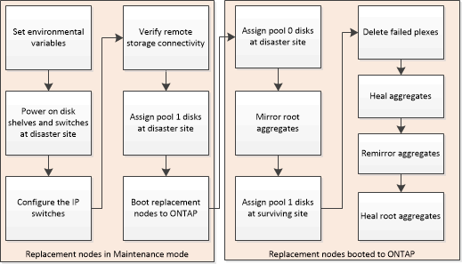

= Prepararsi per lo switchback in una configurazione IP MetroCluster
:allow-uri-read: 
:icons: font
:imagesdir: ../media/

[role="lead"]
È necessario eseguire alcune attività per preparare la configurazione IP di MetroCluster per l'operazione di switchback.

.A proposito di questa attività
nbsp;

