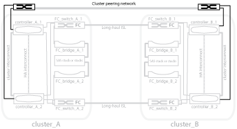

= Immagine della rete di peering del cluster
:allow-uri-read: 
:icons: font
:imagesdir: ../media/

[role="lead"]
I due cluster nella configurazione MetroCluster vengono peering tramite una rete di peering cluster fornita dal cliente. Il peering dei cluster supporta il mirroring sincrono delle macchine virtuali di storage (SVM, precedentemente noto come Vserver) tra i siti.

Le LIF di intercluster devono essere configurate su ciascun nodo della configurazione MetroCluster e i cluster devono essere configurati per il peering. Le porte con le LIF intercluster sono collegate alla rete di peering cluster fornita dal cliente. La replica della configurazione SVM viene eseguita su questa rete attraverso il Servizio di replica della configurazione.

.Informazioni correlate
link:concept_illustration_of_the_local_ha_pairs_in_a_mcc_configuration.html["Immagine delle coppie ha locali in una configurazione MetroCluster"]

link:concept_illustration_of_redundant_fc_to_sas_bridges.html["Immagine di bridge FC-SAS ridondanti"]

link:concept_redundant_fc_switch_fabrics.html["Fabric switch FC ridondanti"]

http://docs.netapp.com/ontap-9/topic/com.netapp.doc.exp-clus-peer/home.html["Configurazione rapida del peering di cluster e SVM"]

link:concept_considerations_peering.html["Considerazioni per la configurazione del peering del cluster"]

link:task_cable_the_cluster_peering_connections.html["Cablaggio delle connessioni di peering del cluster"]

link:concept_configure_the_mcc_software_in_ontap.html["Peering dei cluster"]
