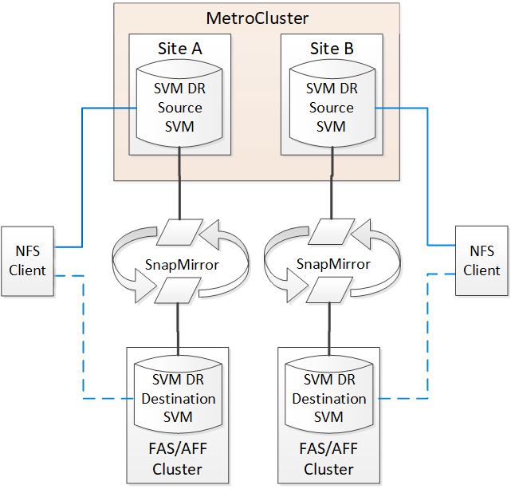

= Considerazioni sull'utilizzo di ONTAP in una configurazione MetroCluster
:allow-uri-read: 
:icons: font
:imagesdir: ../media/

[role="lead"]
Quando si utilizza ONTAP in una configurazione MetroCluster, è necessario tenere presente alcune considerazioni relative a licenze, peering ai cluster al di fuori della configurazione MetroCluster, esecuzione di operazioni sui volumi, operazioni NVFAIL e altre operazioni ONTAP.

.Considerazioni sulle licenze
* Entrambi i siti devono essere concessi in licenza per le stesse funzionalità concesse in licenza al sito.
* Tutti i nodi devono essere concessi in licenza per le stesse funzioni bloccate dal nodo.

.Considerazione di SnapMirror
* Il disaster recovery di SnapMirror SVM è supportato solo nelle configurazioni MetroCluster con versioni di ONTAP 9.5 o successive.

== Supporto di FlexCache in una configurazione MetroCluster

A partire da ONTAP 9.7, i volumi FlexCache sono supportati nelle configurazioni MetroCluster. È necessario conoscere i requisiti per l'abrogazione manuale dopo le operazioni di switchover o switchback.

=== Annullamento della SVM dopo lo switchover quando l'origine e la cache di FlexCache si trovano all'interno dello stesso sito MetroCluster

Dopo uno switchover negoziato o non pianificato, qualsiasi relazione di peering SVM FlexCache all'interno del cluster deve essere configurata manualmente.

Ad esempio, le SVM "vs1" (cache) e "vs2" (origine) si trovano sul sito_A. Questi SVM sono in peering.

Dopo lo switchover, le SVM "vs1-mc" e "vs2-mc" vengono attivate presso il sito del partner (Site_B). Devono essere revocati manualmente per consentire a FlexCache di utilizzare `vserver peer repeer` comando.

=== Annullamento della SVM dopo lo switchover o lo switchback quando una destinazione FlexCache si trova su un terzo cluster e in modalità disconnessa

Per le relazioni FlexCache con un cluster al di fuori della configurazione MetroCluster, il peering deve sempre essere riconfigurato manualmente dopo uno switchover se i cluster coinvolti sono in modalità disconnessa durante lo switchover.

Ad esempio:

* Un'estremità del FlexCache (cache_1 su vs1) risiede sul sito MetroCluster_A.
* L'altra estremità del FlexCache (origin_1 su vs2) risiede sul sito_C (non nella configurazione MetroCluster).

Quando viene attivato lo switchover e se Site_A e Site_C non sono connessi, è necessario revocare manualmente le SVM sul sito_B (il cluster di switchover) e sul sito_C utilizzando `vserver peer repeer` comando dopo lo switchover.

Quando viene eseguito lo switchback, è necessario revocare nuovamente le SVM sul sito_A (il cluster originale) e sul sito_C.

.Informazioni correlate
link:https://docs.netapp.com/us-en/ontap/flexcache/index.html["Gestione dei volumi FlexCache con l'interfaccia CLI"^]

== Supporto FabricPool nelle configurazioni MetroCluster

A partire da ONTAP 9.7, le configurazioni MetroCluster supportano i Tier di storage FabricPool.

Per informazioni generali sull'utilizzo di FabricPools, vedere link:https://docs.netapp.com/us-en/ontap/disks-aggregates/index.html["Gestione di dischi e Tier (aggregato)"^].

=== Considerazioni sull'utilizzo di FabricPools

* I cluster devono disporre di licenze FabricPool con limiti di capacità corrispondenti.
* I cluster devono avere IPspaces con nomi corrispondenti.
+
Può trattarsi dell'IPSpace predefinito o di un IPSpace creato da un amministratore. Questo IPSpace verrà utilizzato per le impostazioni di configurazione dell'archivio di oggetti FabricPool.

* Per l'IPSpace selezionato, ciascun cluster deve avere una LIF intercluster definita che possa raggiungere l'archivio di oggetti esterno

=== Configurazione di un aggregato per l'utilizzo in un FabricPool mirrorato

NOTE: Prima di configurare l'aggregato, è necessario configurare gli archivi di oggetti come descritto in "impostazione degli archivi di oggetti per FabricPool in una configurazione MetroCluster" inhttps://docs.netapp.com/ontap-9/topic/com.netapp.doc.dot-cm-psmg/home.html["Gestione di dischi e aggregati"]

.Fasi
Per configurare un aggregato per l'utilizzo in un FabricPool:

. Creare l'aggregato o selezionare un aggregato esistente.
. Eseguire il mirroring dell'aggregato come tipico aggregato mirrorato all'interno della configurazione MetroCluster.
. Creare il mirror FabricPool con l'aggregato, come descritto in https://docs.netapp.com/ontap-9/topic/com.netapp.doc.dot-cm-psmg/home.html["Gestione di dischi e aggregati"]
+
.. Allegare un archivio di oggetti primario.
+
Questo archivio di oggetti è fisicamente più vicino al cluster.

.. Aggiungere un archivio di oggetti mirror.
+
Questo archivio di oggetti è fisicamente più lontano dal cluster rispetto all'archivio di oggetti primario.

NOTE: Si consiglia di mantenere almeno il 20% di spazio libero per gli aggregati con mirroring, per performance e disponibilità dello storage ottimali. Sebbene il suggerimento sia del 10% per gli aggregati non speculari, il 10% di spazio aggiuntivo può essere utilizzato dal filesystem per assorbire le modifiche incrementali. I cambiamenti incrementali aumentano l'utilizzo dello spazio per gli aggregati con mirroring grazie all'architettura copy-on-write basata su Snapshot di ONTAP. Il mancato rispetto di queste Best practice può avere un impatto negativo sulle prestazioni.

== Supporto FlexGroup nelle configurazioni MetroCluster

A partire da ONTAP 9.6, le configurazioni MetroCluster supportano i volumi FlexGroup.

== Supporto dei gruppi di coerenza nelle configurazioni MetroCluster

A partire da ONTAP 9.11.1, https://docs.netapp.com/us-en/ontap/consistency-groups/index.html["gruppi di coerenza"^] Sono supportati nelle configurazioni MetroCluster.

== Pianificazioni dei lavori in una configurazione MetroCluster

In ONTAP 9.3 e versioni successive, le pianificazioni dei processi create dall'utente vengono replicate automaticamente tra i cluster in una configurazione MetroCluster. Se si crea, modifica o elimina una pianificazione di processo su un cluster, la stessa pianificazione viene creata automaticamente sul cluster partner, utilizzando il servizio di replica configurazione (CRS).

NOTE: Le pianificazioni create dal sistema non vengono replicate ed è necessario eseguire manualmente la stessa operazione sul cluster partner in modo che le pianificazioni dei processi su entrambi i cluster siano identiche.

== Peering dei cluster dal sito MetroCluster a un terzo cluster

Poiché la configurazione di peering non viene replicata, se si esegue il peer di uno dei cluster della configurazione MetroCluster in un terzo cluster esterno a tale configurazione, è necessario configurare anche il peering sul cluster MetroCluster del partner. In questo modo, è possibile mantenere il peering in caso di commutazione.

Il cluster non MetroCluster deve eseguire ONTAP 8.3 o versione successiva. In caso contrario, il peering viene perso se si verifica uno switchover anche se il peering è stato configurato su entrambi i partner MetroCluster.

== Replica della configurazione del client LDAP in una configurazione MetroCluster

Una configurazione del client LDAP creata su una macchina virtuale di storage (SVM) su un cluster locale viene replicata nella SVM dei dati del partner sul cluster remoto. Ad esempio, se la configurazione del client LDAP viene creata sulla SVM amministrativa sul cluster locale, viene replicata su tutti gli SVM dei dati di amministrazione sul cluster remoto. Questa funzione MetroCluster è intenzionale in modo che la configurazione del client LDAP sia attiva su tutte le SVM partner sul cluster remoto.

== Linee guida per il networking e la creazione di LIF per le configurazioni MetroCluster

È necessario conoscere le modalità di creazione e replica delle LIF in una configurazione MetroCluster. È inoltre necessario conoscere i requisiti di coerenza per poter prendere decisioni appropriate durante la configurazione della rete.

.Informazioni correlate
* https://docs.netapp.com/ontap-9/topic/com.netapp.doc.dot-cm-nmg/home.html["Gestione di rete e LIF"]
* È necessario conoscere i requisiti per la replica degli oggetti IPSpace nel cluster partner e per la configurazione di subnet e IPv6 in una configurazione MetroCluster.
+
<<ipspace_obj_rep,Replica di oggetti IPSpace e requisiti di configurazione della subnet>>

* Quando si configura la rete in una configurazione MetroCluster, è necessario conoscere i requisiti per la creazione di LIF.
+
<<reqs_lif_create,Requisiti per la creazione di LIF in una configurazione MetroCluster>>

* È necessario conoscere i requisiti di replica LIF in una configurazione MetroCluster. È inoltre necessario conoscere il modo in cui un LIF replicato viene collocato in un cluster di partner e tenere presenti i problemi che si verificano quando la replica LIF o il posizionamento LIF non riesce.
+
<<lif_rep_place,Requisiti e problemi di posizionamento e replica LIF>>

=== Replica di oggetti IPSpace e requisiti di configurazione della subnet

È necessario conoscere i requisiti per la replica degli oggetti IPSpace nel cluster partner e per la configurazione di subnet e IPv6 in una configurazione MetroCluster.

==== Replica di IPSpace

Durante la replica degli oggetti IPSpace nel cluster partner, è necessario prendere in considerazione le seguenti linee guida:

* I nomi IPSpace dei due siti devono corrispondere.
* Gli oggetti IPSpace devono essere replicati manualmente nel cluster partner.
+
Tutte le macchine virtuali di storage (SVM) create e assegnate a un IPSpace prima della replica di IPSpace non verranno replicate nel cluster partner.

==== Configurazione della subnet

Durante la configurazione delle subnet in una configurazione MetroCluster, è necessario prendere in considerazione le seguenti linee guida:

* Entrambi i cluster della configurazione MetroCluster devono avere una subnet nello stesso IPSpace con lo stesso nome di subnet, subnet, dominio di trasmissione e gateway.
* Gli intervalli IP dei due cluster devono essere diversi.
+
Nell'esempio seguente, gli intervalli IP sono diversi:

+
[listing]
----
cluster_A::> network subnet show

IPspace: Default
Subnet                     Broadcast                   Avail/
Name      Subnet           Domain    Gateway           Total    Ranges
--------- ---------------- --------- ------------      -------  ---------------
subnet1   192.168.2.0/24   Default   192.168.2.1       10/10    192.168.2.11-192.168.2.20

cluster_B::> network subnet show
 IPspace: Default
Subnet                     Broadcast                   Avail/
Name      Subnet           Domain    Gateway           Total    Ranges
--------- ---------------- --------- ------------     --------  ---------------
subnet1   192.168.2.0/24   Default   192.168.2.1       10/10    192.168.2.21-192.168.2.30
----

==== Configurazione IPv6

Se IPv6 è configurato su un sito, IPv6 deve essere configurato anche sull'altro sito.

.Informazioni correlate
* Quando si configura la rete in una configurazione MetroCluster, è necessario conoscere i requisiti per la creazione di LIF.
+
<<reqs_lif_create,Requisiti per la creazione di LIF in una configurazione MetroCluster>>

* È necessario conoscere i requisiti di replica LIF in una configurazione MetroCluster. È inoltre necessario conoscere il modo in cui un LIF replicato viene collocato in un cluster di partner e tenere presenti i problemi che si verificano quando la replica LIF o il posizionamento LIF non riesce.
+
<<lif_rep_place,Requisiti e problemi di posizionamento e replica LIF>>

=== Requisiti per la creazione di LIF in una configurazione MetroCluster

Quando si configura la rete in una configurazione MetroCluster, è necessario conoscere i requisiti per la creazione di LIF.

Durante la creazione di LIF, è necessario prendere in considerazione le seguenti linee guida:

* Fibre Channel (canale fibra): È necessario utilizzare fabric allungati VSAN o allungati
* IP/iSCSI: È necessario utilizzare la rete con estensione Layer 2
* ARP Broadcasts (trasmissioni ARP): È necessario attivare le trasmissioni ARP tra i due cluster
* LIF duplicati: Non è necessario creare più LIF con lo stesso indirizzo IP (LIF duplicati) in un IPSpace
* Configurazioni NFS e SAN: È necessario utilizzare diverse macchine virtuali di storage (SVM) per gli aggregati senza mirror e con mirroring

==== Verificare la creazione di LIF

È possibile confermare la corretta creazione di una LIF in una configurazione MetroCluster eseguendo `metrocluster check lif show` comando. In caso di problemi durante la creazione della LIF, è possibile utilizzare `metrocluster check lif repair-placement` per risolvere i problemi.

.Informazioni correlate
* È necessario conoscere i requisiti per la replica degli oggetti IPSpace nel cluster partner e per la configurazione di subnet e IPv6 in una configurazione MetroCluster.
+
<<ipspace_obj_rep,Replica di oggetti IPSpace e requisiti di configurazione della subnet>>

* È necessario conoscere i requisiti di replica LIF in una configurazione MetroCluster. È inoltre necessario conoscere il modo in cui un LIF replicato viene collocato in un cluster di partner e tenere presenti i problemi che si verificano quando la replica LIF o il posizionamento LIF non riesce.
+
<<lif_rep_place,Requisiti e problemi di posizionamento e replica LIF>>

=== Requisiti e problemi di posizionamento e replica LIF

È necessario conoscere i requisiti di replica LIF in una configurazione MetroCluster. È inoltre necessario conoscere il modo in cui un LIF replicato viene collocato in un cluster di partner e tenere presenti i problemi che si verificano quando la replica LIF o il posizionamento LIF non riesce.

==== Replica di LIF nel cluster del partner

Quando si crea una LIF su un cluster in una configurazione MetroCluster, la LIF viene replicata sul cluster partner. I LIF non vengono posizionati in base al nome uno a uno. Per verificare la disponibilità di LIF dopo un'operazione di switchover, il processo di posizionamento LIF verifica che le porte siano in grado di ospitare LIF in base ai controlli di raggiungibilità e attributo delle porte.

Il sistema deve soddisfare le seguenti condizioni per inserire i file LIF replicati nel cluster del partner:

|===

| Condizione | Tipo LIF: FC | Tipo LIF: IP/iSCSI 

 a| 
Identificazione del nodo
 a| 
ONTAP tenta di collocare il LIF replicato nel partner di disaster recovery (DR) del nodo in cui è stato creato. Se il partner DR non è disponibile, il partner ausiliario DR viene utilizzato per il posizionamento.
 a| 
ONTAP tenta di posizionare il LIF replicato sul partner DR del nodo in cui è stato creato. Se il partner DR non è disponibile, il partner ausiliario DR viene utilizzato per il posizionamento.

 a| 
Identificazione della porta
 a| 
ONTAP identifica le porte di destinazione FC collegate sul cluster DR.
 a| 
Le porte del cluster DR che si trovano nello stesso IPSpace del LIF di origine vengono selezionate per un controllo di raggiungibilità.

Se non sono presenti porte nel cluster DR nello stesso IPSpace, non è possibile posizionare la LIF.

Tutte le porte del cluster di DR che ospitano già una LIF nello stesso IPSpace e nella stessa subnet vengono automaticamente contrassegnate come raggiungibili e possono essere utilizzate per il posizionamento. Queste porte non sono incluse nel controllo di raggiungibilità.

 a| 
Controllo della raggiungibilità
 a| 
La raggiungibilità viene determinata verificando la connettività del WWN del fabric di origine sulle porte del cluster DR.

Se lo stesso fabric non è presente nel sito di DR, il LIF viene posizionato su una porta casuale del partner di DR.
 a| 
La raggiungibilità è determinata dalla risposta a una trasmissione ARP (Address Resolution Protocol) da ciascuna porta precedentemente identificata sul cluster DR all'indirizzo IP di origine della LIF da posizionare.

Per il successo dei controlli di raggiungibilità, le trasmissioni ARP devono essere consentite tra i due cluster.

Ogni porta che riceve una risposta dalla LIF di origine verrà contrassegnata come possibile per il posizionamento.

 a| 
Selezione della porta
 a| 
ONTAP classifica le porte in base ad attributi quali tipo di adattatore e velocità, quindi seleziona le porte con attributi corrispondenti.

Se non vengono trovate porte con attributi corrispondenti, la LIF viene posizionata su una porta connessa in modo casuale del partner DR.
 a| 
Dalle porte contrassegnate come raggiungibili durante il controllo di raggiungibilità, ONTAP preferisce le porte che si trovano nel dominio di broadcast associato alla subnet della LIF.

Se nel cluster DR non sono disponibili porte di rete che si trovano nel dominio di trasmissione associato alla subnet della LIF, ONTAP seleziona le porte che hanno la raggiungibilità della LIF di origine.

Se non sono presenti porte con raggiungibilità alla LIF di origine, viene selezionata una porta dal dominio di trasmissione associato alla subnet della LIF di origine e, se non esiste tale dominio di trasmissione, viene selezionata una porta casuale.

ONTAP classifica le porte in base ad attributi quali tipo di adattatore, tipo di interfaccia e velocità, quindi seleziona le porte con attributi corrispondenti.

 a| 
Posizionamento LIF
 a| 
Dalle porte raggiungibili, ONTAP seleziona la porta meno caricata per il posizionamento.
 a| 
Dalle porte selezionate, ONTAP seleziona la porta meno caricata per il posizionamento.

|===

==== Posizionamento di LIF replicati quando il nodo partner DR non è attivo

Quando viene creato un LIF iSCSI o FC su un nodo il cui partner DR è stato sostituito, il LIF replicato viene posizionato sul nodo del partner ausiliario DR. Dopo una successiva operazione di giveback, i LIF non vengono spostati automaticamente nel partner DR. Ciò può portare alla concentrazione di LIF su un singolo nodo nel cluster del partner. Durante un'operazione di switchover MetroCluster, i tentativi successivi di mappare le LUN appartenenti alla macchina virtuale di storage (SVM) non riescono.

Eseguire il `metrocluster check lif show` Comando dopo un'operazione di Takeover o giveback per verificare che il posizionamento LIF sia corretto. In caso di errori, è possibile eseguire `metrocluster check lif repair-placement` comando per risolvere i problemi.

==== Errori di posizionamento LIF

Errori di posizionamento LIF visualizzati da `metrocluster check lif show` i comandi vengono conservati dopo un'operazione di switchover. Se il `network interface modify`, `network interface rename`, o. `network interface delete` Viene inviato un comando per un LIF con un errore di posizionamento, l'errore viene rimosso e non viene visualizzato nell'output di `metrocluster check lif show` comando.

==== Errore di replica LIF

È inoltre possibile verificare se la replica LIF ha avuto esito positivo utilizzando `metrocluster check lif show` comando. Se la replica LIF non riesce, viene visualizzato un messaggio EMS.

È possibile correggere un errore di replica eseguendo `metrocluster check lif repair-placement` Comando per qualsiasi LIF che non riesce a trovare una porta corretta. È necessario risolvere al più presto eventuali errori di replica LIF per verificare la disponibilità di LIF durante un'operazione di switchover MetroCluster.

NOTE: Anche se la SVM di origine non è disponibile, il posizionamento LIF potrebbe procedere normalmente se esiste una LIF appartenente a una SVM diversa in una porta con lo stesso IPSpace e la stessa rete nella SVM di destinazione.

==== Le LIF non sono accessibili dopo uno switchover

Se viene apportata una modifica al fabric dello switch FC a cui sono collegate le porte di destinazione FC dei nodi di origine e DR, i LIF FC posizionati presso il partner DR potrebbero diventare inaccessibili agli host dopo un'operazione di switchover.

Eseguire il `metrocluster check lif repair-placement` Comando sul nodo di origine e sui nodi DR dopo una modifica apportata al fabric dello switch FC per verificare la connettività host delle LIF. Le modifiche apportate al fabric dello switch potrebbero causare il posizionamento di LIF in diverse porte FC di destinazione nel nodo partner DR.

.Informazioni correlate
* È necessario conoscere i requisiti per la replica degli oggetti IPSpace nel cluster partner e per la configurazione di subnet e IPv6 in una configurazione MetroCluster.
+
<<ipspace_obj_rep,Replica di oggetti IPSpace e requisiti di configurazione della subnet>>

* Quando si configura la rete in una configurazione MetroCluster, è necessario conoscere i requisiti per la creazione di LIF.
+
<<reqs_lif_create,Requisiti per la creazione di LIF in una configurazione MetroCluster>>

=== Creazione di un volume su un aggregato root

Il sistema non consente la creazione di nuovi volumi nell'aggregato root (un aggregato con un criterio ha di CFO) di un nodo in una configurazione MetroCluster.

A causa di questa restrizione, non è possibile aggiungere aggregati root a una SVM utilizzando `vserver add-aggregates` comando.

== Disaster recovery SVM in una configurazione MetroCluster

A partire da ONTAP 9.5, le macchine virtuali con storage attivo (SVM) in una configurazione MetroCluster possono essere utilizzate come origini con la funzione di disaster recovery di SnapMirror SVM. La SVM di destinazione deve trovarsi sul terzo cluster al di fuori della configurazione MetroCluster.

A partire da ONTAP 9.11.1, entrambi i siti all'interno di una configurazione MetroCluster possono essere l'origine di una relazione DR SVM con un cluster di destinazione FAS o AFF, come mostrato nell'immagine seguente.

È necessario conoscere i seguenti requisiti e limitazioni dell'utilizzo di SVM con il disaster recovery SnapMirror:

* Solo una SVM attiva all'interno di una configurazione MetroCluster può essere l'origine di una relazione di disaster recovery SVM.
+
Un'origine può essere una SVM di origine della sincronizzazione prima dello switchover o una SVM di destinazione della sincronizzazione dopo lo switchover.

* Quando una configurazione MetroCluster si trova in uno stato stabile, la SVM di destinazione della sincronizzazione MetroCluster non può essere l'origine di una relazione di disaster recovery SVM, poiché i volumi non sono online.
+
La seguente immagine mostra il comportamento del disaster recovery SVM in uno stato stabile:

+
image::../media/svm_dr_normal_behavior.gif[comportamento normale del dr svm]

* Quando la SVM di origine della sincronizzazione è l'origine di una relazione DR con SVM, le informazioni di relazione DR con SVM di origine vengono replicate nel partner MetroCluster.
+
In questo modo, gli aggiornamenti DR di SVM possono continuare dopo uno switchover, come mostrato nell'immagine seguente:

+
image::../media/svm_dr_image_2.gif[immagine dr svm 2]

* Durante i processi di switchover e switchback, la replica alla destinazione DR SVM potrebbe non riuscire.
+
Tuttavia, una volta completato il processo di switchover o switchback, gli aggiornamenti pianificati per il DR SVM successivi avranno esito positivo.

Vedere la sezione "`Replica della configurazione SVM`" nel link:http://docs.netapp.com/ontap-9/topic/com.netapp.doc.pow-dap/home.html["Protezione dei dati con la CLI"] Per informazioni dettagliate sulla configurazione di una relazione DR SVM.

=== Risincronizzazione SVM in un sito di disaster recovery

Durante la risincronizzazione, l'origine del disaster recovery (DR) delle macchine virtuali dello storage sulla configurazione MetroCluster viene ripristinata dalla SVM di destinazione sul sito non MetroCluster.

Durante la risincronizzazione, la SVM di origine (cluster_A) agisce temporaneamente come SVM di destinazione, come mostrato nell'immagine seguente:

image::../media/svm_dr_resynchronization.gif[risincronizzazione dr svm]

==== Se durante la risincronizzazione si verifica uno switchover non pianificato

Gli switchover non pianificati che si verificano durante la risincronizzazione arrestano il trasferimento di risincronizzazione. Se si verifica uno switchover non pianificato, sono soddisfatte le seguenti condizioni:

* La SVM di destinazione sul sito MetroCluster (che era una SVM di origine prima della risincronizzazione) rimane come SVM di destinazione. La SVM del cluster partner continuerà a conservare il sottotipo e rimarrà inattiva.
* La relazione SnapMirror deve essere ricreata manualmente con la SVM di destinazione della sincronizzazione come destinazione.
* La relazione di SnapMirror non viene visualizzata nell'output di SnapMirror dopo uno switchover nel sito superstite, a meno che non venga eseguita un'operazione di creazione di SnapMirror.

==== Esecuzione dello switchback dopo uno switchover non pianificato durante la risincronizzazione

Per eseguire correttamente il processo di switchback, la relazione di risincronizzazione deve essere interrotta ed eliminata. Lo switchback non è consentito se sono presenti SVM di destinazione DR SnapMirror nella configurazione MetroCluster o se il cluster dispone di una SVM di sottotipo "`dp-destination`".

== L'output del comando "storage aggregate plex show" è indeterminato dopo uno switchover MetroCluster

Quando si esegue `storage aggregate plex show` Comando dopo uno switchover MetroCluster, lo stato di plex0 dell'aggregato root commutato è indeterminato e viene visualizzato come "failed". Durante questo periodo, la root commutata non viene aggiornata. Lo stato effettivo di questo plex può essere determinato solo dopo la fase di riparazione MetroCluster.

== Modifica dei volumi per impostare il flag NVFAIL in caso di switchover

È possibile modificare un volume in modo che il flag NVFAIL venga impostato sul volume in caso di switchover MetroCluster. Il flag NVFAIL disattiva il volume da qualsiasi modifica. Ciò è necessario per i volumi che devono essere gestiti come se le scritture assegnate al volume fossero perse dopo il passaggio.

.A proposito di questa attività
--
[NOTE]
====
Nelle versioni di ONTAP precedenti alla 9.0, il flag NVFAIL viene utilizzato per ogni switchover. In ONTAP 9.0 e versioni successive, viene utilizzato lo switchover non pianificato (USO).

====
--
.Fase
. Abilitare la configurazione MetroCluster per attivare NVFAIL allo switchover impostando `vol -dr-force-nvfail` parametro su "on":
+
`*vol modify -vserver _vserver-name_ -volume _volume-name_ -dr-force-nvfail on*`

