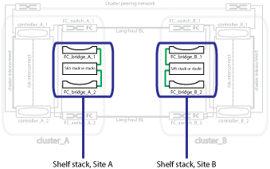

= Immagine di bridge FC-SAS ridondanti
:allow-uri-read: 
:icons: font
:imagesdir: ../media/

[role="lead"]
I bridge FC-SAS forniscono un bridging del protocollo tra i dischi SAS collegati e il fabric dello switch FC.

.Informazioni correlate
link:concept_illustration_of_the_local_ha_pairs_in_a_mcc_configuration.html["Immagine delle coppie ha locali in una configurazione MetroCluster"]

link:concept_redundant_fc_switch_fabrics.html["Fabric switch FC ridondanti"]

link:concept_cluster_peering_network_mcc.html["Immagine della rete di peering del cluster"]
