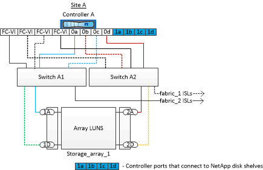

= Esempio di una configurazione MetroCluster a due nodi collegata al fabric con dischi e LUN di array
:allow-uri-read: 
:icons: font
:imagesdir: ../media/

[role="lead"]
Per configurare una configurazione MetroCluster a due nodi con fabric-attached con dischi e LUN di array nativi, è necessario utilizzare bridge FC-SAS per collegare i sistemi ONTAP con gli shelf di dischi attraverso gli switch FC. È possibile collegare i LUN degli array ai sistemi ONTAP attraverso gli switch FC.

Le seguenti illustrazioni rappresentano esempi di configurazione MetroCluster a due nodi con collegamento a fabric con dischi e LUN di array. Entrambi rappresentano la stessa configurazione MetroCluster; le rappresentazioni per i dischi e le LUN degli array sono separate solo per semplificazioni.

Nella seguente illustrazione che mostra la connettività tra i sistemi e i dischi ONTAP, le porte HBA da 1a a 1d vengono utilizzate per la connettività con i dischi attraverso i bridge FC-SAS:

image::../media/two_node_mcc_combined_fabric_disks.gif[due dischi fabric combinati mcc a nodi]

Nella seguente illustrazione che mostra la connettività tra i sistemi ONTAP e i LUN degli array, le porte HBA da 0a a 0d vengono utilizzate per la connettività con i LUN degli array perché le porte da 1a a 1d vengono utilizzate per la connettività con i dischi:

