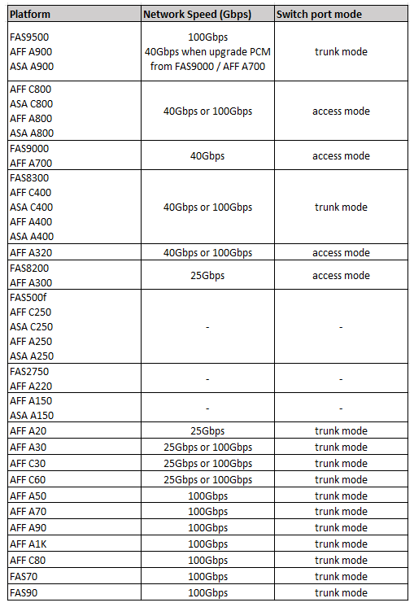

= Velocità di rete specifiche della piattaforma e modalità di porta dello switch per switch compatibili con MetroCluster
:allow-uri-read: 
:icons: font
:imagesdir: ../media/

[role="lead"]
Se si utilizzano switch compatibili MetroCluster, è necessario conoscere le velocità di rete specifiche della piattaforma e i requisiti della modalità porta dello switch.

La tabella seguente fornisce velocità di rete specifiche per piattaforma e modalità di porte switch per gli switch compatibili con MetroCluster. È necessario configurare la modalità della porta dello switch in base alla tabella.

NOTE: Valori mancanti indicano che la piattaforma non può essere utilizzata con uno switch compatibile con MetroCluster.

