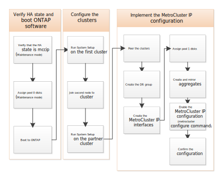

= Configurare il software MetroCluster in ONTAP
:allow-uri-read: 
:icons: font
:imagesdir: ../media/

[role="lead"]
È necessario impostare ciascun nodo nella configurazione MetroCluster in ONTAP, incluse le configurazioni a livello di nodo e la configurazione dei nodi in due siti. È inoltre necessario implementare la relazione MetroCluster tra i due siti.

Se un modulo controller si guasta durante la configurazione, fare riferimento a. link:../disaster-recovery/concept_choosing_the_correct_recovery_procedure_parent_concept.html#controller-module-failure-scenarios-during-metrocluster-installation["Scenari di guasto del modulo controller durante l'installazione di MetroCluster"].

== Configurare configurazioni IP MetroCluster a otto nodi

Una configurazione MetroCluster a otto nodi è costituita da due gruppi DR. Per configurare il primo gruppo DR, completare le attività descritte in questa sezione. Dopo aver configurato il primo gruppo DR, è possibile seguire i passaggi per link:../upgrade/task_expand_a_four_node_mcc_ip_configuration.html["espandere una configurazione IP MetroCluster a quattro nodi in una configurazione a otto nodi"] .
