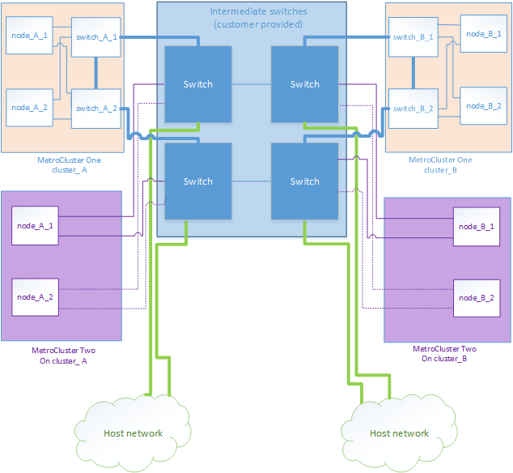

= Considerazioni per la condivisione di reti private Layer 2
:allow-uri-read: 
:icons: font
:imagesdir: ../media/

[role="lead"]
A partire da ONTAP 9.6, le configurazioni IP di MetroCluster con switch Cisco supportati possono condividere le reti esistenti per gli ISL, piuttosto che utilizzare gli ISL MetroCluster dedicati. Le versioni precedenti di ONTAP richiedono ISL dedicati.

Gli switch IP MetroCluster sono dedicati alla configurazione MetroCluster e non possono essere condivisi. Pertanto, una serie di switch IP MetroCluster può collegare una sola configurazione MetroCluster. Solo le porte MetroCluster ISL degli switch IP MetroCluster possono connettersi agli switch condivisi.

CAUTION: Se si utilizza una rete condivisa, il cliente è responsabile del rispetto dei requisiti di rete MetroCluster nella rete condivisa.

== Requisiti ISL

È necessario soddisfare i requisiti in:

* link:../install-ip/concept_considerations_isls.html#basic-metrocluster-isl-requirements["Requisiti ISL di base per MetroCluster"]
* link:../install-ip/concept_considerations_isls.html#isl-requirements-in-shared-layer-2-networks["Requisiti ISL nelle reti condivise Layer 2"]

== Impostazioni richieste sugli switch intermedi

Quando si condivide il traffico ISL in una rete condivisa, la configurazione degli switch intermedi forniti dal cliente deve garantire che il traffico MetroCluster (RDMA e storage) soddisfi i livelli di servizio richiesti per l'intero percorso tra i siti MetroCluster.

I seguenti esempi si riferiscono agli switch Cisco Nexus 3000 e IP Broadcom. A seconda del vendor e dei modelli dello switch, è necessario assicurarsi che gli switch intermedi abbiano una configurazione equivalente.

=== Switch Cisco Nexus

Il seguente diagramma fornisce una panoramica delle impostazioni richieste per una rete condivisa quando gli switch esterni sono switch Cisco.

image::../media/switch_traffic_with_cisco_switches.png[cambia il traffico con gli switch cisco]

In questo esempio, vengono creati i seguenti criteri e mappe per il traffico MetroCluster:

* Un criterio MetroClusterIP_Ingress viene applicato alle porte dello switch intermedio che si collegano agli switch IP MetroCluster.
+
Il criterio MetroClusterIP_Ingress associa il traffico con tag in entrata alla coda appropriata sullo switch intermedio. Il tagging viene eseguito sulla porta del nodo, non sull'ISL. Il traffico non MetroCluster che utilizza le stesse porte sull'ISL rimane nella coda predefinita.

* Un criterio MetroClusterIP_Egress viene applicato alle porte dello switch intermedio che si connettono agli ISL tra switch intermedi

È necessario configurare gli switch intermedi con mappe di accesso QoS, mappe di classe e policy corrispondenti lungo il percorso tra gli switch IP di MetroCluster. Gli switch intermedi mappano il traffico RDMA su COS5 e il traffico di storage su COS4.

L'esempio seguente mostra la configurazione di uno switch Cisco Nexus 3000 fornito dal cliente. Se si dispone di switch Cisco, è possibile utilizzare l'esempio per configurare lo switch lungo il percorso senza problemi. Se non si dispone di switch Cisco, è necessario determinare e applicare la configurazione equivalente agli switch intermedi.

Nell'esempio riportato di seguito vengono illustrate le definizioni della mappa delle classi:

NOTE: Questo esempio è destinato alle configurazioni che utilizzano gli switch IP Cisco MetroCluster. È possibile seguire questo esempio indipendentemente dai tipi di switch che trasportano traffico MetroCluster e che non si connettono a uno switch IP MetroCluster.

[listing]
----
class-map type qos match-all rdma
   match cos 5
class-map type qos match-all storage
   match cos 4
----
Nell'esempio riportato di seguito vengono illustrate le definizioni della mappa dei criteri:

[listing]
----
policy-map type qos MetroClusterIP_Ingress
   class rdma
      set dscp 40
      set cos 5
      set qos-group 5
   class storage
      set dscp 32
      set cos 4
      set qos-group 4
policy-map type queuing MetroClusterIP_Egress
   class type queuing c-out-8q-q7
      priority level 1
   class type queuing c-out-8q-q6
      priority level 2
   class type queuing c-out-8q-q5
      priority level 3
      random-detect threshold burst-optimized ecn
   class type queuing c-out-8q-q4
      priority level 4
      random-detect threshold burst-optimized ecn
   class type queuing c-out-8q-q3
      priority level 5
   class type queuing c-out-8q-q2
      priority level 6
   class type queuing c-out-8q-q1
      priority level 7
   class type queuing c-out-8q-q-default
      bandwidth remaining percent 100
      random-detect threshold burst-optimized ecn
----

=== Switch Broadcom IP MetroCluster

Il seguente diagramma fornisce una panoramica delle impostazioni richieste per una rete condivisa quando gli switch esterni sono switch IP Broadcom.

image::../media/switch_traffic_with_broadcom_switches.png[cambia il traffico con gli switch broadcom]

Le configurazioni che utilizzano gli switch Broadcom IP MetroCluster richiedono una configurazione aggiuntiva:

* Per gli switch esterni, è necessario configurare le mappe di accesso e di classe per classificare il traffico all'ingresso nella rete del cliente.
+

NOTE: Questa operazione non è necessaria per le configurazioni che utilizzano gli switch IP MetroCluster.

+
Nell'esempio seguente viene illustrato come configurare le mappe di accesso e di classe sul primo e sull'ultimo switch del cliente che collegano gli ISL tra gli switch Broadcom IP di MetroCluster.

[listing]
----
ip access-list storage
  10 permit tcp any eq 65200 any
  20 permit tcp any any eq 65200
ip access-list rdma
  10 permit tcp any eq 10006 any
  20 permit tcp any any eq 10006

class-map type qos match-all storage
  match access-group name storage
class-map type qos match-all rdma
  match access-group name rdma
----
* È necessario assegnare la policy di ingresso alla porta dello switch ISL sul primo switch del cliente.
+
Nell'esempio riportato di seguito vengono illustrate le definizioni della mappa delle classi:

+

NOTE: Questo esempio è destinato alle configurazioni che utilizzano gli switch IP Cisco MetroCluster. È possibile seguire questo esempio indipendentemente dai tipi di switch che trasportano traffico MetroCluster e che non si connettono a uno switch IP MetroCluster.

+
[listing]
----
class-map type qos match-all rdma
   match cos 5
class-map type qos match-all storage
   match cos 4
----
+
Nell'esempio riportato di seguito vengono illustrate le definizioni della mappa dei criteri:

+
[listing]
----
policy-map type qos MetroClusterIP_Ingress
   class rdma
      set dscp 40
      set cos 5
      set qos-group 5
   class storage
      set dscp 32
      set cos 4
      set qos-group 4
policy-map type queuing MetroClusterIP_Egress
   class type queuing c-out-8q-q7
      priority level 1
   class type queuing c-out-8q-q6
      priority level 2
   class type queuing c-out-8q-q5
      priority level 3
      random-detect threshold burst-optimized ecn
   class type queuing c-out-8q-q4
      priority level 4
      random-detect threshold burst-optimized ecn
   class type queuing c-out-8q-q3
      priority level 5
   class type queuing c-out-8q-q2
      priority level 6
   class type queuing c-out-8q-q1
      priority level 7
   class type queuing c-out-8q-q-default
      bandwidth remaining percent 100
      random-detect threshold burst-optimized ecn
----

=== Switch intermedi per i clienti

* Per gli switch intermedi del cliente, è necessario assegnare la policy di uscita alle porte dello switch ISL.
* Per tutti gli altri switch interni lungo il percorso che trasportano traffico MetroCluster, seguire gli esempi della mappa delle classi e delle policy nella sezione _switch Cisco Nexus 3000_.

== Esempi di topologie di rete MetroCluster

A partire da ONTAP 9.6, alcune configurazioni di rete ISL condivise sono supportate per le configurazioni IP di MetroCluster.

=== Configurazione di rete condivisa con collegamenti diretti

In questa topologia, due siti distinti sono collegati da collegamenti diretti. Questi collegamenti possono essere tra apparecchiature di multiplazione a divisione di lunghezza d'onda (xWDM) o switch. La capacità degli ISL non è dedicata al traffico MetroCluster, ma è condivisa con altro traffico.

La capacità ISL deve soddisfare i requisiti minimi. A seconda che si utilizzino dispositivi xWDM o switch, potrebbe essere applicata una combinazione diversa di configurazioni di rete.

image::../media/mcc_ip_networking_with_shared_isls.gif[rete ip mcc con isl condivisi]

=== Infrastruttura condivisa con reti intermedie

In questa topologia, il traffico dello switch principale IP di MetroCluster e il traffico host attraversano una rete non fornita da NetApp. L'infrastruttura di rete e i collegamenti (inclusi i collegamenti diretti in leasing) non rientrano nella configurazione di MetroCluster. La rete può essere costituita da una serie di xWDM e switch, ma a differenza della configurazione condivisa con ISL diretti, i collegamenti non sono diretti tra i siti. A seconda dell'infrastruttura tra i siti, è possibile utilizzare qualsiasi combinazione di configurazioni di rete. L'infrastruttura intermedia è rappresentata come "`cloud`" (possono esistere più dispositivi tra i siti), ma è ancora sotto il controllo del cliente. La capacità attraverso questa infrastruttura intermedia non è dedicata al traffico MetroCluster, ma è condivisa con altro traffico.

La configurazione xWDM o dello switch della rete e della VLAN deve soddisfare i requisiti minimi.

image::../media/mcc_ip_networking_with_intermediate_private_networks.gif[rete ip mcc con reti private intermedie]

=== Due configurazioni MetroCluster che condividono una rete intermedia

In questa topologia, due configurazioni MetroCluster separate condividono la stessa rete intermedia. Nell'esempio, MetroCluster uno switch_A_1 e MetroCluster due switch_A_1 si collegano entrambi allo stesso switch intermedio.

L'esempio è semplificato solo a scopo illustrativo:

image::../media/mcc_ip_two_mccs_sharing_the_same_shared_network_sx.gif[mcc ip due mcc che condividono la stessa rete condivisa sx]

=== Due configurazioni MetroCluster con una connessione diretta alla rete intermedia

Questa topologia è supportata a partire da ONTAP 9.7. Due configurazioni MetroCluster separate condividono la stessa rete intermedia e un nodo della configurazione MetroCluster è collegato direttamente allo switch intermedio.

MetroCluster One è una configurazione MetroCluster che utilizza switch validati NetApp, ONTAP 9.6 e una topologia condivisa. MetroCluster Two è una configurazione MetroCluster che utilizza switch compatibili con NetApp e ONTAP 9.7.

NOTE: Gli switch intermedi devono essere conformi alle specifiche NetApp.

L'esempio è semplificato solo a scopo illustrativo:

