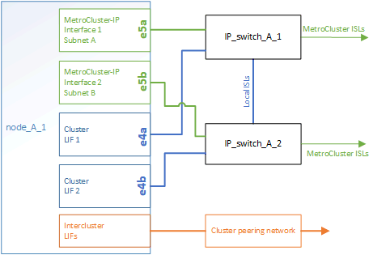

= Parti di una configurazione IP MetroCluster
:allow-uri-read: 
:icons: font
:imagesdir: ../media/

[role="lead"]
Durante la pianificazione della configurazione IP di MetroCluster, è necessario comprendere i componenti hardware e le modalità di interconnessione.

== Elementi hardware chiave

Una configurazione MetroCluster IP include i seguenti elementi hardware principali:

* Controller di storage
+
I controller di storage sono configurati come due cluster a due nodi.

* Rete IP
+
Questa rete IP back-end offre connettività per due utilizzi distinti:

+
** Connettività cluster standard per comunicazioni intra-cluster.
+
Si tratta della stessa funzionalità dello switch del cluster utilizzata nei cluster ONTAP con switch non MetroCluster.

** Connettività back-end MetroCluster per la replica dei dati di storage e della cache non volatile.

* Rete di peering del cluster
+
La rete di peering del cluster fornisce la connettività per il mirroring della configurazione del cluster, che include la configurazione di SVM (Storage Virtual Machine). La configurazione di tutte le SVM su un cluster viene sottoposta a mirroring sul cluster partner.

image::../media/mcc_ip_hardware_architecture_mcc_ip.gif[mcc ip hardware architecture mcc ip]

== Gruppi di disaster recovery (DR)

Una configurazione IP MetroCluster è costituita da un gruppo di DR composto da quattro nodi.

La figura seguente mostra l'organizzazione dei nodi in una configurazione MetroCluster a quattro nodi:

image::../media/mcc_dr_groups_4_node.gif[mcc dr raggruppa 4 nodi]

== Immagine delle coppie ha locali in una configurazione MetroCluster

Ogni sito MetroCluster è costituito da controller di storage configurati come coppia ha. Ciò consente la ridondanza locale in modo che, in caso di guasto di uno storage controller, il partner ha locale possa assumere il controllo. Tali guasti possono essere gestiti senza un'operazione di switchover MetroCluster.

Le operazioni di failover e giveback ha locale vengono eseguite con i comandi di failover dello storage, come una configurazione non MetroCluster.

image::../media/mcc_ip_hardware_architecture_ha_pairs.gif[coppie ha architettura hardware ip mcc]

.Informazioni correlate
https://docs.netapp.com/ontap-9/topic/com.netapp.doc.dot-cm-concepts/home.html["Concetti di ONTAP"]

== Immagine dell'IP MetroCluster e della rete di interconnessione del cluster

I cluster ONTAP in genere includono una rete di interconnessione cluster per il traffico tra i nodi del cluster. Nelle configurazioni MetroCluster IP, questa rete viene utilizzata anche per trasportare il traffico di replica dei dati tra i siti MetroCluster.

image::../media/mcc_ip_hardware_architecture_ip_interconnect.png[interconnessione ip con architettura hardware ip mcc]

Ogni nodo nella configurazione IP MetroCluster dispone di interfacce dedicate per la connessione alla rete IP back-end:

* Due interfacce IP MetroCluster
* Due interfacce cluster locali

La figura seguente mostra queste interfacce. L'utilizzo delle porte mostrato riguarda un sistema AFF A700 o FAS9000.

.Informazioni correlate
link:concept_considerations_mcip.html["Considerazioni per le configurazioni MetroCluster IP"]

== Immagine della rete di peering del cluster

I due cluster nella configurazione MetroCluster vengono peering tramite una rete di peering cluster fornita dal cliente. Il peering dei cluster supporta il mirroring sincrono delle macchine virtuali di storage (SVM, precedentemente noto come Vserver) tra i siti.

Le LIF di intercluster devono essere configurate su ciascun nodo della configurazione MetroCluster e i cluster devono essere configurati per il peering. Le porte con le LIF intercluster sono collegate alla rete di peering cluster fornita dal cliente. La replica della configurazione SVM viene eseguita su questa rete attraverso il Servizio di replica della configurazione.

image::../media/mcc_ip_hardware_architecture_cluster_peering_network.gif[rete di peering cluster con architettura hardware ip mcc]

.Informazioni correlate
http://docs.netapp.com/ontap-9/topic/com.netapp.doc.exp-clus-peer/home.html["Configurazione rapida del peering di cluster e SVM"]

link:concept_considerations_peering.html["Considerazioni per la configurazione del peering del cluster"]

link:task_cable_other_connections.html["Cablaggio delle connessioni di peering del cluster"]

link:task_sw_config_configure_clusters.html#peering-the-clusters["Peering dei cluster"]
