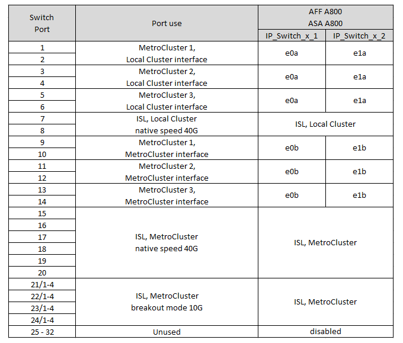

= Assegnazioni delle porte della piattaforma per switch Cisco 3132Q-V.
:allow-uri-read: 
:icons: font
:imagesdir: ../media/

[role="lead"]
L'utilizzo della porta in una configurazione IP MetroCluster dipende dal modello dello switch e dal tipo di piattaforma.

Prima di utilizzare le tabelle, rivedere le seguenti linee guida:

* Se si configura lo switch per la transizione da FC MetroCluster a IP, è possibile utilizzare la porta 5, la porta 6, la porta 13 o la porta 14 per connettere le interfacce del cluster locale del nodo FC MetroCluster. Fare riferimento a. link:https://mysupport.netapp.com/site/tools/tool-eula/rcffilegenerator["RcfFileGenerator"^] e i file di cablaggio generati per ulteriori dettagli sul cablaggio di questa configurazione. Per tutte le altre connessioni, è possibile utilizzare le assegnazioni di utilizzo delle porte elencate nelle tabelle.

== Scegliere la tabella di cablaggio corretta per la configurazione

Utilizzare la tabella seguente per determinare quale tabella di cablaggio seguire.

[cols="25,75"]
|===
| Se il sistema è... | Utilizzare questa tabella di cablaggio... 

 a| 
FAS2750, AFF A220
| <<table_1_cisco_3132q,Assegnazione delle porte della piattaforma Cisco 3132Q-V (gruppo 1)>> 

| FAS9000, AFF A700 | <<table_2_cisco_3132q,Assegnazione delle porte della piattaforma Cisco 3132Q-V (gruppo 2)>> 

| AFF A800, ASA A800 | <<table_3_cisco_3132q,Assegnazione delle porte della piattaforma Cisco 3132Q-V (gruppo 3)>> 
|===
.Assegnazione delle porte della piattaforma Cisco 3132Q-V (gruppo 1)
Esaminare le assegnazioni delle porte della piattaforma per collegare un sistema FAS2750 o AFF A220 a uno switch Cisco 3132Q-V:

image::../media/mcc-ip-cabling-a-fas2750-or-a220-to-a-cisco-3132q-v-switch.png[Mostra le assegnazioni delle porte della piattaforma Cisco 3132Q-V.]

.Assegnazione delle porte della piattaforma Cisco 3132Q-V (gruppo 2)
Esaminare le assegnazioni delle porte della piattaforma per collegare un sistema FAS9000 o AFF A700 a uno switch Cisco 3132Q-V:

image::../media/mcc-ip-cabling-a-fas9000-or-aff-a700-to-a-cisco-3132q-v-switch.png[Mostra le assegnazioni delle porte della piattaforma Cisco 3132Q-V.]

.Assegnazione delle porte della piattaforma Cisco 3132Q-V (gruppo 3)
Esaminare le assegnazioni delle porte della piattaforma per collegare un sistema AFF A800 o ASA A800 a uno switch Cisco 3132Q-V:

