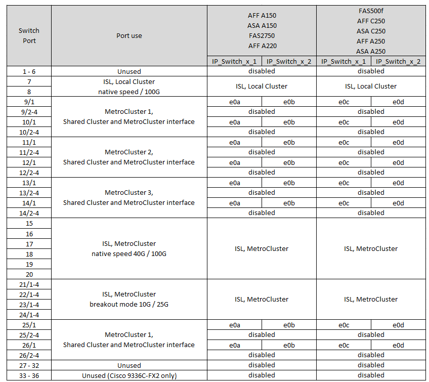

= Assegnazioni delle porte della piattaforma per switch Cisco 3232C o Cisco 9336C
:allow-uri-read: 
:icons: font
:imagesdir: ../media/

[role="lead"]
L'utilizzo della porta in una configurazione IP MetroCluster dipende dal modello dello switch e dal tipo di piattaforma.

Prima di utilizzare le tabelle di configurazione, fare riferimento alle seguenti considerazioni:

* Le seguenti tabelle mostrano l'utilizzo della porta per il sito A. Lo stesso cablaggio viene utilizzato per il sito B.
* Gli switch non possono essere configurati con porte di velocità diverse (ad esempio, una combinazione di porte da 100 Gbps e porte da 40 Gbps).
* Se si configura un singolo MetroCluster con gli switch, utilizzare il gruppo di porte *MetroCluster 1*.
+
Tenere traccia del gruppo di porte MetroCluster (MetroCluster 1, MetroCluster 2, MetroCluster 3 o MetroCluster 4). Sarà necessario quando si utilizza lo strumento RcfFileGenerator come descritto più avanti in questa procedura di configurazione.

* RcfFileGenerator per MetroCluster IP fornisce anche una panoramica del cablaggio per porta per ogni switch.
+
Utilizzare questa panoramica dei cavi per verificare il cablaggio.

* Il file RCF versione v2,10 o successiva è richiesto per la modalità breakout 25g per gli ISL MetroCluster.
* Per utilizzare una piattaforma diversa da FAS8200 o AFF 9.13.1 nel gruppo "MetroCluster 2,00" sono necessari ONTAP A300 o versioni successive e il file RCF versione 4.

NOTE: La versione del file RCF è diversa dalla versione dello strumento RCFfilegenerator utilizzato per generare il file. Ad esempio, è possibile generare un file RCF versione 2,00 utilizzando RCFfilegenerator v1,6c.

== Collegamento di due configurazioni MetroCluster agli switch

Quando si collegano più configurazioni MetroCluster a uno switch Cisco 3132Q-V, è necessario collegare ciascun MetroCluster in base alla tabella appropriata. Ad esempio, se si collegano FAS2750 e AFF A700 allo stesso switch Cisco 3132Q-V. Quindi, collegare il cavo FAS2750 come da "MetroCluster 1" nella Tabella 1 e il cavo AFF A700 come da "MetroCluster 2" o "MetroCluster 3" nella Tabella 2. Non è possibile collegare fisicamente FAS2750 e AFF A700 come "MetroCluster 1".

== Scegliere la tabella di cablaggio corretta per la configurazione

Utilizzare la tabella seguente per determinare quale tabella di cablaggio seguire.

[cols="2*"]
|===
| Se il sistema è... | Utilizzare questa tabella di cablaggio... 

| AFF A150, ASA A150, FAS2750, AFF A220 FAS500f, AFF C250, ASA C250, AFF A250, ASA A250 | <<table_1_cisco_3232c_9336c,Assegnazione delle porte della piattaforma Cisco 3232C o Cisco 9336C (gruppo 1)>> 

| AFF A20 | <<table_2_cisco_3232c_9336c,Assegnazione delle porte della piattaforma Cisco 3232C o Cisco 9336C (gruppo 2)>> 

| AFF A30, AFF C30 AFF C60 | <<table_3_cisco_3232c_9336c,Assegnazione delle porte della piattaforma Cisco 3232C o Cisco 9336C (gruppo 3)>> 

| FAS8200, AFF A300 | <<table_4_cisco_3232c_9336c,Assegnazione delle porte della piattaforma Cisco 3232C o Cisco 9336C (gruppo 4)>> 

| AFF A320 FAS8300, AFF C400, ASA C400, FAS8700 AFF A400, ASA A400 | <<table_5_cisco_3232c_9336c,Assegnazione delle porte della piattaforma Cisco 3232C o Cisco 9336C (gruppo 5)>> 

| AFF A50 | <<table_6_cisco_3232c_9336c,Assegnazione delle porte della piattaforma Cisco 3232C o Cisco 9336C (gruppo 6)>> 

| FAS9000, AFF A700 AFF C800, ASA C800, AFF A800, ASA A800 FAS9500, AFF A900, ASA A900 | <<table_7_cisco_3232c_9336c,Assegnazione delle porte della piattaforma Cisco 3232C o Cisco 9336C (gruppo 7)>> 

| FAS70, AFF A70 AFF C80 FAS90, AFF A90 AFF A1K | <<table_8_cisco_3232c_9336c,Assegnazione delle porte della piattaforma Cisco 3232C o Cisco 9336C (gruppo 8)>> 
|===
.Assegnazione delle porte della piattaforma Cisco 3232C o Cisco 9336C (gruppo 1)
Esaminare le assegnazioni delle porte della piattaforma per collegare un AFF A150, ASA A150, FAS2750, AFF A220, FAS500f, sistema AFF C250, ASA C250, AFF A250 o ASA A250 per uno switch Cisco 3232C o 9336C:

.Assegnazione delle porte della piattaforma Cisco 3232C o Cisco 9336C (gruppo 2)
Esaminare le assegnazioni delle porte della piattaforma per collegare un sistema AFF A20 a uno switch Cisco 3232C o 9336C: image:../media/mcc-ip-cabling-aff-a20-9161.png["Mostra le assegnazioni delle porte della piattaforma Cisco 3232C o Cisco 9336C"]

.Assegnazione delle porte della piattaforma Cisco 3232C o Cisco 9336C (gruppo 3)
Esaminare le assegnazioni delle porte della piattaforma per collegare un sistema AFF A30, AFF C30 o AFF C60 a uno switch Cisco 3232C o 9336C:

image:../media/mcc-ip-cabling-aff-a30-c30-c60-9161.png["Mostra le assegnazioni delle porte della piattaforma Cisco 3232C o Cisco 9336C"]

.Assegnazione delle porte della piattaforma Cisco 3232C o Cisco 9336C (gruppo 4)
Esaminare le assegnazioni delle porte della piattaforma per collegare un sistema FAS8200 o AFF A300 a uno switch Cisco 3232C o 9336C:

image::../media/mcc-ip-cabling-a-aff-a300-or-fas8200-to-a-cisco-3232c-or-cisco-9336c-switch-9161.png[Mostra le assegnazioni delle porte della piattaforma Cisco 3232C o Cisco 9336C]

Se si esegue l'aggiornamento da file RCF meno recenti, la configurazione del cablaggio potrebbe utilizzare porte nel gruppo "MetroCluster 4" (porte 25/26 e 29/30).

.Assegnazione delle porte della piattaforma Cisco 3232C o Cisco 9336C (gruppo 5)
Esaminare le assegnazioni delle porte della piattaforma per collegare un AFF A320, FAS8300, AFF C400, ASA C400, FAS8700, da sistema AFF A400 o ASA A400 a switch Cisco 3232C o 9336C:

image::../media/mcc_ip_cabling_a320_a400_cisco_3232C_or_9336c_switch.png[Mostra le assegnazioni delle porte della piattaforma Cisco 3232C o Cisco 9336C]

NOTE: L'uso delle porte nel gruppo "MetroCluster 4" richiede ONTAP 9.13.1 o versione successiva.

.Assegnazione delle porte della piattaforma Cisco 3232C o Cisco 9336C (gruppo 6)
Esaminare le assegnazioni delle porte della piattaforma per collegare un sistema AFF A50 a uno switch Cisco 3232C o 9336C:

image::../media/mcc-ip-cabling-aff-a50-cisco-3232c-9336c-9161.png[Mostra le assegnazioni delle porte della piattaforma Cisco 3232C o Cisco 9336C]

.Assegnazione delle porte della piattaforma Cisco 3232C o Cisco 9336C (gruppo 7)
Esaminare le assegnazioni delle porte della piattaforma per il cavo a FAS9000, AFF A700, AFF C800, ASA C800, AFF A800, sistema ASA A800, FAS9500, AFF A900 o ASA A900 a uno switch Cisco 3232C o 9336C:

*Nota 1*: Utilizzare le porte e4a e E4E o e4a e E8a se si utilizza un adattatore X91440A (40Gbps). Utilizzare le porte e4a e e4b o e4a e E8a se si utilizza un adattatore X91153A (100Gbps).

NOTE: L'uso delle porte nel gruppo "MetroCluster 4" richiede ONTAP 9.13.1 o versione successiva.

.Assegnazione delle porte della piattaforma Cisco 3232C o Cisco 9336C (gruppo 8)
Esaminare le assegnazioni delle porte della piattaforma per collegare un sistema AFF A70, FAS70, AFF C80, FAS90, AFF A90 o AFF A1K a uno switch Cisco 3232C o 9336C:

