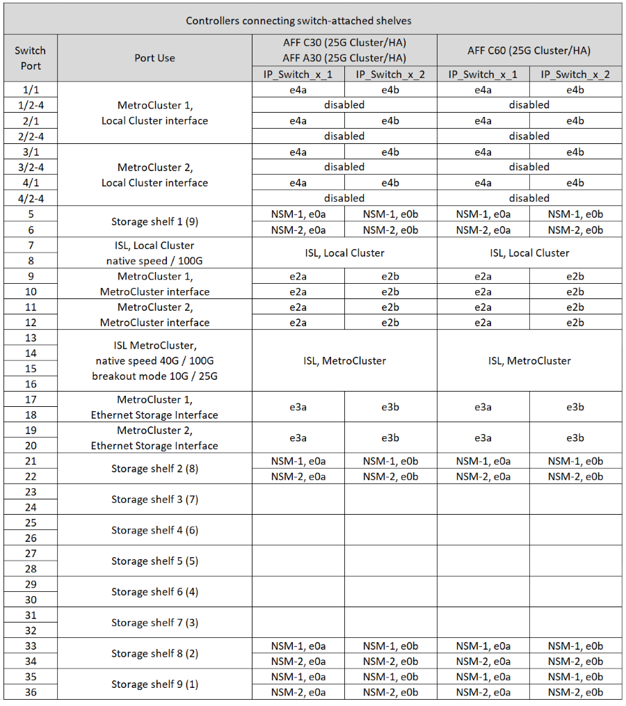
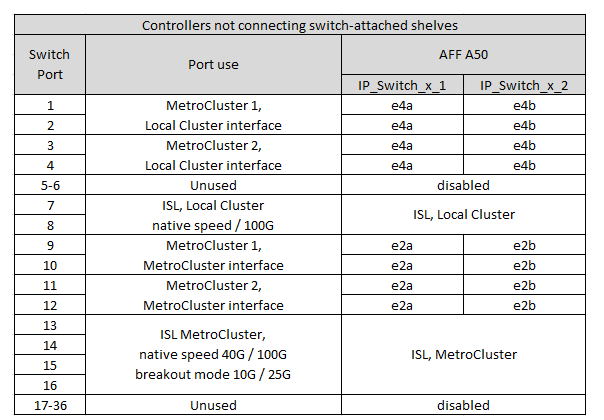
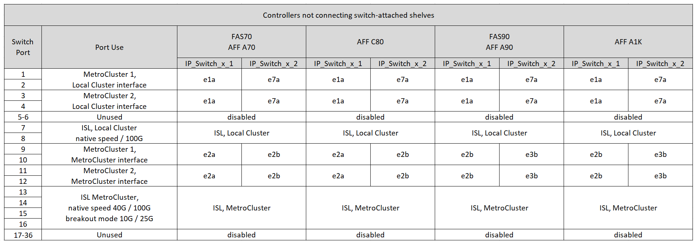

= Assegnazione delle porte della piattaforma per uno switch Cisco 9336C-FX2 che collega lo storage NS224
:allow-uri-read: 
:icons: font
:imagesdir: ../media/

[role="lead"]
L'utilizzo della porta in una configurazione IP MetroCluster dipende dal modello dello switch e dal tipo di piattaforma.

Prima di utilizzare le tabelle di configurazione, fare riferimento alle seguenti considerazioni:

* Quando si collega uno switch Cisco 9336C-FX2 allo storage NS224, è possibile avere al massimo due configurazioni MetroCluster o gruppi DR. Almeno una configurazione MetroCluster o un gruppo DR deve supportare NS224 shelf collegati allo switch. Le piattaforme che non supportano shelf NS224 con switch possono essere connesse solo come una seconda configurazione MetroCluster o come un secondo gruppo di DR.
+

CAUTION: Queste tabelle vengono utilizzate solo quando almeno una configurazione MetroCluster o un gruppo DR connette NS224 ripiani allo switch MetroCluster. Se si utilizzano switch di memorizzazione dedicati per collegare i ripiani NS224, collegare gli interruttori in base alle tabelle riportate nella link:port_usage_3232c_9336c.html["Assegnazioni delle porte della piattaforma per switch Cisco 3232C o Cisco 9336C-FX2"].

* RcfFileGenerator mostra solo le piattaforme idonee quando viene selezionata la prima piattaforma.
* La connessione di una configurazione MetroCluster a otto o due nodi richiede ONTAP 9.14.1 o versione successiva.

== Scegliere la tabella di cablaggio corretta per la configurazione

Consultare la tabella corretta di assegnazione delle porte per la configurazione in uso. In questa sezione sono presenti due serie di tabelle di cablaggio:

* <<tables_connecting_ns224,Tabelle di cablaggio per controller che collegano NS224 ripiani con interruttore>>
* <<tables_not_connecting_ns224,Tabelle di cablaggio per i controller che non collegano ripiani NS224 collegati a switch>>

=== Controller che collegano shelf NS224 collegati con switch

Determinare la tabella di assegnazione delle porte da seguire per i controller che collegano shelf NS224 collegati a switch.

[cols="25,75"]
|===
| Piattaforma | Utilizzare questa tabella di cablaggio... 

| AFF C30, AFF A30 AFF C60  a| 
La tabella seguente dipende dall'utilizzo di una scheda Ethernet 25g (gruppo 1a) o 100g (gruppo 1b).

* <<table_1a_cisco_9336c_fx2,Switch Cisco 9336C-FX2 per il collegamento delle NS224 assegnazioni delle porte della piattaforma di archiviazione (gruppo 1a - 25g)>>
* <<table_1b_cisco_9336c_fx2,Switch Cisco 9336C-FX2 per il collegamento delle NS224 assegnazioni delle porte della piattaforma di archiviazione (gruppo 1b - 100g)>>

| AFF A320 AFF C400, ASA C400 AFF A400, ASA A400 | <<table_2_cisco_9336c_fx2,Switch Cisco 9336C-FX2 per la connessione di NS224 assegnazioni delle porte della piattaforma di archiviazione (gruppo 2)>> 

| AFF A50 | <<table_3_cisco_9336c_fx2,Switch Cisco 9336C-FX2 per la connessione di NS224 assegnazioni delle porte della piattaforma di archiviazione (gruppo 3)>> 

| AFF A700 AFF C800, ASA C800, AFF A800 AFF A900, ASA A900 | <<table_4_cisco_9336c_fx2,Switch Cisco 9336C-FX2 per la connessione di NS224 assegnazioni delle porte della piattaforma di archiviazione (gruppo 4)>> 

| AFF A70 AFF C80 AFF A90 AFF A1K | <<table_5_cisco_9336c_fx2,Switch Cisco 9336C-FX2 per la connessione di NS224 assegnazioni delle porte della piattaforma di archiviazione (gruppo 5)>> 
|===
.Switch Cisco 9336C-FX2 per la connessione di NS224 assegnazioni delle porte della piattaforma di archiviazione (gruppo 1a)
Esaminare le assegnazioni delle porte della piattaforma per collegare un sistema AFF A30, AFF C30 o AFF C60 che sta collegando shelf NSS24 collegati a switch a uno switch Cisco 9336C-FX2 utilizzando una scheda Ethernet 25g a quattro porte.

NOTE: Questa configurazione richiede una scheda Ethernet 25g GB a quattro porte nello slot 4 per collegare il cluster locale e le interfacce ha.

.Switch Cisco 9336C-FX2 per la connessione di NS224 assegnazioni delle porte della piattaforma di archiviazione (gruppo 1b)
Esaminare le assegnazioni delle porte della piattaforma per collegare un sistema AFF A30, AFF C30 o AFF C60 che sta collegando shelf NSS24 collegati a switch a uno switch Cisco 9336C-FX2 utilizzando una scheda Ethernet 100g a due porte.

NOTE: Questa configurazione richiede una scheda Ethernet 100g GB a due porte nello slot 4 per collegare il cluster locale e le interfacce ha.

image:../media/mccip-cabling-greeley-connecting-a30-c30-fas50-c60-100G.png["Mostra lo switch Cisco 9336C-FX2 che collega le assegnazioni delle porte della piattaforma di archiviazione NS224"]

.Switch Cisco 9336C-FX2 per la connessione di NS224 assegnazioni delle porte della piattaforma di archiviazione (gruppo 2)
Esaminare l'assegnazione delle porte della piattaforma per collegare via cavo un sistema AFF A320, AFF C400, ASA C400, AFF A400 o ASA A400 che sta collegando shelf NSS24 collegati agli switch a uno switch Cisco 9336C-FX2:

image::../media/mcc_ip_cabling_a320_c400_a400_to_cisco_9336c_shared_switch.png[Mostra lo switch Cisco 9336C-FX2 che collega le assegnazioni delle porte della piattaforma di archiviazione NS224]

.Switch Cisco 9336C-FX2 per la connessione di NS224 assegnazioni delle porte della piattaforma di archiviazione (gruppo 3)
Esaminare le assegnazioni delle porte della piattaforma per collegare un sistema AFF A50 che collega shelf NSS24 collegati a switch a uno switch Cisco 9336C-FX2:

image:../media/mccip-cabling-greeley-connecting-a50-updated.png["Mostra lo switch Cisco 9336C-FX2 che collega le assegnazioni delle porte della piattaforma di archiviazione NS224"]

.Switch Cisco 9336C-FX2 per la connessione di NS224 assegnazioni delle porte della piattaforma di archiviazione (gruppo 4)
Esaminare l'assegnazione delle porte della piattaforma per collegare via cavo un sistema AFF A700, AFF C800, ASA C800, AFF A800, AFF A900 o ASA A900 che sta collegando shelf NSS24 collegati a switch a uno switch Cisco 9336C-FX2:

image:../media/mcc_ip_cabling_a700_c800_a800_a900_to_cisco_9336c_shared_switch.png["Mostra lo switch Cisco 9336C-FX2 che collega le assegnazioni delle porte della piattaforma di archiviazione NS224"]

*Nota 1*: Utilizzare le porte e4a e E4E o e4a e E8a se si utilizza un adattatore X91440A (40Gbps). Utilizzare le porte e4a e e4b o e4a e E8a se si utilizza un adattatore X91153A (100Gbps).

.Switch Cisco 9336C-FX2 per la connessione di NS224 assegnazioni delle porte della piattaforma di archiviazione (gruppo 5)
Esaminare l'assegnazione delle porte della piattaforma per collegare via cavo un sistema AFF A70, AFF C80, AFF A90 o AFF A1K che sta collegando shelf NSS24 collegati a switch a uno switch Cisco 9336C-FX2:

image::../media/mccip-cabling-greeley-connecting-a70-c80-a-90-fas90-a1k.png[Mostra lo switch Cisco 9336C-FX2 che collega le assegnazioni delle porte della piattaforma di archiviazione NS224]

=== I controller non collegano shelf NS224 collegati con switch

Determinare la tabella di assegnazione delle porte da seguire per i controller che non collegano shelf NS224 collegati a switch.

[cols="25,75"]
|===
| Piattaforma | Utilizzare questa tabella di cablaggio... 

| AFF A150, ASA A150 FAS2750, AFF A220 | <<table_6_cisco_9336c_fx2,Lo switch Cisco 9336C-FX2 non connette le assegnazioni delle porte della piattaforma di archiviazione NS224 (gruppo 6)>> 

| AFF A20 | <<table_7_cisco_9336c_fx2,Lo switch Cisco 9336C-FX2 non connette le assegnazioni delle porte della piattaforma di archiviazione NS224 (gruppo 7)>> 

| FAS500f AFF C250, ASA C250 AFF A250, ASA A250 | <<table_8_cisco_9336c_fx2,Lo switch Cisco 9336C-FX2 non connette le assegnazioni delle porte della piattaforma di archiviazione NS224 (gruppo 8)>> 

| AFF C30, AFF A30 FAS50 AFF C60  a| 
La tabella seguente dipende dall'utilizzo di una scheda Ethernet 25g (gruppo 9a) o 100g (gruppo 9b).

* <<table_9a_cisco_9336c_fx2,Lo switch Cisco 9336C-FX2 non connette le assegnazioni delle porte della piattaforma di archiviazione NS224 (gruppo 9a)>>
* <<table_9b_cisco_9336c_fx2,Lo switch Cisco 9336C-FX2 non connette le assegnazioni delle porte della piattaforma di archiviazione NS224 (gruppo 9b)>>

| FAS8200, AFF A300 | <<table_10_cisco_9336c_fx2,Lo switch Cisco 9336C-FX2 non connette le assegnazioni delle porte della piattaforma di archiviazione NS224 (gruppo 10)>> 

| AFF A320 FAS8300, AFF C400, ASA C400, FAS8700 AFF A400, ASA A400 | <<table_11_cisco_9336c_fx2,Lo switch Cisco 9336C-FX2 non connette le assegnazioni delle porte della piattaforma di archiviazione NS224 (gruppo 11)>> 

| AFF A50 | <<table_12_cisco_9336c_fx2,Lo switch Cisco 9336C-FX2 non connette le assegnazioni delle porte della piattaforma di archiviazione NS224 (gruppo 12)>> 

| FAS9000, AFF A700 AFF C800, ASA C800, AFF A800, ASA A800 FAS9500, AFF A900, ASA A900 | <<table_13_cisco_9336c_fx2,Lo switch Cisco 9336C-FX2 non connette le assegnazioni delle porte della piattaforma di archiviazione NS224 (gruppo 13)>> 

| FAS70, AFF A70 AFF C80 FAS90, AFF A90 AFF A1K | <<table_14_cisco_9336c_fx2,Lo switch Cisco 9336C-FX2 non connette le assegnazioni delle porte della piattaforma di archiviazione NS224 (gruppo 14)>> 
|===
.Lo switch Cisco 9336C-FX2 non connette le assegnazioni delle porte della piattaforma di archiviazione NS224 (gruppo 6)
Esaminare le assegnazioni delle porte della piattaforma per collegare un sistema AFF A150, ASA A150, FAS2750 o AFF A220 che non connette shelf NSS24 collegati a switch a uno switch Cisco 9336C-FX2:

image::../media/mcc-ip-cabling-a-aff-a150-asa-a150-fas2750-aff-a220-to-a-cisco-9336c-shared-switch.png[Indica che lo switch Cisco 9336C-FX2 non connette le assegnazioni delle porte della piattaforma di archiviazione NS224]

.Lo switch Cisco 9336C-FX2 non connette le assegnazioni delle porte della piattaforma di archiviazione NS224 (gruppo 7)
Esaminare le assegnazioni delle porte della piattaforma per collegare un sistema AFF A20 che non connette shelf NSS24 collegati a switch a uno switch Cisco 9336C-FX2:

image:../media/mcc-ip-aff-a20-to-a-cisco-9336c-shared-switch-not-connecting.png["Indica che lo switch Cisco 9336C-FX2 non connette le assegnazioni delle porte della piattaforma di archiviazione NS224"]

.Lo switch Cisco 9336C-FX2 non connette le assegnazioni delle porte della piattaforma di archiviazione NS224 (gruppo 8)
Esaminare le assegnazioni delle porte della piattaforma per collegare un sistema FAS500f, AFF C250, ASA C250, AFF A250 o ASA A250 che non connette shelf NSS24 collegati a switch a uno switch Cisco 9336C-FX2:

image::../media/mcc-ip-cabling-c250-asa-c250-a250-asa-a250-to-cisco-9336c-shared-switch.png[Indica che lo switch Cisco 9336C-FX2 non connette le assegnazioni delle porte della piattaforma di archiviazione NS224]

.Lo switch Cisco 9336C-FX2 non connette le assegnazioni delle porte della piattaforma di archiviazione NS224 (gruppo 9a)
Esaminare le assegnazioni delle porte della piattaforma per collegare un sistema AFF A30, AFF C30, AFF C60 o FAS50 che non connette shelf NSS24 collegati a switch a uno switch Cisco 9336C-FX2 utilizzando una scheda Ethernet 25g a quattro porte:

NOTE: Questa configurazione richiede una scheda Ethernet 25g GB a quattro porte nello slot 4 per collegare il cluster locale e le interfacce ha.

image:../media/mccip-cabling-greeley-not-connecting-a30-c30-fas50-c60-25G.png["Indica che lo switch Cisco 9336C-FX2 non connette le assegnazioni delle porte della piattaforma di archiviazione NS224"]

.Lo switch Cisco 9336C-FX2 non connette le assegnazioni delle porte della piattaforma di archiviazione NS224 (gruppo 9b)
Esaminare le assegnazioni delle porte della piattaforma per collegare un sistema AFF A30, AFF C30, AFF C60 o FAS50 che non connette shelf NSS24 collegati a switch a uno switch Cisco 9336C-FX2 utilizzando una scheda Ethernet 100g a due porte:

NOTE: Questa configurazione richiede una scheda Ethernet 100g GB a due porte nello slot 4 per collegare il cluster locale e le interfacce ha.

image:../media/mccip-cabling-greeley-not-connecting-a30-c30-fas50-c60-100G.png["Mostra lo switch Cisco 9336C-FX2 che collega le assegnazioni delle porte della piattaforma di archiviazione NS224"]

.Lo switch Cisco 9336C-FX2 non connette le assegnazioni delle porte della piattaforma di archiviazione NS224 (gruppo 10)
Esaminare le assegnazioni delle porte della piattaforma per collegare un sistema FAS8200 o AFF A300 che non connette shelf NSS24 collegati a switch a uno switch Cisco 9336C-FX2:

image::../media/mcc-ip-cabling-fas8200-affa300-to-cisco-9336c-shared-switch.png[Mostra lo switch Cisco 9336C-FX2 che collega le assegnazioni delle porte della piattaforma di archiviazione NS224]

.Lo switch Cisco 9336C-FX2 non connette le assegnazioni delle porte della piattaforma di archiviazione NS224 (gruppo 11)
Esaminare le assegnazioni delle porte della piattaforma per collegare un sistema AFF A320, FAS8300, AFF C400, ASA C400, FAS8700, AFF A400 o ASA A400 che non connette shelf NSS24 collegati a switch a uno switch Cisco 9336C-FX2:

image::../media/mcc_ip_cabling_a320_fas8300_a400_fas8700_to_a_cisco_9336c_shared_switch.png[Indica che lo switch Cisco 9336C-FX2 non connette le assegnazioni delle porte della piattaforma di archiviazione NS224]

.Lo switch Cisco 9336C-FX2 non connette le assegnazioni delle porte della piattaforma di archiviazione NS224 (gruppo 12)
Esaminare le assegnazioni delle porte della piattaforma per collegare un sistema AFF A50 che non connette shelf NSS24 collegati a switch a uno switch Cisco 9336C-FX2:

.Lo switch Cisco 9336C-FX2 non connette le assegnazioni delle porte della piattaforma di archiviazione NS224 (gruppo 13)
Esaminare le assegnazioni delle porte della piattaforma per collegare un sistema FAS9000, AFF A700, AFF C800, ASA C800, AFF A800, ASA A800, FAS9500, AFF A900 o ASA A900 che non connette shelf NSS24 collegati a switch a uno switch Cisco 9336C-FX2:

image::../media/mcc_ip_cabling_a700_a800_fas9000_fas9500_to_cisco_9336c_shared_switch.png[Indica che lo switch Cisco 9336C-FX2 non connette le assegnazioni delle porte della piattaforma di archiviazione NS224]

*Nota 1*: Utilizzare le porte e4a e E4E o e4a e E8a se si utilizza un adattatore X91440A (40Gbps). Utilizzare le porte e4a e e4b o e4a e E8a se si utilizza un adattatore X91153A (100Gbps).

.Lo switch Cisco 9336C-FX2 non connette le assegnazioni delle porte della piattaforma di archiviazione NS224 (gruppo 14)
Esaminare le assegnazioni delle porte della piattaforma per collegare un sistema AFF A70, FAS70, AFF C80, FAS90, AFF A90 o AFF A1K che non connette shelf NSS24 collegati a switch a uno switch Cisco 9336C-FX2:

