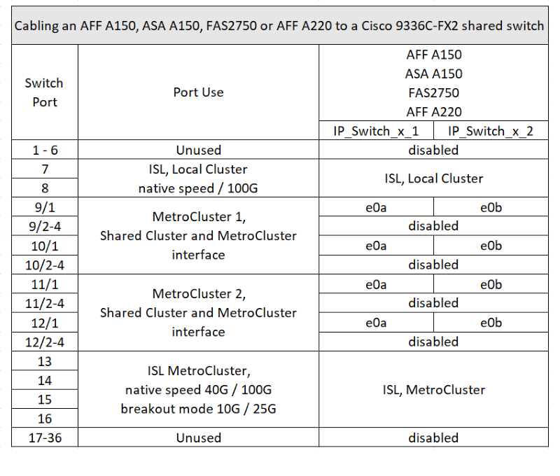
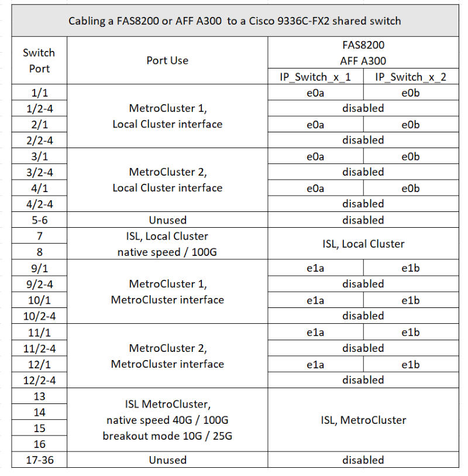

= Assegnazione delle porte della piattaforma per uno switch condiviso Cisco 9336C-FX2
:allow-uri-read: 
:icons: font
:imagesdir: ../media/

[role="lead"]
L'utilizzo della porta in una configurazione IP MetroCluster dipende dal modello dello switch e dal tipo di piattaforma.

Esaminare queste considerazioni prima di utilizzare le tabelle:

* Almeno una configurazione MetroCluster o un gruppo di DR deve supportare gli shelf NS224 collegati con switch.
* Le piattaforme che non supportano shelf NS224 con switch possono essere connesse solo come una seconda configurazione MetroCluster o come un secondo gruppo di DR.
* RcfFileGenerator mostra solo le piattaforme idonee quando viene selezionata la prima piattaforma.
* La connessione di una configurazione MetroCluster a otto o due nodi richiede ONTAP 9.14.1 o versione successiva.

== Collegamento di un AFF A320, AFF C400, ASA C400, AFF A400, ASA A400, AFF A700, AFF C800, ASA C800, AFF A800, AFF A900, o dal sistema ASA A900 a uno switch condiviso Cisco 9336C-FX2

image::../media/mcc_ip_cabling_a320_c400_a400_a700_c800_a800_a900_to_cisco_9336c_shared_switch.png[cablaggio ip da mcc a320 c400 a400 a700 c800 a800 a900 a switch condiviso cisco 9336c]

*Nota 1*: Se si utilizza un adattatore X91440A (40Gbps), utilizzare le porte e4a e E4E o e4a e E8a. Se si utilizza un adattatore X91153A (100Gbps), utilizzare le porte e4a e e4b o e4a e E8a.

== Collegamento di un sistema AFF A150, ASA A150, FAS2750 o AFF A220 a uno switch condiviso Cisco 9336C-FX2

== Collegamento di un sistema FAS500f, AFF C250, ASA C250, AFF A250 o ASA A250 a uno switch condiviso Cisco 9336C-FX2

image::../media/mcc_ip_cabling_c250_asa_c250_a250_asa_a250_to_cisco_9336c_shared_switch.png[cablaggio ip mcc c250 ASA c250 a250 ASA a250 a switch condiviso cisco 9336c]

== Collegamento di un sistema FAS8200 o AFF A300 a uno switch condiviso Cisco 9336C-FX2

== Collegamento di un sistema FAS8300, FAS8700, FAS9000 o FAS9500 a uno switch condiviso Cisco 9336C-FX2

image::../media/mcc_ip_cabling_fas8300_fas8700_fas9000_fas9500_to_cisco_9336c_shared_switch.png[cablaggio ip da mcc fas8300 fas8700 fas9000 fas9500 a switch condiviso cisco 9336c]

*Nota 1*: Se si utilizza un adattatore X91440A (40Gbps), utilizzare le porte e4a e E4E o e4a e E8a. Se si utilizza un adattatore X91153A (100Gbps), utilizzare le porte e4a e e4b o e4a e E8a.
