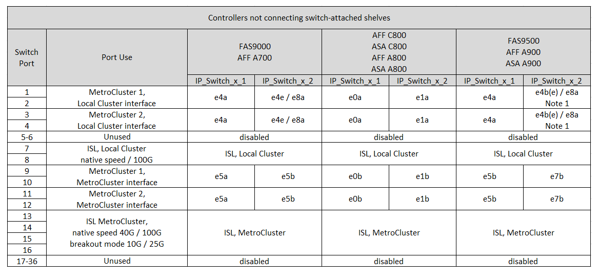

= Assegnazione delle porte della piattaforma per uno switch condiviso Cisco 9336C-FX2
:allow-uri-read: 
:icons: font
:imagesdir: ../media/

[role="lead"]
L'utilizzo della porta in una configurazione IP MetroCluster dipende dal modello dello switch e dal tipo di piattaforma.

Prima di utilizzare le tabelle di configurazione, fare riferimento alle seguenti considerazioni:

* Almeno una configurazione MetroCluster o un gruppo di DR deve supportare shelf NS224 collegati agli switch.
* Le piattaforme che non supportano shelf NS224 con switch possono essere connesse solo come una seconda configurazione MetroCluster o come un secondo gruppo di DR.
* RcfFileGenerator mostra solo le piattaforme idonee quando viene selezionata la prima piattaforma.
* La connessione di una configurazione MetroCluster a otto o due nodi richiede ONTAP 9.14.1 o versione successiva.

== Scegliere la tabella di cablaggio corretta per la configurazione

Consultare la tabella corretta di assegnazione delle porte per la configurazione in uso. In questa sezione sono presenti due serie di tabelle di cablaggio:

* <<tables_connecting_ns224,Tabelle di cablaggio per controller che si collegano a ripiani NS224 collegati allo switch>>
* <<tables_not_connecting_ns224,Tabelle di cablaggio per i controller che non si collegano ai ripiani NS224 collegati allo switch>>

=== Controller che si collegano a shelf NS224 collegati allo switch

Determinare la tabella di assegnazione delle porte da seguire per i controller che si collegano agli shelf NS224 collegati agli switch.

[cols="2*"]
|===
| Piattaforma | Utilizzare questa tabella di cablaggio... 

| AFF C30, AFF A30 AFF C60 | <<table_1_cisco_9336c_fx2,Assegnazione delle porte della piattaforma switch condivisa Cisco 9336C-FX2 (gruppo 1)>> 

| AFF A320 AFF C400, ASA C400 AFF A400, ASA A400 | <<table_2_cisco_9336c_fx2,Assegnazione delle porte della piattaforma switch condivisa Cisco 9336C-FX2 (gruppo 2)>> 

| AFF A50 | <<table_3_cisco_9336c_fx2,Assegnazione delle porte della piattaforma switch condivisa Cisco 9336C-FX2 (gruppo 3)>> 

| AFF A700 AFF C800, ASA C800, AFF A800 AFF A900, ASA A900 | <<table_4_cisco_9336c_fx2,Assegnazione delle porte della piattaforma switch condivisa Cisco 9336C-FX2 (gruppo 4)>> 

| AFF A70 AFF C80 AFF A90 AFF A1K | <<table_5_cisco_9336c_fx2,Assegnazione delle porte della piattaforma switch condivisa Cisco 9336C-FX2 (gruppo 5)>> 
|===
.Assegnazione delle porte della piattaforma switch condivisa Cisco 9336C-FX2 (gruppo 1)
Esaminare le assegnazioni delle porte della piattaforma per collegare un sistema AFF C30, AFF A30 o AFF C60 che sta collegando shelf NSS24 collegati a switch a uno switch condiviso Cisco 9336C-FX2:

image::../media/mcc-ip-affa30-c30-c60-cisco-9336fx2-switch-attached.png[Mostra le assegnazioni delle porte della piattaforma switch condivisa Cisco 9336C-FX2]

.Assegnazione delle porte della piattaforma switch condivisa Cisco 9336C-FX2 (gruppo 2)
Esaminare le assegnazioni delle porte della piattaforma per collegare un sistema AFF A320, AFF C400, ASA C400, AFF A400 o ASA A400 che collega shelf NSS24 collegati a switch a uno switch condiviso Cisco 9336C-FX2:

image::../media/mcc_ip_cabling_a320_c400_a400_to_cisco_9336c_shared_switch.png[Mostra le assegnazioni delle porte della piattaforma switch condivisa Cisco 9336C-FX2]

.Assegnazione delle porte della piattaforma switch condivisa Cisco 9336C-FX2 (gruppo 3)
Esaminare le assegnazioni delle porte della piattaforma per collegare un sistema AFF A50 che collega shelf NSS24 collegati a switch a uno switch condiviso Cisco 9336C-FX2:

image:../media/mcc-ip-cabling-aff-a50-cisco-9336fx2-switch-attached.png["Mostra le assegnazioni delle porte della piattaforma switch condivisa Cisco 9336C-FX2"]

.Assegnazione delle porte della piattaforma switch condivisa Cisco 9336C-FX2 (gruppo 4)
Esaminare le assegnazioni delle porte della piattaforma per collegare un AFF A700, AFF C800, ASA C800, AFF A800, AFF A900, o ASA A900 che connette shelf da NSS24 collegati a switch a uno switch condiviso Cisco 9336C-FX2:

image:../media/mcc_ip_cabling_a700_c800_a800_a900_to_cisco_9336c_shared_switch.png["Mostra le assegnazioni delle porte della piattaforma switch condivisa Cisco 9336C-FX2"]

*Nota 1*: Utilizzare le porte e4a e E4E o e4a e E8a se si utilizza un adattatore X91440A (40Gbps). Utilizzare le porte e4a e e4b o e4a e E8a se si utilizza un adattatore X91153A (100Gbps).

.Assegnazione delle porte della piattaforma switch condivisa Cisco 9336C-FX2 (gruppo 5)
Esaminare l'assegnazione delle porte della piattaforma per collegare un sistema AFF A70, AFF C80, AFF A90 o AFF A1K che sta collegando shelf NSS24 collegati a switch a uno switch condiviso Cisco 9336C-FX2:

image::../media/mcc-ip-cabling-a70-c80-a90-a1k-to-cisco-9336c-shared-switch-updated.png[Mostra le assegnazioni delle porte della piattaforma switch condivisa Cisco 9336C-FX2]

=== I controller non si connettono a shelf NS224 collegati con switch

Determinare la tabella di assegnazione delle porte da seguire per i controller che non si collegano agli shelf NS224 collegati agli switch.

[cols="2*"]
|===
| Piattaforma | Utilizzare questa tabella di cablaggio... 

| AFF A150, ASA A150 FAS2750, AFF A220 | <<table_6_cisco_9336c_fx2,Assegnazione delle porte della piattaforma switch condivisa Cisco 9336C-FX2 (gruppo 6)>> 

| AFF A20 | <<table_7_cisco_9336c_fx2,Assegnazione delle porte della piattaforma switch condivisa Cisco 9336C-FX2 (gruppo 7)>> 

| FAS500f AFF C250, ASA C250 AFF A250, ASA A250 | <<table_8_cisco_9336c_fx2,Assegnazione delle porte della piattaforma switch condivisa Cisco 9336C-FX2 (gruppo 8)>> 

| AFF C30, AFF A30 AFF C60 | <<table_9_cisco_9336c_fx2,Assegnazione delle porte della piattaforma switch condivisa Cisco 9336C-FX2 (gruppo 9)>> 

| FAS8200, AFF A300 | <<table_10_cisco_9336c_fx2,Assegnazione delle porte della piattaforma switch condivisa Cisco 9336C-FX2 (gruppo 10)>> 

| AFF A320 FAS8300, AFF C400, ASA C400, FAS8700 AFF A400, ASA A400 | <<table_11_cisco_9336c_fx2,Assegnazione delle porte della piattaforma switch condivisa Cisco 9336C-FX2 (gruppo 11)>> 

| AFF A50 | <<table_12_cisco_9336c_fx2,Assegnazione delle porte della piattaforma switch condivisa Cisco 9336C-FX2 (gruppo 12)>> 

| FAS9000, AFF A700 AFF C800, ASA C800, AFF A800, ASA A800 FAS9500, AFF A900, ASA A900 | <<table_13_cisco_9336c_fx2,Assegnazione delle porte della piattaforma switch condivisa Cisco 9336C-FX2 (gruppo 13)>> 

| FAS70, AFF A70 AFF C80 FAS90, AFF A90 AFF A1K | <<table_14_cisco_9336c_fx2,Assegnazione delle porte della piattaforma switch condivisa Cisco 9336C-FX2 (gruppo 14)>> 
|===
.Assegnazione delle porte della piattaforma switch condivisa Cisco 9336C-FX2 (gruppo 6)
Esaminare le assegnazioni delle porte della piattaforma per collegare un sistema AFF A150, ASA A150, FAS2750 o AFF A220 che non connette shelf NSS24 collegati a switch a uno switch condiviso Cisco 9336C-FX2:

image::../media/mcc-ip-cabling-a-aff-a150-asa-a150-fas2750-aff-a220-to-a-cisco-9336c-shared-switch.png[Mostra le assegnazioni delle porte della piattaforma switch condivisa Cisco 9336C-FX2]

.Assegnazione delle porte della piattaforma switch condivisa Cisco 9336C-FX2 (gruppo 7)
Esaminare le assegnazioni delle porte della piattaforma per collegare un sistema AFF A20 che non connette shelf NSS24 collegati a switch a uno switch condiviso Cisco 9336C-FX2:

image:../media/mcc-ip-aff-a20-to-a-cisco-9336c-shared-switch-not-connecting.png["Mostra le assegnazioni delle porte della piattaforma switch condivisa Cisco 9336C-FX2"]

.Assegnazione delle porte della piattaforma switch condivisa Cisco 9336C-FX2 (gruppo 8)
Esaminare le assegnazioni delle porte della piattaforma per collegare un sistema FAS500f, AFF C250, ASA C250, AFF A250 o ASA A250 che non connette shelf NSS24 collegati a switch a uno switch condiviso Cisco 9336C-FX2:

image::../media/mcc-ip-cabling-c250-asa-c250-a250-asa-a250-to-cisco-9336c-shared-switch.png[Mostra le assegnazioni delle porte della piattaforma switch condivisa Cisco 9336C-FX2]

.Assegnazione delle porte della piattaforma switch condivisa Cisco 9336C-FX2 (gruppo 9)
Esaminare le assegnazioni delle porte della piattaforma per collegare un sistema AFF A30, AFF C30 o AFF C60 che non connette shelf NSS24 collegati a switch a uno switch condiviso Cisco 9336C-FX2:

image:../media/mcc-ip-cabling-affa30-c30-c60a-cisco-9336c-shared-switch-not-connecting.png["Mostra le assegnazioni delle porte della piattaforma switch condivisa Cisco 9336C-FX2"]

.Assegnazione delle porte della piattaforma switch condivisa Cisco 9336C-FX2 (gruppo 10)
Esaminare le assegnazioni delle porte della piattaforma per collegare un sistema FAS8200 o AFF A300 che non connette shelf NSS24 collegati a switch a uno switch condiviso Cisco 9336C-FX2:

image::../media/mcc-ip-cabling-fas8200-affa300-to-cisco-9336c-shared-switch.png[Mostra le assegnazioni delle porte della piattaforma switch condivisa Cisco 9336C-FX2]

.Assegnazione delle porte della piattaforma switch condivisa Cisco 9336C-FX2 (gruppo 11)
Esaminare le assegnazioni delle porte della piattaforma per collegare un AFF A320, FAS8300, AFF C400, ASA C400, FAS8700, sistema AFF A400 o ASA A400 che non connette shelf NSS24 collegati a switch a uno switch condiviso Cisco 9336C-FX2:

image::../media/mcc_ip_cabling_a320_fas8300_a400_fas8700_to_a_cisco_9336c_shared_switch.png[Mostra le assegnazioni delle porte della piattaforma switch condivisa Cisco 9336C-FX2]

.Assegnazione delle porte della piattaforma switch condivisa Cisco 9336C-FX2 (gruppo 12)
Esaminare le assegnazioni delle porte della piattaforma per collegare un sistema AFF A50 che non connette shelf NSS24 collegati a switch a uno switch condiviso Cisco 9336C-FX2:

image::../media/mcc-ip-cabling-aff-a50-cisco-9336c-shared-switch-not-connecting.png[Mostra le assegnazioni delle porte della piattaforma switch condivisa Cisco 9336C-FX2]

.Assegnazione delle porte della piattaforma switch condivisa Cisco 9336C-FX2 (gruppo 13)
Esaminare le assegnazioni delle porte della piattaforma per il cavo a FAS9000, AFF A700, AFF C800, ASA C800, AFF A800, sistema ASA A800, FAS9500, AFF A900 o ASA A900 che non connette shelf NSS24 switch-attached a uno switch condiviso Cisco 9336C-FX2:

*Nota 1*: Utilizzare le porte e4a e E4E o e4a e E8a se si utilizza un adattatore X91440A (40Gbps). Utilizzare le porte e4a e e4b o e4a e E8a se si utilizza un adattatore X91153A (100Gbps).

.Assegnazione delle porte della piattaforma switch condivisa Cisco 9336C-FX2 (gruppo 14)
Esaminare le assegnazioni delle porte della piattaforma per collegare un sistema AFF A70, FAS70, AFF C80, FAS90, AFF A90 o AFF A1K che non connette shelf NSS24 collegati a switch a uno switch condiviso Cisco 9336C-FX2:

image::../media/mcc-ip-cabling-aff-a70-fas70-c80-fas90-a90-a1k-cisco-9336c-shared-switch-not-connecting-updated.png[Mostra le assegnazioni delle porte della piattaforma switch condivisa Cisco 9336C-FX2]
