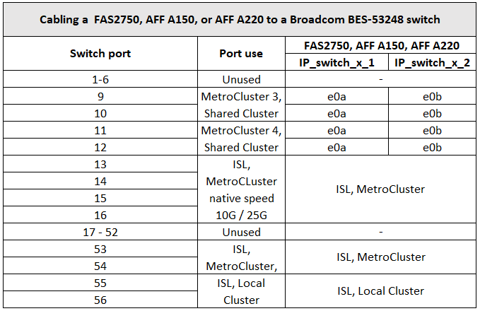
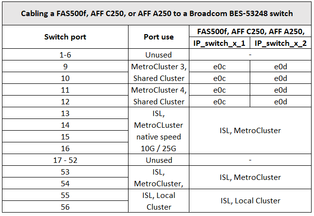

= Assegnazioni delle porte della piattaforma per gli switch IP BES-53248 supportati da Broadcom
:allow-uri-read: 
:icons: font
:imagesdir: ../media/

[role="lead"]
L'utilizzo della porta in una configurazione IP MetroCluster dipende dal modello dello switch e dal tipo di piattaforma.

Gli switch non possono essere utilizzati con porte ISL remote di velocità diverse (ad esempio, una porta da 25 Gbps collegata a una porta ISL da 10 Gbps).

.Note per le tabelle seguenti:
. Per alcune piattaforme, è possibile utilizzare le porte 49 - 54 per le connessioni di interfaccia MetroCluster o MetroCluster.
+
Queste porte richiedono una licenza aggiuntiva.

. È possibile collegare allo switch solo un singolo MetroCluster a quattro nodi con sistemi AFF A320.
+
Le funzionalità che richiedono un cluster con switch non sono supportate in questa configurazione, incluse le procedure di transizione da MetroCluster FC a IP e di aggiornamento tecnico.

. I sistemi AFF A320 configurati con switch Broadcom BES-53248 potrebbero non supportare tutte le funzioni.
+
Qualsiasi configurazione o funzione che richieda la connessione delle connessioni cluster locali a uno switch non è supportata. Ad esempio, le seguenti configurazioni e procedure non sono supportate:

+
** Configurazioni MetroCluster a otto nodi
** Transizione da configurazioni MetroCluster FC a MetroCluster IP
** Aggiornamento di una configurazione MetroCluster IP a quattro nodi (ONTAP 9.8 e versioni successive)

. Se si collegano due configurazioni MetroCluster e entrambe utilizzano lo stesso tipo di controller, è necessario utilizzare i gruppi di porte MetroCluster 3 e 4. Se i controller sono diversi, è necessario utilizzare i gruppi di porte MetroCluster 3 e 4 per un tipo e i gruppi di porte MetroCluster 1 e 2 per l'altro.
+
** Ad esempio, se ci si connette:
+
*** Due configurazioni MetroCluster costituite solo da FAS2750/AFF A220 o solo da FAS500f/AFF A250, è necessario selezionare i gruppi di porte MetroCluster 3 e 4.
*** Due configurazioni MetroCluster in cui una MetroCluster è di tipo FAS2750/AFF A220 e l'altra è FAS500f/AFF A250, è necessario selezionare i gruppi di porte 3 e 4 per uno e i gruppi di porte 1 e 2 per l'altro. In https://mysupport.netapp.com/site/tools/tool-eula/rcffilegenerator["RcfFileGenerator per MetroCluster IP"]i campi a discesa 1 e 2 vengono compilati solo con la piattaforma supportata dopo aver selezionato le piattaforme nei campi a discesa 3 e 4. Fare riferimento a. link:../install-ip/using_rcf_generator.html["Utilizzo delle tabelle delle porte con lo strumento RcfFileGenerator o di più configurazioni MetroCluster"] per ulteriori informazioni sull'utilizzo delle tabelle delle porte.

== Utilizzo della porta dello switch per i sistemi FAS2750, AFF 150 o AFF A220

== Utilizzo della porta dello switch per i sistemi FAS500f, AFF C250 o AFF A250

== Utilizzo della porta dello switch per l'utilizzo combinato di AFF A150, FAS2750, AFF A220 e FAS500f o AFF C250, O sistemi AFF A250

image::../media/mcc_ip_cabling_aff_a250_and_ a220_to_a_broadcom_bes_53248_switch.png[mcc ip cabling AFF a250 e a220 a uno switch broadcom bes 53248]

== Utilizzo della porta dello switch per i sistemi FAS8200 o AFF A300

image::../media/mcc_ip_cabling_a_aff_a300_or_fas8200_to_a_broadcom_bes_53248_switch.png[mcc ip che consente di collegare un AFF a300 o fas8200 a uno switch broadcom bes 53248]

image::../media/mcc_ip_cabling_a_aff_a320_to_a_broadcom_bes_53248_switch.png[mcc ip che consente di collegare un AFF a320 a uno switch broadcom bes 53248]

== Utilizzo della porta dello switch per i sistemi FAS8300, AFF C400, AFF A400 o FAS8700

image::../media/mcc_ip_cabling_a_fas8300_a400_or_fas8700_to_a_broadcom_bes_53248_switch.png[mcc ip che consente di collegare un a400 fas8300 o fas8700 a uno switch broadcom bes 53248]
