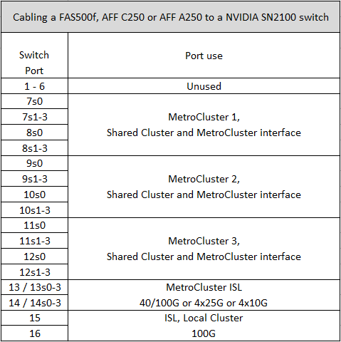

= Assegnazioni delle porte della piattaforma per gli switch IP SN2100 supportati da NVIDIA
:allow-uri-read: 
:icons: font
:imagesdir: ../media/

[role="lead"]
L'utilizzo della porta in una configurazione IP MetroCluster dipende dal modello dello switch e dal tipo di piattaforma.

== Configurazioni supportate

Attualmente sono supportate le seguenti piattaforme:

* FAS500f / AFF C250 / AFF A250
* FAS8300/AFF C400/AFF A400
* FAS8700
* FAS9000/AFF A700
* AFF C800/AFF A800
* FAS9500/AFF A900

Le seguenti piattaforme e configurazioni non sono attualmente supportate:

* Transizione MetroCluster FC-IP
* Una configurazione MetroCluster a otto nodi

.Esaminare queste considerazioni prima di utilizzare le tabelle di configurazione
Se si utilizzano più configurazioni MetroCluster, seguire la tabella corrispondente. Ad esempio:

* Se si utilizzano due configurazioni MetroCluster a quattro nodi di tipo AFF A700, collegare il primo MetroCluster indicato come "MetroCluster 1" e il secondo MetroCluster indicato come "MetroCluster 2" nella tabella AFF A700.

NOTE: Le porte 13 e 14 possono essere utilizzate in modalità di velocità nativa che supporta 40 Gbps e 100 Gbps o in modalità breakout per supportare 4 × 25 Gbps o 4 × 10 Gbps. Se utilizzano la modalità di velocità nativa, vengono rappresentate come porte 13 e 14. Se utilizzano la modalità breakout, 4 × 25 Gbps o 4 × 10 Gbps, vengono rappresentate come porte 13s0-3 e 14s0-3.

Le sezioni seguenti descrivono il cablaggio fisico. Fare riferimento anche alla https://mysupport.netapp.com/site/tools/tool-eula/rcffilegenerator["RcfFileGenerator"] per informazioni dettagliate sul cablaggio.

== Utilizzo della porta dello switch per FAS500f, AFF C250 o AFF A250

== Utilizzo della porta dello switch per AFF C400, AFF A400, AFF A700, FAS9000, FAS8300, FAS8700, AFF A800, FAS9500 o AFF A900

image::../media/mcc_ip_cabling_aff250_400_700_800_cseriesMSN2100.png[mcc ip Cabining aff250 400 700 800 cseriMSN2100]
