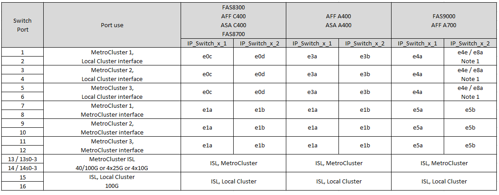
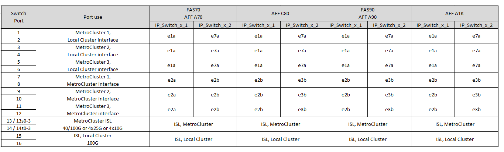

= Assegnazioni delle porte della piattaforma per gli switch IP SN2100 supportati da NVIDIA
:allow-uri-read: 
:icons: font
:imagesdir: ../media/

[role="lead"]
L'utilizzo della porta in una configurazione IP MetroCluster dipende dal modello dello switch e dal tipo di piattaforma.

Prima di utilizzare le tabelle di configurazione, fare riferimento alle seguenti considerazioni:

* La connessione di una configurazione MetroCluster a otto o due nodi richiede ONTAP 9.14.1 o versione successiva e il file RCF versione 2,00 o successiva.
+

NOTE: La versione del file RCF è diversa dalla versione dello strumento RCFfilegenerator utilizzato per generare il file. Ad esempio, è possibile generare un file RCF versione 2,00 utilizzando RCFfilegenerator v1,6c.

* Se si utilizzano più configurazioni MetroCluster, seguire la tabella corrispondente. Ad esempio:
+
** Se si utilizzano due configurazioni MetroCluster a quattro nodi di tipo AFF A700, collegare il primo MetroCluster indicato come "MetroCluster 1" e il secondo MetroCluster indicato come "MetroCluster 2" nella tabella AFF A700.

NOTE: Le porte 13 e 14 possono essere utilizzate in modalità di velocità nativa che supporta 40 Gbps e 100 Gbps o in modalità breakout per supportare 4 × 25 Gbps o 4 × 10 Gbps. Se utilizzano la modalità di velocità nativa, vengono rappresentate come porte 13 e 14. Se utilizzano la modalità breakout, 4 × 25 Gbps o 4 × 10 Gbps, vengono rappresentate come porte 13s0-3 e 14s0-3.

Le sezioni seguenti descrivono il cablaggio fisico. Fare riferimento anche alla https://mysupport.netapp.com/site/tools/tool-eula/rcffilegenerator["RcfFileGenerator"] per informazioni dettagliate sul cablaggio.

== Scegliere la tabella di cablaggio corretta per la configurazione

Utilizzare la tabella seguente per determinare quale tabella di cablaggio seguire.

[cols="2*"]
|===
| Se il sistema è... | Utilizzare questa tabella di cablaggio... 

 a| 
AFF A150, ASA A150

FAS500f

AFF C250, ASA C250

AFF A250, ASA A250
| <<table_1_nvidia_sn2100,Assegnazione delle porte della piattaforma NVIDIA SN2100 (gruppo 1)>> 

| AFF A20 | <<table_2_nvidia_sn2100,Assegnazione delle porte della piattaforma NVIDIA SN2100 (gruppo 2)>> 

| AFF C30, AFF A30 AFF C60 | <<table_3_nvidia_sn2100,Assegnazione delle porte della piattaforma NVIDIA SN2100 (gruppo 3)>> 

| FAS8300 AFF C400, ASA C400 AFF A400, ASA A400 FAS8700 FAS9000, AFF A700 | <<table_4_nvidia_sn2100,Assegnazione delle porte della piattaforma NVIDIA SN2100 (gruppo 4)>> 

| AFF A50 | <<table_5_nvidia_sn2100,Assegnazione delle porte della piattaforma NVIDIA SN2100 (gruppo 5)>> 

| AFF C800, ASA C800 AFF A800, ASA A800 FAS9500 AFF A900, ASA A900 | <<table_6_nvidia_sn2100,Assegnazione delle porte della piattaforma NVIDIA SN2100 (gruppo 6)>> 

| FAS70, AFF A70 AFF C80 FAS90, AFF A90 AFF A1K | <<table_7_nvidia_sn2100,Assegnazione delle porte della piattaforma NVIDIA SN2100 (gruppo 7)>> 
|===
.Assegnazione delle porte della piattaforma NVIDIA SN2100 (gruppo 1)
Esaminare le assegnazioni delle porte della piattaforma per collegare un AFF A150, ASA A150, FAS500f, AFF C250, ASA C250, da sistema AFF A250 o ASA A250 a switch NVIDIA SN2100:

[#table_1_nvidia_sn2100]
image::../media/mcc-ip-cabling-aff-asa-a150-fas500f-a25-c250-MSN2100.png[Mostra le assegnazioni delle porte della piattaforma NVIDIA SN2100]

.Assegnazione delle porte della piattaforma NVIDIA SN2100 (gruppo 2)
Esaminare le assegnazioni delle porte della piattaforma per collegare un sistema AFF A20 a uno switch NVIDIA SN2100:

[#table_2_nvidia_sn2100]
image::../media/mccip-cabling-aff-a20-nvidia-sn2100.png[Mostra le assegnazioni delle porte della piattaforma NVIDIA SN2100]

.Assegnazione delle porte della piattaforma NVIDIA SN2100 (gruppo 3)
Esaminare le assegnazioni delle porte della piattaforma per collegare un sistema AFF C30, AFF A30 o AFF C60 a uno switch NVIDIA SN2100:

[#table_3_nvidia_sn2100]
image::../media/mccip-cabling-aff-a30-c30-c60-nvidia-sn2100.png[Mostra le assegnazioni delle porte della piattaforma NVIDIA SN2100]

.Assegnazione delle porte della piattaforma NVIDIA SN2100 (gruppo 4)
Esaminare le assegnazioni delle porte della piattaforma per il cavo a FAS8300, AFF C400, ASA C400, AFF A400, ASA A400, da sistema FAS8700, FAS9000 o AFF A700 a uno switch NVIDIA SN2100:

*Nota 1*: Utilizzare le porte e4a e E4E o e4a e E8a se si utilizza un adattatore X91440A (40Gbps). Utilizzare le porte e4a e e4b o e4a e E8a se si utilizza un adattatore X91153A (100Gbps).

.Assegnazione delle porte della piattaforma NVIDIA SN2100 (gruppo 5)
Esaminare le assegnazioni delle porte della piattaforma per collegare un sistema AFF A50 a uno switch NVIDIA SN2100:

[#table_5_nvidia_sn2100]
image::../media/mccip-cabling-aff-a50-nvidia-sn2100.png[Mostra le assegnazioni delle porte della piattaforma NVIDIA SN2100]

.Assegnazione delle porte della piattaforma NVIDIA SN2100 (gruppo 6)
Esaminare le assegnazioni delle porte della piattaforma per collegare un AFF C800, ASA C800, AFF A800, ASA A800, FAS9500, da sistema AFF A900 o ASA A900 a switch NVIDIA SN2100:

image::../media/mcc_ip_cabling_fas8300_aff_asa_a800_a900_fas9500_MSN2100.png[Mostra le assegnazioni delle porte della piattaforma NVIDIA SN2100]

*Nota 1*: Utilizzare le porte e4a e E4E o e4a e E8a se si utilizza un adattatore X91440A (40Gbps). Utilizzare le porte e4a e e4b o e4a e E8a se si utilizza un adattatore X91153A (100Gbps).

.Assegnazione delle porte della piattaforma NVIDIA SN2100 (gruppo 7)
Esaminare le assegnazioni delle porte della piattaforma per collegare un sistema FAS70, AFF A70, AFF C80, FAS90, AFF A90 o AFF A1K a uno switch NVIDIA SN2100:

