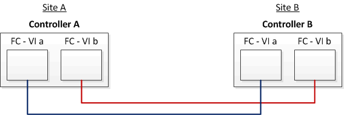

= Esempio di configurazione stretch MetroCluster con LUN array
:allow-uri-read: 
:icons: font
:imagesdir: ../media/

[role="lead"]
In una configurazione stretch MetroCluster con LUN array, è necessario collegare le porte FC-VI per la connettività diretta tra i controller. Inoltre, è necessario collegare ciascuna porta HBA del controller alle porte dello switch degli switch FC corrispondenti. Il cablaggio ai LUN degli array è lo stesso di quello di un MetroCluster collegato a fabric, ad eccezione dei LUN degli array e-Series, che possono essere collegati direttamente.

La figura seguente mostra le porte FC-VI cablate tra i controller A e B in una configurazione stretch MetroCluster:

NOTE: I moduli controller dei sistemi storage FAS9000 utilizzano quattro porte FC-VI ciascuna.

Per le configurazioni con LUN array e-Series, è possibile collegare direttamente i LUN e-Series.

https://kb.netapp.com/Advice_and_Troubleshooting/Data_Protection_and_Security/MetroCluster/Direct_Attach_support_for_Stretch_MetroCluster_Configuration_with_NetApp_E-Series_array["Supporto di collegamento diretto per la configurazione Stretch MetroCluster con array NetApp e-Series"]

Ad eccezione del collegamento delle porte FC-VI, il resto di questa procedura serve per configurare una configurazione MetroCluster con LUN di array, che non utilizzano LUN di array e-Series. Ciò richiede switch FC che siano gli stessi dell'utilizzo di LUN array nelle configurazioni fabric-attached.

https://docs.netapp.com/us-en/ontap-metrocluster/install-fc/index.html["Installazione e configurazione di Fabric-Attached MetroCluster"]
