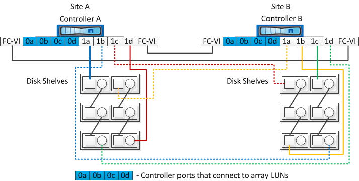

= Esempi di configurazioni MetroCluster stretch a due nodi con dischi e LUN di array
:allow-uri-read: 
:icons: font
:imagesdir: ../media/

[role="lead"]
Per configurare una configurazione stretch MetroCluster con dischi nativi e LUN di array, è necessario utilizzare bridge FC-SAS o cavi ottici SAS per collegare i sistemi ONTAP agli shelf di dischi. Inoltre, è necessario utilizzare gli switch FC per collegare i LUN degli array ai sistemi ONTAP.

Sono necessarie almeno otto porte HBA per il collegamento di un sistema ONTAP a dischi nativi e LUN di array.

Nei seguenti esempi che rappresentano configurazioni stretch MetroCluster a due nodi con dischi e LUN di array, le porte HBA da 0a a 0d vengono utilizzate per il collegamento con LUN di array. Le porte HBA da 1a a 1d vengono utilizzate per le connessioni con dischi nativi.

La figura seguente mostra una configurazione Stretch MetroCluster a due nodi in cui i dischi nativi sono collegati ai sistemi ONTAP utilizzando cavi ottici SAS:

La figura seguente mostra una configurazione Stretch MetroCluster a due nodi in cui i dischi nativi sono connessi ai sistemi ONTAP utilizzando bridge FC-SAS:

image::../media/two_node_mcc_combined_armadillo.gif[armadillo combinato mcc a due nodi]

La figura seguente mostra una configurazione Stretch MetroCluster a due nodi con le connessioni LUN dell'array:

image::../media/two_node_mcc_combined_array_luns.gif[due lun array combinati mcc a nodi]

NOTE: Se necessario, è anche possibile utilizzare gli stessi switch FC per collegare i dischi nativi e le LUN degli array ai controller nella configurazione MetroCluster.

https://docs.netapp.com/us-en/ontap-metrocluster/install-fc/index.html["Installazione e configurazione di Fabric-Attached MetroCluster"]
