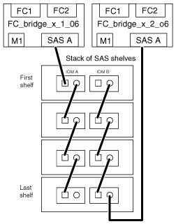

= Collegamento di un bridge FibreBridge 6500N con shelf di dischi utilizzando moduli IOM6 o IOM3
:allow-uri-read: 
:icons: font
:imagesdir: ../media/

[role="lead"]
Dopo aver configurato il bridge, è possibile iniziare a cablare il nuovo sistema. Il bridge FibreBridge 6500N utilizza connettori QSFP.

Accendere e attendere almeno 10 secondi prima di collegare la porta. I connettori dei cavi SAS sono dotati di chiave; se orientati correttamente in una porta SAS, il connettore scatta in posizione e il LED LNK della porta SAS dello shelf di dischi si illumina di verde. Per gli shelf di dischi, inserire un connettore per cavo SAS con la linguetta rivolta verso il basso (nella parte inferiore del connettore).

Il bridge FibreBridge 6500N non supporta shelf di dischi che utilizzano un modulo IOM12.

.Fasi
. Collegare a margherita gli shelf di dischi in ogni stack.
+
Per informazioni sugli shelf di dischi con concatenamento a margherita, consultare la _Guida all'installazione e al servizio_ relativa al modello di shelf di dischi in uso.

. Per ogni stack di shelf di dischi, collegare l'IOM A una porta quadrata del primo shelf alla porta SAS A su FibreBridge A.
. Per ogni stack di shelf di dischi, collegare la porta circolare IOM B dell'ultimo shelf alla porta SAS A su FibreBridge B.
+
Ogni bridge dispone di un percorso per lo stack di shelf di dischi. Il ponte A si collega Al lato A dello stack attraverso il primo shelf e il ponte B si collega al lato B dello stack attraverso l'ultimo shelf.

+

NOTE: Il bridge della porta SAS B è disattivato.

+
La figura seguente mostra un set di bridge collegati a uno stack di quattro shelf di dischi:

+

