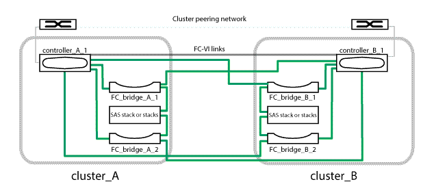

= Collegamento dei bridge FC-SAS al modulo controller in una configurazione MetroCluster con collegamento a ponte a due nodi
:allow-uri-read: 
:icons: font
:imagesdir: ../media/

[role="lead"]
È necessario collegare i bridge al modulo controller in una configurazione MetroCluster con collegamento a ponte a due nodi.

.Fasi
. [[step1-verify-detect]]verifica che ciascun bridge sia in grado di rilevare tutti i dischi e gli shelf di dischi a cui è collegato il bridge.
+
|===

| Se si utilizza... | Quindi... 

 a| 
GUI ExpressNAV
 a| 
.. In un browser Web supportato, inserire l'indirizzo IP di un bridge nella casella del browser.
+
Verrà visualizzato il sito Web di ATTO FibreBridge del collegamento bridge per l'indirizzo IP immesso.

.. Fare clic sul collegamento, quindi immettere il nome utente e la password designati al momento della configurazione del bridge.
+
Viene visualizzata la pagina di stato di ATTO FibreBridge del bridge con un menu a sinistra.

.. Fare clic su *Avanzate* nel menu.
.. Eseguire il seguente comando, quindi fare clic su *Invia*: +
`sastargets`

 a| 
Connessione alla porta seriale
 a| 
Eseguire il seguente comando:

`sastargets`

|===
+
Il `sastargets` l'output del comando mostra i dispositivi (dischi e shelf di dischi) collegati al bridge. Le linee di output sono numerate in sequenza in modo da poter contare rapidamente i dispositivi.

+

NOTE: Se all'inizio dell'output viene visualizzato "`text Response tronced`", è possibile utilizzare Telnet per connettersi al bridge ed eseguire lo stesso comando per visualizzare tutti gli output.

+
Il seguente output indica che sono collegati 10 dischi:

+
[listing]
----
Tgt VendorID ProductID        Type        SerialNumber
  0 NETAPP   X410_S15K6288A15 DISK        3QP1CLE300009940UHJV
  1 NETAPP   X410_S15K6288A15 DISK        3QP1ELF600009940V1BV
  2 NETAPP   X410_S15K6288A15 DISK        3QP1G3EW00009940U2M0
  3 NETAPP   X410_S15K6288A15 DISK        3QP1EWMP00009940U1X5
  4 NETAPP   X410_S15K6288A15 DISK        3QP1FZLE00009940G8YU
  5 NETAPP   X410_S15K6288A15 DISK        3QP1FZLF00009940TZKZ
  6 NETAPP   X410_S15K6288A15 DISK        3QP1CEB400009939MGXL
  7 NETAPP   X410_S15K6288A15 DISK        3QP1G7A900009939FNTT
  8 NETAPP   X410_S15K6288A15 DISK        3QP1FY0T00009940G8PA
  9 NETAPP   X410_S15K6288A15 DISK        3QP1FXW600009940VERQ
----
. Verificare che l'output del comando indichi che il bridge è collegato a tutti i dischi e gli shelf di dischi nello stack che deve essere collegato.
+
[cols="30,70"]
|===

| Se l'output è... | Quindi... 

 a| 
Esatto
 a| 
Ripetere <<step1-verify-detect,Fase 1>> per ogni bridge rimanente.

 a| 
Non corretto
 a| 
.. Verificare l'eventuale presenza di cavi SAS allentati o correggere il cablaggio SAS riinserendo gli shelf di dischi nei bridge.
+
link:task_fb_new_install_cabl.html["Collegamento degli shelf di dischi ai bridge"]

.. Ripetere <<step1-verify-detect,Fase 1>> per ogni bridge rimanente.

|===
. [[step3-cable-each-bridge]]collegare ciascun bridge ai moduli controller:
+
.. Collegare la porta FC 1 del bridge a una porta FC sul modulo controller in cluster_A.
.. Collegare la porta FC 2 del bridge a una porta FC sul modulo controller in cluster_B.
+
Se il modulo controller è configurato con un adattatore FC a quattro porte, assicurarsi che gli stack di storage siano collegati a due porte FC sullo stesso ASIC. Le porte a e b condividono lo stesso ASIC, mentre le porte c e d condividono lo stesso ASIC. Non collegare uno stack di shelf alla porta a e alla porta b. Utilizzare invece la porta a e la porta c oppure la porta b e la porta d per evitare un singolo punto di errore in caso di guasto di un ASIC.

+
Se il modulo controller è configurato con più adattatori FC, non collegare entrambe le porte bridge allo stesso adattatore. È necessario distribuire la porta FC 1 all'adattatore A e la porta FC 2 all'adattatore B per evitare un singolo punto di errore.

+

. Ripetere <<step3-cable-each-bridge,Fase 3>> sugli altri ponti fino a quando tutti i ponti sono stati cablati.

