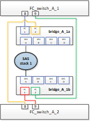

= Sostituzione senza interruzioni di uno shelf in una configurazione MetroCluster collegata al fabric
:allow-uri-read: 
:icons: font
:imagesdir: ../media/

[role="lead"]
Potrebbe essere necessario sapere come sostituire uno shelf senza interruzioni in una configurazione Fabric-Attached MetroCluster.

NOTE: Questa procedura deve essere utilizzata solo in una configurazione Fabric-Attached MetroCluster.

== Disattivazione dell'accesso allo shelf

È necessario disattivare l'accesso allo shelf prima di sostituire i moduli dello shelf.

Controllare lo stato generale della configurazione. Se il sistema non risulta integro, risolvere il problema prima di procedere.

.Fasi
. Da entrambi i cluster, offline tutti i plessi con dischi nello shelf stack interessato:
+
`aggr offline _plex_name_`

+
L'esempio mostra i comandi per l'offlining dei plex per un controller che esegue l'ONTAP in cluster.

+
[listing]
----

cluster_A_1::> storage aggregate plex offline -aggr aggrA_1_0 -plex plex0
cluster_A_1::> storage aggregate plex offline -aggr dataA_1_data -plex plex0
cluster_A_2::> storage aggregate plex offline -aggr aggrA_2_0 -plex plex0
cluster_A_2::> storage aggregate plex offline -aggr dataA_2_data -plex plex0
----
. Verificare che i plessi siano offline:
+
`aggr status _-raggr_name_`

+
L'esempio mostra i comandi per verificare che gli aggregati siano offline per un controller che esegue cmode.

+
[listing]
----

Cluster_A_1::> storage aggregate show -aggr aggrA_1_0
Cluster_A_1::> storage aggregate show -aggr dataA_1_data
Cluster_A_2::> storage aggregate show -aggr aggrA_2_0
Cluster_A_2::> storage aggregate show -aggr dataA_2_data
----
. Disattivare le porte SAS o dello switch a seconda che i bridge che collegano lo shelf di destinazione collegino un singolo stack SAS o due o più stack SAS:
+
** Se i bridge collegano un singolo stack SAS, disattivare le porte dello switch a cui sono collegati i bridge utilizzando il comando appropriato per lo switch.
+
L'esempio seguente mostra una coppia di bridge che collegano un singolo stack SAS, che contiene lo shelf di destinazione:

+

+
Le porte 8 e 9 di ogni switch collegano i bridge alla rete.

+
Nell'esempio seguente vengono mostrate le porte 8 e 9 disabilitate su uno switch Brocade.

+
[listing]
----
FC_switch_A_1:admin> portDisable 8
FC_switch_A_1:admin> portDisable 9

FC_switch_A_2:admin> portDisable 8
FC_switch_A_2:admin> portDisable 9
----
+
L'esempio seguente mostra la disattivazione delle porte 8 e 9 su uno switch Cisco.

+
[listing]
----
FC_switch_A_1# conf t
FC_switch_A_1(config)# int fc1/8
FC_switch_A_1(config)# shut
FC_switch_A_1(config)# int fc1/9
FC_switch_A_1(config)# shut
FC_switch_A_1(config)# end

FC_switch_A_2# conf t
FC_switch_A_2(config)# int fc1/8
FC_switch_A_2(config)# shut
FC_switch_A_2(config)# int fc1/9
FC_switch_A_2(config)# shut
FC_switch_A_2(config)# end
----
** Se i bridge collegano due o più stack SAS, disattivare le porte SAS che collegano i bridge allo shelf di destinazione: +
`SASportDisable _port number_`
+

NOTE: Non applicabile ai bridge FibreBridge 6500.

+
L'esempio seguente mostra una coppia di bridge che collegano quattro stack SAS. Lo stack SAS 2 contiene lo shelf di destinazione:

+
image::../media/mcc_shelf_replacement_bridges_with_four_stacks.gif[ponti di sostituzione degli shelf mcc con quattro stack]

+
La porta SAS B collega i bridge allo shelf di destinazione. Disattivando solo la porta SAS B su entrambi gli shelf, gli altri stack SAS possono continuare a servire i dati durante la procedura di sostituzione.

+
In questo caso, disattivare la porta SAS che collega il bridge allo shelf di destinazione:

+
`SASportDisable _port number_`

+
L'esempio seguente mostra che la porta SAS B è disattivata dal bridge e verifica che sia disattivata. È necessario ripetere il comando su entrambi i bridge.

+
[listing]
----
Ready. *
SASPortDisable B

SAS Port B has been disabled.
----

. Se in precedenza le porte dello switch sono state disattivate, verificare che siano disattivate:
+
`switchShow`

+
L'esempio mostra che le porte dello switch sono disattivate su uno switch Brocade.

+
[listing]
----

FC_switch_A_1:admin> switchShow
FC_switch_A_2:admin> switchShow
----
+
L'esempio mostra che le porte dello switch sono disattivate su uno switch Cisco.

+
[listing]
----

FC_switch_A_1# show interface fc1/6
FC_switch_A_2# show interface fc1/6
----
. Attendere che ONTAP si renda conto che il disco è mancante.
. Spegnere lo shelf che si desidera sostituire.

== Sostituzione dello shelf

Rimuovere fisicamente tutti i cavi e lo shelf prima di inserire e collegare i nuovi shelf e moduli.

.Fasi
. Rimuovere tutti i dischi e scollegare tutti i cavi dallo shelf da sostituire.
. Rimuovere i moduli dello shelf.
. Inserire il nuovo ripiano.
. Inserire i nuovi dischi nel nuovo shelf.
. Inserire i moduli dello shelf.
. Cablare lo shelf (SAS o Power).
. Accendere lo shelf.

== Riabilitare l'accesso e verificare il funzionamento

Una volta sostituito lo shelf, è necessario riabilitare l'accesso e verificare che il nuovo shelf funzioni correttamente.

.Fasi
. Verificare che lo shelf si accenda correttamente e che siano presenti i collegamenti sui moduli IOM.
. Abilitare le porte dello switch o la porta SAS in base ai seguenti scenari:
+
[cols="1,3"]
|===

| Opzione | Fase 

 a| 
*Se in precedenza sono state disattivate le porte dello switch*
 a| 
.. Abilitare le porte dello switch:
+
`portEnable _port number_`

+
L'esempio mostra la porta dello switch attivata su uno switch Brocade.

+
[listing]
----

Switch_A_1:admin> portEnable 6
Switch_A_2:admin> portEnable 6
----
+
L'esempio mostra la porta dello switch abilitata su uno switch Cisco.

+
[listing]
----

Switch_A_1# conf t
Switch_A_1(config)# int fc1/6
Switch_A_1(config)# no shut
Switch_A_1(config)# end

Switch_A_2# conf t
Switch_A_2(config)# int fc1/6
Switch_A_2(config)# no shut
Switch_A_2(config)# end
----

 a| 
*Se in precedenza è stata disattivata una porta SAS*
 a| 
.. Abilitare la porta SAS che collega lo stack alla posizione dello shelf:
+
`SASportEnable _port number_`

+
L'esempio mostra che la porta SAS A è abilitata dal bridge e verifica che sia abilitata.

+
[listing]
----
Ready. *
SASPortEnable A

SAS Port A has been enabled.
----

NOTE: Questo non è applicabile a ATTO 6500 FiberBridges.

|===
. Se in precedenza le porte dello switch sono state disattivate, verificare che siano attivate e in linea e che tutti i dispositivi siano collegati correttamente:
+
`switchShow`

+
L'esempio mostra `switchShow` Comando per verificare che uno switch Brocade sia in linea.

+
[listing]
----

Switch_A_1:admin> SwitchShow
Switch_A_2:admin> SwitchShow
----
+
L'esempio mostra `switchShow` Comando per verificare che uno switch Cisco sia in linea.

+
[listing]
----

Switch_A_1# show interface fc1/6
Switch_A_2# show interface fc1/6
----
+

NOTE: Dopo alcuni minuti, ONTAP rileva l'inserimento di nuovi dischi e visualizza un messaggio per ogni nuovo disco.

. Verificare che i dischi siano stati rilevati da ONTAP:
+
`sysconfig -a`

. Online i plex offline in precedenza:
+
`aggr online__plex_name__`

+
L'esempio mostra i comandi per posizionare i plex su un controller che esegue cmode di nuovo online.

+
[listing]
----

Cluster_A_1::> storage aggregate plex online -aggr aggr1 -plex plex2
Cluster_A_1::> storage aggregate plex online -aggr aggr2 -plex plex6
Cluster_A_1::> storage aggregate plex online -aggr aggr3 -plex plex1
----
+
I plessi iniziano a risincronizzarsi.

+

NOTE: È possibile monitorare l'avanzamento della risincronizzazione utilizzando `aggr status _-raggr_name_` comando.

