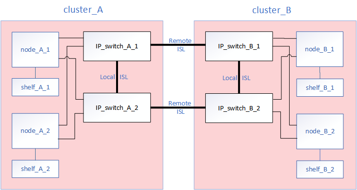
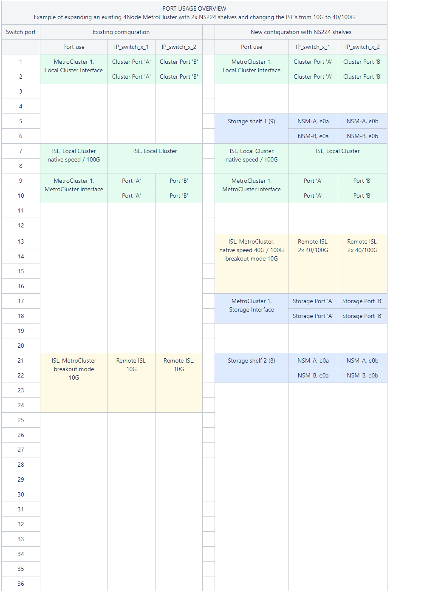

= Sostituire uno switch IP o modificare l'utilizzo degli switch IP MetroCluster esistenti
:allow-uri-read: 
:icons: font
:imagesdir: ../media/

[role="lead"]
Potrebbe essere necessario sostituire uno switch guasto, aggiornare o eseguire il downgrade di uno switch o modificare l'utilizzo degli switch IP MetroCluster esistenti.

CAUTION: Se devi sostituire uno switch sulle piattaforme AFF A220, AFF A250 o FAS2750, consulta link:https://kb.netapp.com/on-prem/ontap/mc/MC-KBs/Cluster_and_HA_communication_issues_during_back-end_switch_replacement["l'articolo della Knowledge Base "Cluster and HA communication issues during back-end switch replacement""^].

.A proposito di questa attività
Questa procedura si applica quando si utilizzano switch validati da NetApp. Se si utilizzano switch compatibili con MetroCluster, rivolgersi al fornitore dello switch.

link:enable-console-logging-before-maintenance.html["Attivare la registrazione della console"] prima di eseguire questa attività.

[NOTE]
====
Le velocità di collegamento miste non sono supportate sulle piattaforme che utilizzano una scheda di interfaccia di rete X60134A. Per verificare se la tua piattaforma è interessata, consulta la  https://hwu.netapp.com/["Hardware Universe"^].

Se stai sostituendo uno switch che utilizza porte da 25G con un nuovo switch che utilizza porte da 100G su una piattaforma interessata (ad esempio sostituendo uno switch BES-53248 con uno switch Cisco 9336C su una piattaforma AFF A50), consulta link:https://kb.netapp.com/on-prem/ontap/mc/MC-KBs/100G_link_not_coming_online_during_MetroCluster_back-end_switch_replacement?caseId=2010523490["l'articolo della Knowledge Base "100G link not coming online during MetroCluster back-end switch replacement""^].

====
Questa procedura supporta le seguenti conversioni:

* Modifica del vendor, del tipo o di entrambi gli switch. Il nuovo switch può essere lo stesso del vecchio switch in caso di guasto oppure è possibile modificare il tipo di switch (aggiornare o eseguire il downgrade dello switch).
+
Ad esempio, per espandere una configurazione MetroCluster IP da una singola configurazione a quattro nodi utilizzando controller AFF A400 e switch BES-53248 a una configurazione a otto nodi utilizzando controller AFF A400, è necessario modificare gli switch in un tipo supportato per la configurazione, in quanto gli switch BES-53248 non sono supportati nella nuova configurazione.

+
Se si desidera sostituire uno switch guasto con lo stesso tipo di switch, sostituire solo lo switch guasto. Se si desidera aggiornare o eseguire il downgrade di uno switch, è necessario regolare due switch che si trovano nella stessa rete. Due switch si trovano nella stessa rete quando sono collegati con un collegamento inter-switch (ISL) e non si trovano nello stesso sito. Ad esempio, la rete 1 include IP_switch_A_1 e IP_switch_B_1, mentre la rete 2 include IP_switch_A_2 e IP_switch_B_2, come mostrato nel diagramma seguente:

+

+

NOTE: Se si sostituisce uno switch o si esegue l'aggiornamento a switch diversi, è possibile preconfigurare gli switch installando il firmware dello switch e il file RCF.

* Convertire una configurazione IP MetroCluster in una configurazione IP MetroCluster utilizzando switch MetroCluster di storage condiviso.
+
Ad esempio, se si dispone di una configurazione MetroCluster IP regolare utilizzando i controller AFF A700 e si desidera riconfigurare MetroCluster per collegare gli shelf NS224 agli stessi switch.

+
[NOTE]
====
** Se si aggiungono o rimuovono shelf in una configurazione MetroCluster IP utilizzando switch MetroCluster IP storage condiviso, seguire la procedura descritta in link:https://docs.netapp.com/us-en/ontap-metrocluster/maintain/task_add_shelves_using_shared_storage.html["Aggiunta di shelf a un MetroCluster IP utilizzando switch MetroCluster per lo storage condiviso"]
** La configurazione IP di MetroCluster potrebbe già essere collegata direttamente agli shelf NS224 o a switch di storage dedicati.

====

[[port_usage_worksheet]]
.Foglio di lavoro sull'utilizzo delle porte
Di seguito viene riportato un esempio di foglio di lavoro per la conversione di una configurazione MetroCluster IP in una configurazione storage condivisa che collega due shelf NS224 utilizzando gli switch esistenti.

Definizioni dei fogli di lavoro:

* Configurazione esistente: Il cablaggio della configurazione MetroCluster esistente.
* Nuova configurazione con shelf NS224: La configurazione di destinazione in cui gli switch sono condivisi tra lo storage e MetroCluster.

I campi evidenziati in questo foglio di lavoro indicano quanto segue:

* Verde: Non è necessario modificare il cablaggio.
* Giallo: È necessario spostare le porte con la stessa configurazione o con una configurazione diversa.
* Blu: Porte nuove connessioni.

.Fasi
. [[all_step1]]controllare lo stato della configurazione.
+
.. Verificare che MetroCluster sia configurato e in modalità normale su ciascun cluster: `*metrocluster show*`
+
[listing]
----
cluster_A::> metrocluster show
Cluster                   Entry Name          State
------------------------- ------------------- -----------
 Local: cluster_A         Configuration state configured
                          Mode                normal
                          AUSO Failure Domain auso-on-cluster-disaster
Remote: cluster_B         Configuration state configured
                          Mode                normal
                          AUSO Failure Domain auso-on-cluster-disaster
----
.. Verificare che il mirroring sia attivato su ciascun nodo: `*metrocluster node show*`
+
[listing]
----
cluster_A::> metrocluster node show
DR                           Configuration  DR
Group Cluster Node           State          Mirroring Mode
----- ------- -------------- -------------- --------- --------------------
1     cluster_A
              node_A_1       configured     enabled   normal
      cluster_B
              node_B_1       configured     enabled   normal
2 entries were displayed.
----
.. Verificare che i componenti di MetroCluster siano in buone condizioni: `*metrocluster check run*`
+
[listing]
----
cluster_A::> metrocluster check run

Last Checked On: 10/1/2014 16:03:37

Component           Result
------------------- ---------
nodes               ok
lifs                ok
config-replication  ok
aggregates          ok
4 entries were displayed.

Command completed. Use the "metrocluster check show -instance" command or sub-commands in "metrocluster check" directory for detailed results.
To check if the nodes are ready to do a switchover or switchback operation, run "metrocluster switchover -simulate" or "metrocluster switchback -simulate", respectively.
----
.. Verificare che non siano presenti avvisi sullo stato di salute: `*system health alert show*`

. Configurare il nuovo switch prima dell'installazione.
+
Se si stanno riutilizzando gli switch esistenti, passare a. <<existing_step4,Fase 4>>.

+

NOTE: Se si stanno aggiornando o eseguendo il downgrade degli switch, è necessario configurare tutti gli switch della rete.

+
Seguire la procedura per il fornitore dello switch:

+
** link:../install-ip/task_switch_config_broadcom.html["Configurare gli switch IP Broadcom"]
** link:../install-ip/task_switch_config_cisco.html["Configurare gli switch IP Cisco"]
** link:../install-ip/task_switch_config_nvidia.html["Configurare gli switch NVIDIA IP"]
+
Assicurarsi di applicare il file RCF corretto per lo switch _A_1, _A_2, _B_1 o _B_2. Se il nuovo switch è lo stesso del vecchio switch, è necessario applicare lo stesso file RCF.

+
Se si esegue l'aggiornamento o il downgrade di uno switch, applicare il file RCF più recente supportato per il nuovo switch.

. Eseguire il comando port show per visualizzare le informazioni relative alle porte di rete:
+
`*network port show*`

+
.. Modifica tutte le LIF del cluster per disattivare l'indirizzamento automatico:
+
[source, cli]
----
network interface modify -vserver <vserver_name> -lif <lif_name> -auto-revert false
----
.. link:../install-ip/switch-move-cluster-lifs.html["Sposta i LIF del cluster"].
+

NOTE: Devi aggiornare gli switch nel seguente ordine: Switch_A_1, Switch_B_1, Switch_A_2, Switch_B_2. Devi ripetere i passaggi per spostare le LIF del cluster sul secondo fabric (Switch_A_2, Switch_B_2) dopo aver configurato gli switch nel primo fabric (Switch_A_1, Switch_B_1). Consulta link:../install-ip/task_install_and_cable_the_mcc_components.html["Scopri come configurare gli switch IP MetroCluster"].

. [[existing_step4]]Disconnetti le connessioni dal vecchio switch.
+

NOTE: Si scollegano solo le connessioni che non utilizzano la stessa porta nelle configurazioni precedenti e nuove. Se si utilizzano nuovi switch, è necessario scollegare tutte le connessioni.

+
Rimuovere i collegamenti nel seguente ordine:

+
.. Scollegare le interfacce del cluster locale
.. Disconnettere gli ISL del cluster locale
.. Scollegare le interfacce IP di MetroCluster
.. Disconnettere gli ISL MetroCluster
+
Nell'esempio <<port_usage_worksheet>>, gli switch non cambiano. Gli ISL MetroCluster vengono ricollocati e devono essere disconnessi. Non è necessario scollegare le connessioni contrassegnate in verde sul foglio di lavoro.

. Se si utilizzano nuovi switch, spegnere il vecchio switch, rimuovere i cavi e rimuovere fisicamente il vecchio switch.
+
Se si stanno riutilizzando gli switch esistenti, passare a. <<existing_step6,Fase 6>>.

+

NOTE: Non collegare * i nuovi switch ad eccezione dell'interfaccia di gestione (se utilizzata).

. [[existing_step6]]Configura gli switch esistenti.
+
Se gli switch sono già stati preconfigurati, è possibile saltare questo passaggio.

+
Per configurare gli switch esistenti, seguire la procedura per installare e aggiornare il firmware e i file RCF:

+
** link:https://docs.netapp.com/us-en/ontap-metrocluster/maintain/task_upgrade_firmware_on_mcc_ip_switches.html["Aggiornamento del firmware sugli switch IP MetroCluster"]
** link:https://docs.netapp.com/us-en/ontap-metrocluster/maintain/task_upgrade_rcf_files_on_mcc_ip_switches.html["Aggiornare i file RCF sugli switch IP MetroCluster"]

. Collegare gli switch.
+
Puoi seguire i passaggi in link:../install-ip/using_rcf_generator.html["Collegare via cavo gli switch IP MetroCluster"].

+
Collegare gli switch nel seguente ordine (se necessario):

+
.. Collegare gli ISL al sito remoto.
.. Collegare le interfacce IP di MetroCluster.
.. Collegare le interfacce del cluster locale.
+
[NOTE]
====
*** Se il tipo di switch è diverso, le porte utilizzate potrebbero essere diverse da quelle del vecchio switch. Se si stanno aggiornando o eseguendo il downgrade degli switch, *NON* collegare gli ISL locali. Collegare gli ISL locali solo se si aggiornano o si esegue il downgrade degli switch nella seconda rete e entrambi gli switch in un sito sono dello stesso tipo e del medesimo cablaggio.
*** Se si sta aggiornando Switch-A1 e Switch-B1, eseguire i passaggi da 1 a 6 per gli switch Switch-A2 e Switch-B2.

====

. Finalizzare il cablaggio del cluster locale.
+
.. Se le interfacce del cluster locale sono collegate a uno switch:
+
... Collegare via cavo gli ISL del cluster locale.

.. Se le interfacce del cluster locale sono *non* collegate a uno switch:
+
... Usa la link:https://docs.netapp.com/us-en/ontap-systems-switches/switch-bes-53248/migrate-to-2n-switched.html["Migrare a un ambiente cluster NetApp con switch"^] procedura per convertire un cluster senza switch in un cluster con switch. Usa le porte indicate in link:https://docs.netapp.com/us-en/ontap-metrocluster/install-ip/using_rcf_generator.html["Installazione e configurazione di MetroCluster IP"] o i file di cablaggio RCF per collegare l'interfaccia locale del cluster.

. Accendere lo switch o gli switch.
+
Se il nuovo switch è identico, accendi il nuovo switch. Se stai eseguendo un upgrade o un downgrade degli switch, accendi entrambi gli switch. La configurazione può funzionare con due switch diversi in ciascun sito fino all'aggiornamento del secondo fabric.

. Verificare che la configurazione di MetroCluster sia corretta ripetendo la configurazione <<all_step1,Fase 1>>.
+
Se stai aggiornando o eseguendo il downgrade degli switch nel primo fabric, potresti vedere alcuni avvisi relativi al clustering locale.

+

NOTE: Se aggiorni o esegui il downgrade del fabric, ripeti tutti i passaggi per il secondo fabric.

. Modifica tutte le LIF del cluster per riattivare l'indirizzamento automatico:
+
[source, cli]
----
network interface modify -vserver <vserver_name> -lif <lif_name> -auto-revert true
----
. Ripristina tutti i LIF del cluster che attualmente non si trovano sulle loro porte home alle loro porte home:
+
`network interface revert -vserver * -lif *`

. In alternativa, spostare gli shelf NS224.
+
Se si sta riconfigurando una configurazione IP MetroCluster che non collega gli shelf NS224 agli switch IP MetroCluster, utilizzare la procedura appropriata per aggiungere o spostare gli shelf NS224:

+
** link:https://docs.netapp.com/us-en/ontap-metrocluster/maintain/task_add_shelves_using_shared_storage.html["Aggiunta di shelf a un MetroCluster IP utilizzando switch MetroCluster per lo storage condiviso"]
** link:https://docs.netapp.com/us-en/ontap-systems-switches/switch-cisco-9336c-fx2-shared/migrate-from-switchless-cluster-dat-storage.html["Migrazione da un cluster senza switch con storage direct-attached"^]
** link:https://docs.netapp.com/us-en/ontap-systems-switches/switch-cisco-9336c-fx2-shared/migrate-from-switchless-configuration-sat-storage.html["Migrare da una configurazione senza switch con storage collegato a switch riutilizzando gli switch storage"^]

