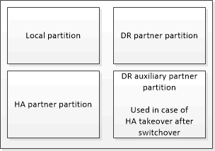

= Comprensione della protezione dei dati e del disaster recovery di MetroCluster
:allow-uri-read: 
:icons: font
:imagesdir: ../media/

[role="lead"]
È utile comprendere in che modo MetroCluster protegge i dati e fornisce un ripristino trasparente dai guasti, in modo da poter gestire le attività di switchover e switchback in modo semplice ed efficiente.

MetroCluster utilizza il mirroring per proteggere i dati in un cluster. Fornisce il disaster recovery attraverso un singolo comando MetroCluster che attiva un secondario sul sito di sopravvivenza per fornire i dati mirrorati originariamente di proprietà di un sito primario colpito da un disastro.

== In che modo le configurazioni MetroCluster a otto e quattro nodi offrono failover e switchover locali

Le configurazioni MetroCluster a otto e quattro nodi proteggono i dati sia a livello locale che a livello di cluster. Se si sta configurando una configurazione MetroCluster, è necessario conoscere il modo in cui le configurazioni MetroCluster proteggono i dati.

Le configurazioni MetroCluster proteggono i dati utilizzando due cluster con mirroring fisicamente separati. Ogni cluster esegue il mirroring sincrono della configurazione SVM (Data and Storage Virtual Machine) dell'altro. Quando si verifica un disastro in un sito, un amministratore può attivare la SVM mirrorata e iniziare a fornire i dati mirrorati dal sito sopravvissuto. Inoltre, i nodi di ciascun cluster sono configurati come coppia ha, fornendo un livello di failover locale.

=== Come funziona la protezione locale dei dati ha in una configurazione MetroCluster

È necessario comprendere il funzionamento delle coppie ha nella configurazione MetroCluster.

I due cluster della rete peered forniscono il disaster recovery bidirezionale, in cui ciascun cluster può essere l'origine e il backup dell'altro cluster. Ciascun cluster include due nodi configurati come coppia ha. In caso di guasto o manutenzione richiesta all'interno della configurazione di un singolo nodo, il failover dello storage può trasferire le operazioni del nodo al partner ha locale.

La figura seguente mostra una configurazione MetroCluster FC. La funzionalità ha è la stessa nelle configurazioni IP di MetroCluster, tranne per il fatto che l'interconnessione ha è fornita dagli switch del cluster.

image::../media/mcc_hw_architecture_local_ha.gif[HA locale in una configurazione MetroCluster]

.Informazioni correlate
link:https://docs.netapp.com/us-en/ontap/high-availability/index.html["Configurazione ad alta disponibilità"^]

== In che modo le configurazioni MetroCluster forniscono la replica di dati e configurazione

Le configurazioni MetroCluster utilizzano una vasta gamma di funzionalità ONTAP per fornire replica sincrona dei dati e configurazione tra i due siti MetroCluster.

=== Protezione della configurazione con il servizio di replica della configurazione

Il servizio di replica della configurazione ONTAP (CRS) protegge la configurazione MetroCluster replicando automaticamente le informazioni al partner di DR.

Il CRS replica in modo sincrono la configurazione del nodo locale al partner di DR nel cluster del partner. Questa replica viene eseguita sulla rete di peering del cluster.

Le informazioni replicate includono la configurazione del cluster e la configurazione SVM.

=== Replica di SVM durante le operazioni MetroCluster

Il servizio di replica della configurazione di ONTAP (CRS) fornisce la configurazione del server dati ridondante e il mirroring dei volumi di dati che appartengono alla SVM. Se si verifica uno switchover, la SVM di origine viene portata in basso e la SVM di destinazione, situata nel cluster in uso, diventa attiva.

NOTE: Le SVM di destinazione nella configurazione MetroCluster hanno il suffisso "`-mc`" aggiunto automaticamente al loro nome per facilitarne l'identificazione. Una configurazione MetroCluster aggiunge il suffisso "`-mc`" al nome delle SVM di destinazione; se il nome SVM contiene un punto, il suffisso "`-mc`" viene applicato prima del primo punto. Ad esempio, se il nome SVM è SVM.DNS.NAME, il suffisso "`-mc`" viene aggiunto come SVM-MC.DNS.NAME.

Nell'esempio riportato di seguito vengono illustrate le SVM per una configurazione MetroCluster, dove "`SVM_cluster_A`" è una SVM sul sito di origine e "`SVM_cluster_A-mc`" è un aggregato di destinazione di sincronizzazione sul sito di disaster recovery.

* SVM_cluster_A fornisce i dati sul cluster A.
+
Si tratta di una SVM Sync-source che rappresenta la configurazione SVM (LIF, protocolli e servizi) e i dati nei volumi appartenenti alla SVM. La configurazione e i dati vengono replicati in SVM_cluster_A-mc, una SVM di destinazione della sincronizzazione situata sul cluster B.

* SVM_cluster_B fornisce i dati sul cluster B.
+
Si tratta di una SVM di origine sincrona che rappresenta la configurazione e i dati a SVM_cluster_B-mc situata sul cluster A.

* SVM_cluster_B-mc è una SVM di destinazione della sincronizzazione che viene interrotta durante il normale funzionamento della configurazione MetroCluster.
+
In caso di passaggio riuscito dal cluster B al cluster A, SVM_cluster_B viene arrestato e SVM_cluster_B-mc viene attivato e inizia a fornire i dati dal cluster A.

* SVM_cluster_A-mc è una SVM di destinazione della sincronizzazione che viene interrotta durante il normale funzionamento della configurazione MetroCluster.
+
In caso di passaggio riuscito dal cluster A al cluster B, SVM_cluster_A viene arrestato e SVM_cluster_A-mc viene attivato e inizia a fornire i dati dal cluster B.

image::../media/mcc_mirroring_of_svms.gif[Mirroring MetroCluster delle SVM]

Se si verifica uno switchover, il plex remoto sul cluster in uso viene online e la SVM secondaria inizia a fornire i dati.

image::../media/mcc_svms_after_switchover.gif[SVM MetroCluster dopo il passaggio]

La disponibilità di plessi remoti dopo lo switchover dipende dal tipo di configurazione MetroCluster:

* Per le configurazioni MetroCluster FC, dopo lo switchover, i plex locali e remoti rimangono online se lo storage del sito di disastro è accessibile tramite gli ISL.
+
Se gli ISL si sono guastati e lo storage del sito di emergenza non è disponibile, la SVM di destinazione della sincronizzazione inizia a fornire i dati dal sito sopravvissuto.

* Per le configurazioni MetroCluster IP, la disponibilità dei plessi remoti dipende dalla versione di ONTAP:
+
** A partire da ONTAP 9.5, i plex locali e remoti rimangono online se i nodi del sito di emergenza rimangono avviati.
** Prima di ONTAP 9.5, lo storage è disponibile solo dal plesso locale sul sito sopravvissuto.
+
La SVM di destinazione della sincronizzazione inizia a fornire i dati dal sito sopravvissuto.

.Informazioni correlate
https://docs.netapp.com/ontap-9/topic/com.netapp.doc.dot-cm-sag/home.html["Amministrazione del sistema"^]

=== In che modo le configurazioni MetroCluster utilizzano SyncMirror per fornire ridondanza dei dati

Gli aggregati mirrorati che utilizzano la funzionalità SyncMirror forniscono la ridondanza dei dati e contengono i volumi di proprietà della macchina virtuale di storage di origine e di destinazione (SVM). I dati vengono replicati in pool di dischi sul cluster partner. Sono supportati anche gli aggregati senza mirror.

La seguente tabella mostra lo stato (online o offline) di un aggregato senza mirror dopo uno switchover:

|===

| Tipo di switchover | Stato di configurazione di MetroCluster FC | Stato di configurazione dell'IP MetroCluster 

 a| 
Switchover negoziato (NSO)
 a| 
Online
 a| 
Offline (Nota 1)

 a| 
Switchover automatico non pianificato (AUSO)
 a| 
Online
 a| 
Offline (Nota 1)

 a| 
Switchover non pianificato (USO)
 a| 
* Se lo storage non è disponibile: Offline
* Se lo storage è disponibile: Online

 a| 
Offline (Nota 1)

|===
*Nota 1*: Nelle configurazioni IP di MetroCluster, una volta completato lo switchover, è possibile portare online manualmente gli aggregati senza mirror.

Scopri di più <<Differenze nello switchover tra le configurazioni MetroCluster FC e IP>>.

NOTE: Dopo uno switchover, se l'aggregato senza mirror si trova nel nodo partner DR e si verifica un errore di collegamento interswitch (ISL), il nodo locale potrebbe non funzionare.

La seguente illustrazione mostra come vengono mirrorati i pool di dischi tra i cluster partner. I dati nei plessi locali (in pool0) vengono replicati in plessi remoti (in pool1).

IMPORTANT: Se si utilizzano aggregati ibridi, le performance possono peggiorare dopo un guasto di un SyncMirror plex a causa del riempimento dello strato del disco a stato solido (SSD).

image::../media/mcc_mirroring_of_pools.gif[Mirroring MetroCluster dei pool di archiviazione]

=== Funzionamento del mirroring della cache NVRAM o NVMEM e del mirroring dinamico nelle configurazioni MetroCluster

La memoria non volatile (NVRAM o NVMEM, a seconda del modello di piattaforma) nei controller di storage viene sottoposta a mirroring sia localmente su un partner ha locale che in remoto su un partner di disaster recovery remoto (DR) sul sito del partner. In caso di failover o switchover locale, questa configurazione consente di conservare i dati nella cache non volatile.

In una coppia ha che non fa parte di una configurazione MetroCluster, ogni controller di storage mantiene due partizioni della cache non volatile: Una per sé e una per il partner ha.

In una configurazione MetroCluster a quattro nodi, la cache non volatile di ciascun controller di storage è divisa in quattro partizioni. In una configurazione MetroCluster a due nodi, la partizione partner ha e la partizione ausiliaria DR non vengono utilizzate, perché i controller di storage non sono configurati come coppia ha.

|===

2+| Cache non volatili per un controller di storage 

| In una configurazione MetroCluster | In una coppia ha non MetroCluster 

 a| 

 a| 
image:../media/mcc_nvram_split_in_non_mcc_ha_pair.gif["Cache non volatile divisa in coppia HA non MetroCluster"]

|===
Le cache non volatili memorizzano i seguenti contenuti:

* La partizione locale contiene i dati che il controller di storage non ha ancora scritto su disco.
* La partizione partner ha contiene una copia della cache locale del partner ha del controller di storage.
+
In una configurazione MetroCluster a due nodi, non esiste alcuna partizione partner ha perché i controller di storage non sono configurati come coppia ha.

* La partizione partner di DR contiene una copia della cache locale del partner DR del controller di storage.
+
Il partner DR è un nodo del cluster partner associato al nodo locale.

* La partizione partner ausiliaria DR contiene una copia della cache locale del partner ausiliario DR del controller di storage.
+
Il partner ausiliario DR è il partner ha del partner DR del nodo locale. Questa cache è necessaria in caso di un takeover ha (quando la configurazione è in funzione normale o dopo uno switchover MetroCluster).

+
In una configurazione MetroCluster a due nodi, non esiste alcuna partizione partner ausiliaria DR perché i controller di storage non sono configurati come coppia ha.

Ad esempio, la cache locale di un nodo (Node_A_1) viene sottoposta a mirroring sia localmente che in remoto nei siti MetroCluster. L'illustrazione seguente mostra che la cache locale di Node_A_1 viene mirrorata al partner ha (Node_A_2) e al partner DR (Node_B_1):

image::../media/mcc_nvram_mirroring_example.gif[Esempio di mirroring NVRAM MetroCluster]

==== Mirroring dinamico in caso di takeover ha locale

Se si verifica un Takeover ha locale in una configurazione MetroCluster a quattro nodi, il nodo preso in consegna non può più fungere da mirror per il partner di DR. Per consentire il mirroring del DR, il mirroring passa automaticamente al partner ausiliario del DR. Dopo un giveback riuscito, il mirroring ritorna automaticamente al partner DR.

Ad esempio, Node_B_1 non riesce e viene sostituito da Node_B_2. Non è più possibile eseguire il mirroring della cache locale di Node_A_1 su Node_B_1. Il mirroring passa al partner ausiliario DR, Node_B_2.

image::../media/mcc_nvram_mirroring_example_dynamic_dr_aux.gif[Mirroring NVRAM MetroCluster con DR ausiliario]

== Tipi di disastri e metodi di ripristino

È necessario conoscere i diversi tipi di guasti e disastri in modo da poter utilizzare la configurazione MetroCluster per rispondere in modo appropriato.

* Guasto a nodo singolo
+
Un singolo componente della coppia ha locale si guasta.

+
In una configurazione MetroCluster a quattro nodi, questo errore potrebbe portare a un Takeover automatico o negoziato del nodo danneggiato, a seconda del componente che ha avuto esito negativo. Il ripristino dei dati è descritto in link:https://docs.netapp.com/us-en/ontap/high-availability/index.html["Gestione delle coppie ad alta disponibilità"^] .

+
In una configurazione MetroCluster a due nodi, questo guasto porta a uno switchover automatico non pianificato (USO).

* Guasto del controller a livello di sito
+
Tutti i moduli controller si guastano in un sito a causa di perdita di alimentazione, sostituzione dell'apparecchiatura o disastro. In genere, le configurazioni MetroCluster non sono in grado di distinguere tra guasti e disastri. Tuttavia, il software Witness, come il software MetroCluster Tiebreaker, può differenziarsi tra di loro. Una condizione di guasto del controller a livello di sito può portare a uno switchover automatico se i collegamenti e gli switch InterSwitch link (ISL) sono attivati e lo storage è accessibile.

+
link:https://docs.netapp.com/us-en/ontap/high-availability/index.html["Gestione delle coppie ad alta disponibilità"^] contiene ulteriori informazioni su come eseguire il ripristino da guasti dei controller a livello di sito che non includono guasti dei controller, oltre a guasti che includono uno o più controller.

* Errore ISL
+
I collegamenti tra i siti non funzionano. La configurazione di MetroCluster non esegue alcuna operazione. Ogni nodo continua a servire i dati normalmente, ma i mirror non vengono scritti nei rispettivi siti di disaster recovery perché l'accesso ad essi viene perso.

* Guasti sequenziali multipli
+
Più componenti si guastano in una sequenza. Ad esempio, un modulo controller, un fabric di switch e uno shelf si guastano in una sequenza e si traducono in un failover dello storage, ridondanza del fabric e SyncMirror che proteggono in sequenza da downtime e perdita di dati.

La tabella seguente mostra i tipi di errore, il meccanismo di disaster recovery (DR) e il metodo di recovery corrispondenti:

NOTE: AUSO (switchover automatico non pianificato) non è supportato nelle configurazioni IP MetroCluster.

|===

.2+| Tipo di guasto 2+| Meccanismo DR 2+| Riepilogo del metodo di ripristino 

| Configurazione a quattro nodi | Configurazione a due nodi | Configurazione a quattro nodi | Configurazione a due nodi 

| Guasto a nodo singolo | Failover ha locale | AUSNO | Non necessario se sono attivati failover e giveback automatici. | Una volta ripristinato il nodo, eseguire la riparazione manuale e lo switchback utilizzando `metrocluster heal -phase aggregates`, `metrocluster heal -phase root-aggregates`, e. `metrocluster switchback` i comandi sono obbligatori. NOTA: Il `metrocluster heal` I comandi non sono richiesti nelle configurazioni MetroCluster IP con ONTAP 9.5 o versioni successive. 

| Guasto del sito 2+| Switchover MetroCluster 2.3+| Una volta ripristinato il nodo, eseguire la riparazione manuale e lo switchback utilizzando `metrocluster healing` e. `metrocluster switchback` i comandi sono obbligatori. Il `metrocluster heal` I comandi non sono richiesti nelle configurazioni MetroCluster IP con ONTAP 9.5. 

| Guasto del controller a livello di sito | AUSO solo se lo storage nel sito di disastro è accessibile. | AUSO (come un guasto a nodo singolo) 

| Guasti sequenziali multipli | Failover ha locale seguito da switchover forzato MetroCluster utilizzando il comando MetroCluster switchover -forced-on-disaster. NOTA: A seconda del componente guasto, potrebbe non essere necessario uno switchover forzato. | MetroCluster ha forzato lo switchover utilizzando `metrocluster switchover -forced-on-disaster` comando. 

| Errore ISL 2+| Nessun switchover MetroCluster; i due cluster servono i propri dati in modo indipendente 2+| Non richiesto per questo tipo di guasto. Una volta ripristinata la connettività, lo storage viene risincronizzato automaticamente. 
|===

== In che modo una configurazione MetroCluster a otto o quattro nodi offre operazioni senza interruzioni

In caso di problemi limitati a un singolo nodo, un failover e un giveback all'interno della coppia ha locale garantiscono un funzionamento continuo e senza interruzioni. In questo caso, la configurazione MetroCluster non richiede uno switchover al sito remoto.

Poiché la configurazione MetroCluster a otto o quattro nodi è costituita da una o più coppie ha in ogni sito, ciascun sito può resistere a guasti locali ed eseguire operazioni senza interruzioni senza dover passare al sito del partner. Il funzionamento della coppia ha è lo stesso delle coppie ha nelle configurazioni non MetroCluster.

Per le configurazioni MetroCluster a quattro e otto nodi, i guasti dei nodi dovuti a panico o perdita di alimentazione possono causare uno switchover automatico.

link:https://docs.netapp.com/us-en/ontap/high-availability/index.html["Gestione delle coppie ad alta disponibilità"^]

Se si verifica un secondo guasto dopo un failover locale, l'evento di switchover MetroCluster offre operazioni senza interruzioni. Analogamente, dopo un'operazione di switchover, in caso di un secondo guasto in uno dei nodi sopravvissuti, un evento di failover locale offre operazioni senza interruzioni. In questo caso, il singolo nodo sopravvissuto serve i dati per gli altri tre nodi del gruppo DR.

=== Switchover e switchback durante la transizione MetroCluster

La transizione FC-IP di MetroCluster implica l'aggiunta di nodi IP MetroCluster e switch IP a una configurazione FC MetroCluster esistente, quindi il ritiro dei nodi FC MetroCluster. A seconda della fase del processo di transizione, le operazioni di switchover, riparazione e switchback di MetroCluster utilizzano flussi di lavoro diversi.

Vedere http://docs.netapp.com/ontap-9/topic/com.netapp.doc.dot-mcc-upgrade/GUID-1870FDC4-1774-4604-86A7-5C979C297ADA.html["Operazioni di switchover, riparazione e switchback durante la transizione"^].

=== Conseguenze del failover locale dopo lo switchover

Se si verifica uno switchover MetroCluster e si verifica un problema nel sito sopravvissuto, un failover locale può garantire un funzionamento continuo e senza interruzioni. Tuttavia, il sistema è a rischio perché non si trova più in una configurazione ridondante.

Se si verifica un failover locale dopo uno switchover, un singolo controller serve i dati per tutti i sistemi storage nella configurazione MetroCluster, causando possibili problemi di risorse ed è vulnerabile a ulteriori guasti.

== In che modo una configurazione MetroCluster a due nodi offre operazioni senza interruzioni

Se uno dei due siti presenta un problema dovuto al panico, lo switchover MetroCluster garantisce un funzionamento continuo e senza interruzioni. Se la perdita di alimentazione influisce sia sul nodo che sullo storage, lo switchover non è automatico e si verifica un'interruzione fino al `metrocluster switchover` viene emesso il comando.

Poiché tutto lo storage viene mirrorato, è possibile utilizzare un'operazione di switchover per fornire una resilienza senza interruzioni in caso di guasto di un sito simile a quello riscontrato in un failover dello storage in una coppia ha per un guasto di un nodo.

Per le configurazioni a due nodi, gli stessi eventi che attivano un failover automatico dello storage in una coppia ha attivano uno switchover automatico non pianificato (AUSO). Ciò significa che una configurazione MetroCluster a due nodi ha lo stesso livello di protezione di una coppia ha.

.Informazioni correlate
link:concept_understanding_mcc_data_protection_and_disaster_recovery.html["Switchover automatico non pianificato nelle configurazioni MetroCluster FC"]

== Panoramica del processo di switchover

L'operazione di switchover MetroCluster consente la ripresa immediata dei servizi in seguito a un disastro spostando lo storage e l'accesso client dal cluster di origine al sito remoto. Devi essere consapevole delle modifiche da prevedere e delle azioni da eseguire in caso di passaggio.

Durante un'operazione di switchover, il sistema esegue le seguenti operazioni:

* La proprietà dei dischi appartenenti al sito di disaster recovery viene modificata in partner di disaster recovery (DR).
+
Questo è simile al caso di un failover locale in una coppia ad alta disponibilità (ha), in cui la proprietà dei dischi appartenenti al partner che non è in funzione viene modificata in un partner sano.

* I plex sopravvissuti che si trovano nel sito sopravvissuto ma appartengono ai nodi del cluster di disastro vengono portati online nel cluster nel sito sopravvissuto.
* La SVM (Storage Virtual Machine) di origine di sincronizzazione che appartiene al sito di disastro viene interrotta solo durante uno switchover negoziato.
+

NOTE: Ciò è applicabile solo a uno switchover negoziato.

* Viene creata la SVM di destinazione della sincronizzazione appartenente al sito di emergenza.

Durante il passaggio, gli aggregati root del partner DR non vengono portati online.

Il `metrocluster switchover` Command consente di passare dai nodi di tutti i gruppi di DR nella configurazione MetroCluster. Ad esempio, in una configurazione MetroCluster a otto nodi, viene eseguita la commutazione dei nodi in entrambi i gruppi di DR.

Se si passa solo ai servizi del sito remoto, è necessario eseguire uno switchover negoziato senza scherma del sito. Se lo storage o le apparecchiature non sono affidabili, è necessario individuare il sito di emergenza ed eseguire uno switchover non pianificato. La funzione di scherma impedisce le ricostruzioni RAID quando i dischi si accendano in modo sfalsato.

NOTE: Questa procedura deve essere utilizzata solo se l'altro sito è stabile e non deve essere portato offline.

=== Disponibilità dei comandi durante lo switchover

La seguente tabella mostra la disponibilità dei comandi durante lo switchover:

|===

| Comando | Disponibilità 

 a| 
`storage aggregate create`
 a| 
È possibile creare un aggregato:

* Se è di proprietà di un nodo che fa parte del cluster esistente

Impossibile creare un aggregato:

* Per un nodo nel sito di disastro
* Per un nodo che fa parte del cluster esistente

 a| 
`storage aggregate delete`
 a| 
È possibile eliminare un aggregato di dati.

 a| 
`storage aggregate mirror`
 a| 
È possibile creare un plesso per un aggregato non mirrorato.

 a| 
`storage aggregate plex delete`
 a| 
È possibile eliminare un plex per un aggregato mirrorato.

 a| 
`vserver create`
 a| 
È possibile creare una SVM:

* Se il volume root risiede in un aggregato di dati di proprietà del cluster esistente

Impossibile creare una SVM:

* Se il volume root risiede in un aggregato di dati di proprietà del cluster del sito di emergenza

 a| 
`vserver delete`
 a| 
È possibile eliminare le SVM di origine e di destinazione della sincronizzazione.

 a| 
`network interface create -lif`
 a| 
È possibile creare una LIF SVM di dati per le SVM di origine e di destinazione della sincronizzazione.

 a| 
`network interface delete -lif`
 a| 
È possibile eliminare una LIF SVM di dati sia per le SVM di origine sincronizzazione che di destinazione sincronizzazione.

 a| 
`volume create`
 a| 
È possibile creare un volume per le SVM di origine e di destinazione della sincronizzazione.

* Per una SVM di origine della sincronizzazione, il volume deve risiedere in un aggregato di dati di proprietà del cluster esistente
* Per una SVM di destinazione della sincronizzazione, il volume deve risiedere in un aggregato di dati di proprietà del cluster del sito di emergenza

 a| 
`volume delete`
 a| 
È possibile eliminare un volume per le SVM di origine e di destinazione della sincronizzazione.

 a| 
`volume move`
 a| 
È possibile spostare un volume per le SVM di origine e di destinazione della sincronizzazione.

* Per una SVM di origine della sincronizzazione, il cluster sopravvissuto deve possedere l'aggregato di destinazione
* Per una SVM di destinazione della sincronizzazione, il cluster del sito di emergenza deve possedere l'aggregato di destinazione

 a| 
`snapmirror break`
 a| 
È possibile interrompere una relazione SnapMirror tra un endpoint di origine e di destinazione di un mirror per la protezione dei dati.

|===

=== Differenze nello switchover tra le configurazioni MetroCluster FC e IP

Nelle configurazioni MetroCluster IP, poiché l'accesso ai dischi remoti avviene attraverso i nodi partner di DR remoti che fungono da destinazioni iSCSI, i dischi remoti non sono accessibili quando i nodi remoti vengono interrati in un'operazione di switchover. Ciò comporta differenze con le configurazioni MetroCluster FC:

* Gli aggregati mirrorati di proprietà del cluster locale diventano degradati.
* Gli aggregati mirrorati che sono stati commutati dal cluster remoto diventano degradati.

NOTE: Quando gli aggregati senza mirror sono supportati su una configurazione IP MetroCluster, gli aggregati senza mirror che non vengono commutati dal cluster remoto non sono accessibili.

=== La proprietà del disco cambia durante il takeover ha e lo switchover MetroCluster in una configurazione MetroCluster a quattro nodi

La proprietà dei dischi viene temporaneamente modificata automaticamente durante le operazioni MetroCluster e ad alta disponibilità. È utile sapere in che modo il sistema tiene traccia del nodo proprietario dei dischi.

In ONTAP, l'ID di sistema univoco di un modulo controller (ottenuto dalla scheda NVRAM o dalla scheda NVMEM di un nodo) viene utilizzato per identificare quale nodo possiede un disco specifico. A seconda dello stato ha o DR del sistema, la proprietà del disco potrebbe cambiare temporaneamente. Se la proprietà cambia a causa di un takeover ha o di uno switchover DR, il sistema registra quale nodo è il proprietario originale (chiamato "`home`") del disco, in modo che possa restituire la proprietà dopo il giveback ha o lo switchback DR. Il sistema utilizza i seguenti campi per tenere traccia della proprietà del disco:

* Proprietario
* Proprietario di casa
* Proprietario di DR Home

Nella configurazione MetroCluster, in caso di switchover, un nodo può assumere la proprietà di un aggregato originariamente di proprietà dei nodi nel cluster partner. Tali aggregati sono indicati come aggregati cluster-estranei. La caratteristica distintiva di un aggregato esterno al cluster è che si tratta di un aggregato non attualmente noto al cluster, pertanto il campo DR Home Owner viene utilizzato per dimostrare che è di proprietà di un nodo del cluster partner. Un aggregato estraneo tradizionale all'interno di una coppia ha è identificato da valori proprietari e proprietari domestici diversi, ma i valori proprietari e proprietari domestici sono gli stessi per un aggregato estraneo al cluster; pertanto, è possibile identificare un aggregato estraneo al cluster in base al valore proprietario DR.

Man mano che lo stato del sistema cambia, i valori dei campi cambiano, come mostrato nella seguente tabella:

|===

.2+| Campo 4+| Valore durante... 

| Funzionamento normale | Takeover ha locale | Switchover MetroCluster | Takeover durante lo switchover 

 a| 
Proprietario
 a| 
ID del nodo che ha accesso al disco.
 a| 
ID del partner ha, che ha temporaneamente accesso al disco.
 a| 
ID del partner DR, che ha temporaneamente accesso al disco.
 a| 
ID del partner ausiliario DR, che ha temporaneamente accesso al disco.

 a| 
Proprietario di casa
 a| 
ID del proprietario originale del disco all'interno della coppia ha.
 a| 
ID del proprietario originale del disco all'interno della coppia ha.
 a| 
ID del partner DR, che è il proprietario di casa nella coppia ha durante lo switchover.
 a| 
ID del partner DR, che è il proprietario di casa nella coppia ha durante lo switchover.

 a| 
Proprietario di DR Home
 a| 
Vuoto
 a| 
Vuoto
 a| 
ID del proprietario originale del disco all'interno della configurazione MetroCluster.
 a| 
ID del proprietario originale del disco all'interno della configurazione MetroCluster.

|===
L'illustrazione e la tabella seguenti forniscono un esempio di come cambia la proprietà, per un disco nel pool di dischi di Node_A_1, fisicamente ubicato in cluster_B.

image::../media/mcc_disk_ownership.gif[Proprietà del disco MetroCluster]

|===

| Stato MetroCluster | Proprietario | Proprietario di casa | Proprietario di DR Home | Note 

 a| 
Normale con tutti i nodi completamente operativi.
 a| 
Node_A_1
 a| 
Node_A_1
 a| 
non applicabile
 a| 

 a| 
Local ha Takeover, node_A_2 ha preso il controllo dei dischi appartenenti al suo nodo partner ha_A_1.
 a| 
Node_A_2
 a| 
Node_A_1
 a| 
non applicabile
 a| 

 a| 
Switchover DR, Node_B_1 ha preso il controllo dei dischi appartenenti al proprio partner DR, Node_A_1.
 a| 
Node_B_1
 a| 
Node_B_1
 a| 
Node_A_1
 a| 
L'ID del nodo principale originale viene spostato nel campo DR Home Owner. Dopo lo switchback o la riparazione dell'aggregato, la proprietà ritorna al nodo_A_1.

 a| 
Nello switchover DR e nel Takeover ha locale (doppio guasto), il nodo_B_2 ha sostituito i dischi appartenenti al nodo ha_B_1.
 a| 
Node_B_2
 a| 
Node_B_1
 a| 
Node_A_1
 a| 
Dopo il giveback, la proprietà torna al nodo_B_1. Dopo lo switchback o la riparazione, la proprietà ritorna al nodo_A_1.

 a| 
Dopo il giveback ha e lo switchback DR, tutti i nodi sono pienamente operativi.
 a| 
Node_A_1
 a| 
Node_A_1
 a| 
non applicabile
 a| 

|===

=== Considerazioni sull'utilizzo di aggregati senza mirror

Se la configurazione include aggregati senza mirror, è necessario essere consapevoli dei potenziali problemi di accesso dopo le operazioni di switchover.

==== Considerazioni per gli aggregati senza mirror quando si eseguono interventi di manutenzione che richiedono lo spegnimento dell'alimentazione

Se si esegue uno switchover negoziato per motivi di manutenzione che richiedono uno spegnimento dell'alimentazione a livello di sito, è necessario prima portare manualmente offline qualsiasi aggregato senza mirror di proprietà del sito di disastro.

In caso contrario, i nodi del sito sopravvissuto potrebbero andare in stato di inattività a causa della panica su più dischi. Questo potrebbe verificarsi se gli aggregati senza mirror con switch-over non sono in linea o mancano a causa della perdita di connettività allo storage nel sito di emergenza a causa dell'interruzione dell'alimentazione o di una perdita degli ISL.

==== Considerazioni per gli aggregati senza mirror e gli spazi dei nomi gerarchici

Se si utilizzano spazi dei nomi gerarchici, è necessario configurare il percorso di giunzione in modo che tutti i volumi in quel percorso siano solo su aggregati mirrorati o solo su aggregati senza mirror. La configurazione di una combinazione di aggregati senza mirror e mirrorati nel percorso di giunzione potrebbe impedire l'accesso agli aggregati senza mirror dopo l'operazione di switchover.

==== Considerazioni per aggregati senza mirror e volumi di metadati CRS e volumi root SVM di dati

Il volume di metadati del servizio di replica della configurazione (CRS) e i volumi radice SVM dei dati devono trovarsi su un aggregato mirrorato. Non è possibile spostare questi volumi in aggregato senza mirror. Se si trovano su aggregato senza mirror, le operazioni di switchover e switchback negoziate vengono vetoed. Il `metrocluster check` in questo caso, il comando fornisce un avviso.

==== Considerazioni per aggregati senza mirror e SVM

Le SVM devono essere configurate solo su aggregati mirrorati o solo su aggregati senza mirror. La configurazione di una combinazione di aggregati senza mirror e con mirroring può portare a un'operazione di switchover che supera i 120 secondi e a un'interruzione dei dati se gli aggregati senza mirror non vengono online.

==== Considerazioni per aggregati senza mirror e SAN

Un LUN non deve essere posizionato su un aggregato senza mirror. La configurazione di un LUN su un aggregato senza mirror può comportare un'operazione di switchover che supera i 120 secondi e un'interruzione dei dati.

=== Switchover automatico non pianificato nelle configurazioni MetroCluster FC

Nelle configurazioni MetroCluster FC, alcuni scenari possono attivare uno switchover automatico non pianificato (USO) in caso di guasto di un controller a livello di sito per fornire operazioni senza interruzioni. SE lo si desidera, È possibile disattivare AUSO.

NOTE: Lo switchover automatico non pianificato non è supportato nelle configurazioni MetroCluster IP.

In una configurazione MetroCluster FC, è possibile attivare UNA FUNZIONE AUSO se tutti i nodi di un sito sono guasti per i seguenti motivi:

* Spegnere
* Perdita di alimentazione
* Panico

NOTE: In una configurazione MetroCluster FC a otto nodi, è possibile impostare un'opzione per attivare UN AUSO se entrambi i nodi in una coppia ha falliscono.

Poiché non è disponibile un failover ha locale in una configurazione MetroCluster a due nodi, il sistema esegue UN'ALTRA FUNZIONE per garantire un funzionamento continuo dopo un guasto del controller. Questa funzionalità è simile alla funzionalità ha Takeover in una coppia ha. In una configurazione MetroCluster a due nodi, è possibile attivare AUSO nei seguenti scenari:

* Disattivazione del nodo
* Perdita di alimentazione del nodo
* Nodo panico
* Riavvio del nodo

Se si verifica un'INTERRUZIONE, la proprietà del disco per i dischi pool0 e pool1 del nodo compromesso viene modificata in partner di disaster recovery (DR). Questo cambiamento di proprietà impedisce agli aggregati di passare a uno stato degradato dopo lo switchover.

Dopo lo switchover automatico, è necessario eseguire manualmente le operazioni di riparazione e switchback per ripristinare il normale funzionamento del controller.

==== AUSO con supporto hardware in configurazioni MetroCluster a due nodi

In una configurazione MetroCluster a due nodi, il Service Processor (SP) del modulo controller monitora la configurazione. In alcuni scenari, l'SP è in grado di rilevare un guasto più rapidamente rispetto al software ONTAP. In questo caso, l'SP attiva AUSO. Questa funzione viene attivata automaticamente.

L'SP invia e riceve il traffico SNMP da e verso il proprio partner DR per monitorarne lo stato di salute.

==== Modifica dell'impostazione AUSO nelle configurazioni MetroCluster FC

AUSO è impostato su "auso-on-cluster-disaster" per impostazione predefinita. Il relativo stato può essere visualizzato in `metrocluster show` comando.

NOTE: L'impostazione AUSO non si applica alle configurazioni IP MetroCluster.

È possibile disattivare AUSO con `metrocluster modify -auto-switchover-failure-domain auto-disabled` comando. Questo comando impedisce L'attivazione DI AUSO in un guasto del controller DR a livello di sito. Dovrebbe essere eseguito su entrambi i siti se si desidera disattivare AUSO su entrambi i siti.

AUSO può essere riabilitato con `metrocluster modify -auto-switchover-failure-domain auso-on-cluster-disaster` comando.

AUSO può anche essere impostato su "`auso-on-dr-group-disaster`". Questo comando di livello avanzato attiva AUSO su failover ha in un sito. Deve essere eseguito su entrambi i siti con `metrocluster modify -auto-switchover-failure-domain auso-on-dr-group-disaster` comando.

==== L'impostazione AUSO durante lo switchover

Quando si verifica lo switchover, l'impostazione AUSO viene disattivata internamente perché, se un sito è in switchover, non può passare automaticamente.

==== Ripristino da AUSO

Per eseguire il ripristino da AUSO, eseguire le stesse operazioni di uno switchover pianificato.

link:task_perform_switchover_for_tests_or_maintenance.html["Esecuzione di uno switchover per test o manutenzione"]

=== Switchover automatico non pianificato assistito dal mediatore nelle configurazioni MetroCluster IP

link:../install-ip/concept-ontap-mediator-supports-automatic-unplanned-switchover.html["Scoprite in che modo ONTAP Mediator supporta lo switchover automatico non pianificato nelle configurazioni IP di MetroCluster"].

== Cosa succede durante la riparazione (configurazioni MetroCluster FC)

Durante la riparazione nelle configurazioni MetroCluster FC, la risincronizzazione degli aggregati mirrorati avviene in un processo in fasi che prepara i nodi nel sito di emergenza riparato per lo switchback. Si tratta di un evento pianificato, che ti offre il pieno controllo di ogni fase per ridurre al minimo i downtime. La riparazione è un processo in due fasi che si verifica sui componenti dello storage e del controller.

=== Riparazione degli aggregati di dati

Una volta risolto il problema nel sito di emergenza, si avvia la fase di riparazione dello storage:

. Verifica che tutti i nodi siano attivi e in esecuzione nel sito sopravvissuto.
. Modifica la proprietà di tutti i dischi del pool 0 nel sito di disastro, compresi gli aggregati root.

Durante questa fase di riparazione, il sottosistema RAID risincronizza gli aggregati mirrorati e il sottosistema WAFL riproduce i file nvsaved degli aggregati mirrorati con un pool 1 plex guasto al momento dello switchover.

Se alcuni componenti dello storage di origine si sono guastati, il comando riporta gli errori ai livelli applicabili: Storage, Sanown o RAID.

Se non vengono segnalati errori, gli aggregati vengono risincronizzati correttamente. A volte il completamento di questo processo può richiedere ore.

link:../manage/task_verifiy_that_your_system_is_ready_for_a_switchover.html["Riparazione della configurazione"]

=== Healing dell'aggregato root

Una volta sincronizzati gli aggregati, si avvia la fase di healing del controller restituendo gli aggregati CFO e gli aggregati root ai rispettivi partner DR.

link:../manage/task_verifiy_that_your_system_is_ready_for_a_switchover.html["Riparazione della configurazione"]

== Cosa succede durante la riparazione (configurazioni MetroCluster IP)

Durante la riparazione nelle configurazioni MetroCluster IP, la risincronizzazione degli aggregati mirrorati avviene in un processo in fasi che prepara i nodi nel sito di emergenza riparato per lo switchback. Si tratta di un evento pianificato, che ti offre il pieno controllo di ogni fase per ridurre al minimo i downtime. La riparazione è un processo in due fasi che si verifica sui componenti dello storage e del controller.

=== Differenze con le configurazioni MetroCluster FC

Nelle configurazioni MetroCluster IP, è necessario avviare i nodi nel cluster del sito di emergenza prima di eseguire l'operazione di riparazione.

I nodi nel cluster del sito di emergenza devono essere in esecuzione in modo che sia possibile accedere ai dischi iSCSI remoti quando gli aggregati vengono risincronizzati.

Se i nodi del sito di emergenza non sono in esecuzione, l'operazione di riparazione non riesce perché il nodo di emergenza non può eseguire le modifiche necessarie alla proprietà del disco.

=== Riparazione degli aggregati di dati

Una volta risolto il problema nel sito di emergenza, si avvia la fase di riparazione dello storage:

. Verifica che tutti i nodi siano attivi e in esecuzione nel sito sopravvissuto.
. Modifica la proprietà di tutti i dischi del pool 0 nel sito di disastro, compresi gli aggregati root.

Durante questa fase di riparazione, il sottosistema RAID risincronizza gli aggregati mirrorati e il sottosistema WAFL riproduce i file nvsaved degli aggregati mirrorati con un pool 1 plex guasto al momento dello switchover.

Se alcuni componenti dello storage di origine si sono guastati, il comando riporta gli errori ai livelli applicabili: Storage, Sanown o RAID.

Se non vengono segnalati errori, gli aggregati vengono risincronizzati correttamente. A volte il completamento di questo processo può richiedere ore.

link:../manage/task_verifiy_that_your_system_is_ready_for_a_switchover.html["Riparazione della configurazione"]

=== Healing dell'aggregato root

Una volta sincronizzati gli aggregati, viene eseguita la fase di healing dell'aggregato root. Nelle configurazioni MetroCluster IP, questa fase conferma che gli aggregati sono stati riparati.

link:../manage/task_verifiy_that_your_system_is_ready_for_a_switchover.html["Riparazione della configurazione"]

== Riparazione automatica degli aggregati nelle configurazioni MetroCluster IP dopo lo switchover

A partire da ONTAP 9.5, la riparazione viene automatizzata durante le operazioni di switchover negoziate sulle configurazioni IP di MetroCluster. A partire da ONTAP 9.6, è supportata la riparazione automatica dopo lo switchover non pianificato. In questo modo si elimina il requisito di emissione di `metrocluster heal` comandi.

=== Riparazione automatica dopo lo switchover negoziato (a partire da ONTAP 9.5)

Dopo aver eseguito uno switchover negoziato (un comando di switchover emesso senza l'opzione -forced-on-disaster true), la funzionalità di riparazione automatica semplifica le operazioni necessarie per riportare il sistema al normale funzionamento. Nei sistemi con riparazione automatica, dopo lo switchover si verifica quanto segue:

* I nodi del sito di disastro rimangono attivi.
+
Poiché si trovano nello stato di switchover, non stanno fornendo dati dai loro plessi locali mirrorati.

* I nodi del sito di emergenza vengono spostati nello stato "`Waiting for switchback`" (in attesa di switchback).
+
È possibile confermare lo stato dei nodi del sito di emergenza utilizzando il comando MetroCluster Operation show.

* È possibile eseguire l'operazione di switchback senza emettere i comandi di riparazione.

Questa funzione si applica alle configurazioni IP di MetroCluster con ONTAP 9.5 e versioni successive. Non si applica alle configurazioni MetroCluster FC.

I comandi di riparazione manuale sono ancora necessari nelle configurazioni MetroCluster IP con ONTAP 9.4 e versioni precedenti.

image::../media/mcc_so_sb_with_autoheal.gif[Switchover e switchback MetroCluster con autoheal]

=== Riparazione automatica dopo switchover non pianificato (a partire da ONTAP 9.6)

La riparazione automatica dopo uno switchover non pianificato è supportata nelle configurazioni MetroCluster IP a partire da ONTAP 9.6. Uno switchover non pianificato è quello in cui viene eseguito il `switchover` con il `-forced-on-disaster true` opzione.

La riparazione automatica dopo uno switchover non pianificato non è supportata nelle configurazioni MetroCluster FC e i comandi di riparazione manuale sono ancora necessari dopo lo switchover non pianificato nelle configurazioni MetroCluster IP con ONTAP 9.5 e versioni precedenti.

Nei sistemi che eseguono ONTAP 9.6 e versioni successive, dopo lo switchover non pianificato si verifica quanto segue:

* A seconda dell'entità del disastro, i nodi del sito di emergenza possono essere guasti.
+
Poiché si trovano nello stato di switchover, non stanno fornendo dati dai loro plessi locali mirrorati, anche se sono accesi.

* Se i siti di emergenza non erano attivi, all'avvio, i nodi del sito di emergenza vengono spostati nello stato "`Waiting for switchback`" (in attesa di switchback).
+
Se i siti di disastro sono rimasti in alto, vengono immediatamente spostati nello stato "`Waiting for switchback`" (in attesa di switchback).

* Le operazioni di riparazione vengono eseguite automaticamente.
+
È possibile confermare lo stato dei nodi del sito di emergenza e le operazioni di riparazione riuscite utilizzando `metrocluster operation show` comando.

image::../media/mcc_uso_with_autoheal.gif[Passaggio non programmato MetroCluster con autoheal]

=== Se la riparazione automatica non riesce

Se l'operazione di riparazione automatica non riesce per qualsiasi motivo, è necessario eseguire il `metrocluster heal` Comandi manuali come nelle versioni di ONTAP precedenti a ONTAP 9.6. È possibile utilizzare `metrocluster operation show` e. `metrocluster operation history show -instance` comandi per monitorare lo stato di riparazione e determinare la causa di un errore.

== Creazione di SVM per una configurazione MetroCluster

È possibile creare SVM per una configurazione MetroCluster per fornire disaster recovery sincrono e alta disponibilità dei dati sui cluster configurati per una configurazione MetroCluster.

* I due cluster devono essere in una configurazione MetroCluster.
* Gli aggregati devono essere disponibili e online in entrambi i cluster.
* Se necessario, è necessario creare spazi IPcon gli stessi nomi su entrambi i cluster.
* Se uno dei cluster che formano la configurazione MetroCluster viene riavviato senza utilizzare uno switchover, le SVM di origine della sincronizzazione potrebbero essere online come "`ssormontato`" invece di "`started`".

Quando si crea una SVM su uno dei cluster in una configurazione MetroCluster, la SVM viene creata come SVM di origine e la SVM partner viene creata automaticamente con lo stesso nome ma con il suffisso "`-mc`" sul cluster partner. Se il nome SVM contiene un punto, il suffisso "`-mc`" viene applicato prima del primo periodo, ad esempio SVM-MC.DNS.NAME.

In una configurazione MetroCluster, è possibile creare 64 SVM su un cluster. Una configurazione MetroCluster supporta 128 SVM.

. Utilizzare `vserver create` comando.
+
Nell'esempio seguente viene illustrata la SVM con il sottotipo "`sync-source`" sul sito locale e la SVM con il sottotipo "`sync-destination`" sul sito partner:

+
[listing]
----
cluster_A::>vserver create -vserver vs4 -rootvolume vs4_root -aggregate aggr1
-rootvolume-security-style mixed
[Job 196] Job succeeded:
Vserver creation completed
----
+
La SVM "`vs4`" viene creata sul sito locale e la SVM "`vs4-mc`" viene creata sul sito del partner.

. Visualizzare le SVM appena create.
+
** Sul cluster locale, verificare lo stato di configurazione delle SVM:
+
`metrocluster vserver show`

+
L'esempio seguente mostra le SVM del partner e il relativo stato di configurazione:

+
[listing]
----
cluster_A::> metrocluster vserver show

                      Partner    Configuration
Cluster     Vserver   Vserver    State
---------  --------  --------- -----------------
cluster_A   vs4       vs4-mc     healthy
cluster_B   vs1       vs1-mc     healthy
----
** Dai cluster locali e partner, verificare lo stato delle SVM appena configurate:
+
`vserver show command`

+
Nell'esempio seguente vengono visualizzati gli stati amministrativi e operativi delle SVM:

+
[listing]
----
cluster_A::> vserver show

                             Admin   Operational Root
Vserver Type  Subtype        State   State       Volume     Aggregate
------- ----- -------       ------- --------    ----------- ----------
vs4     data  sync-source   running   running    vs4_root   aggr1

cluster_B::> vserver show

                               Admin   Operational  Root
Vserver Type  Subtype          State   State        Volume      Aggregate
------- ----- -------          ------  ---------    ----------- ----------
vs4-mc  data  sync-destination running stopped      vs4_root    aggr1
----

+
La creazione di SVM potrebbe non riuscire se le operazioni intermedie, ad esempio la creazione del volume root, non riescono e la SVM si trova nello stato "`Initializing`". È necessario eliminare la SVM e ricrearla.

Le SVM per la configurazione MetroCluster vengono create con una dimensione del volume root di 1 GB. La SVM di origine della sincronizzazione si trova nello stato "`in esecuzione`" e la SVM di destinazione della sincronizzazione si trova nello stato "`ssuperiore`".

== Cosa succede durante uno switchback

Dopo il ripristino del sito di emergenza e la guarigione degli aggregati, il processo di switchback di MetroCluster restituisce lo storage e l'accesso client dal sito di disaster recovery al cluster domestico.

Il `metrocluster switchback` Il comando riporta il sito primario alla normale operazione MetroCluster completa. Le modifiche di configurazione vengono propagate alle SVM originali. Il funzionamento del server di dati viene quindi restituito alle SVM di origine della sincronizzazione sul sito di disastro e le SVM di destinazione della sincronizzazione che erano state operative sul sito di sopravvivenza vengono disattivate.

Se le SVM sono state eliminate nel sito sopravvissuto mentre la configurazione MetroCluster era in stato di switchover, il processo di switchback esegue le seguenti operazioni:

* Elimina le SVM corrispondenti sul sito del partner (il sito di disastro precedente).
* Elimina tutte le relazioni di peering delle SVM eliminate.

