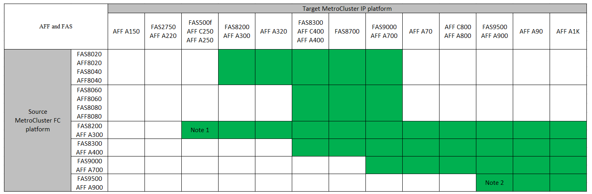

= Scelta della procedura di transizione
:allow-uri-read: 
:icons: font
:imagesdir: ../media/

[role="lead"]
Quando si passa a una configurazione MetroCluster IP, è necessario disporre di una combinazione di modelli di piattaforma supportati. È inoltre necessario assicurarsi che la piattaforma IP di MetroCluster sia delle dimensioni appropriate per il carico che si sta passando dalla configurazione FC di MetroCluster alla configurazione IP di MetroCluster.

La seguente tabella mostra le combinazioni di piattaforme supportate. È possibile passare da piattaforme nella colonna di sinistra a piattaforme elencate come supportate nelle colonne a destra, come indicato dalle celle colorate della tabella.

Ad esempio, è supportata la transizione da una configurazione MetroCluster FC costituita da moduli controller AFF8060 a una configurazione IP costituita da moduli controller AFF A400.

* Nota 1: Questa combinazione di piattaforme richiede ONTAP 9.13.1 o versione successiva.
* Nota 2: È necessario disporre di un'interfaccia 100GbE per le interfacce cluster locali sui nodi FC. Questa combinazione di piattaforme richiede ONTAP 9.11.1 o versione successiva.
* Tutte le procedure di transizione richiedono ONTAP 9.8 o versioni successive, salvo diversamente indicato nelle note o come richiesto da una singola piattaforma.
* Tutti i nodi della configurazione MetroCluster devono utilizzare la stessa versione di ONTAP. Ad esempio, se si dispone di una configurazione a otto nodi, tutti e otto i nodi devono utilizzare la stessa versione di ONTAP.

[NOTE]
====
* Non superare i limiti di oggetti della "parte inferiore" delle piattaforme nella combinazione. Applicare il limite inferiore di oggetti delle due piattaforme.
* Se i limiti della piattaforma di destinazione sono inferiori ai limiti MetroCluster, è necessario riconfigurare il MetroCluster in modo che sia pari o inferiore ai limiti della piattaforma di destinazione prima di aggiungere i nuovi nodi.
* Fare riferimento a. link:https://hwu.netapp.com["Hardware Universe"^] per i limiti della piattaforma.

====
Selezionare una procedura di transizione in base alla configurazione MetroCluster FC esistente.

Una procedura di transizione sostituisce il fabric switch FC back-end o la connessione FC-VI con una rete switch IP. La procedura esatta dipende dalla configurazione iniziale.

Le piattaforme originali e gli switch FC (se presenti) vengono ritirati al termine della procedura di transizione.

[cols="20,20,20,40"]
|===

| Avvio della configurazione | Disruptivo o senza interruzioni | Requisiti | Procedura 

 a| 
Otto nodi
 a| 
Senza interruzioni
 a| 
I nuovi shelf di storage sono supportati sulle nuove piattaforme.
 a| 
link:concept_nondisruptively_transitioning_from_a_four_node_mcc_fc_to_a_mcc_ip_configuration.html["Collegamento alla procedura"]

 a| 
Quattro nodi
 a| 
Senza interruzioni
 a| 
I nuovi shelf di storage sono supportati sulle nuove piattaforme.
 a| 
link:concept_nondisruptively_transitioning_from_a_four_node_mcc_fc_to_a_mcc_ip_configuration.html["Collegamento alla procedura"]

 a| 
Due nodi
 a| 
Disgregativo
 a| 
I nuovi shelf di storage sono supportati sia sulle piattaforme originali che su quelle nuove.
 a| 
link:task_disruptively_transition_from_a_two_node_mcc_fc_to_a_four_node_mcc_ip_configuration.html["Collegamento alla procedura"]

 a| 
Due nodi
 a| 
Disgregativo
 a| 
I nuovi shelf di storage sono supportati sia sulle piattaforme originali che su quelle nuove. I vecchi shelf di storage devono essere ritirati.
 a| 
link:task_disruptively_transition_while_move_volumes_from_old_shelves_to_new_shelves.html["Collegamento alla procedura"]

 a| 
Due nodi
 a| 
Disgregativo
 a| 
I vecchi shelf di storage non sono supportati sulle nuove piattaforme. I vecchi shelf di storage devono essere ritirati.
 a| 
link:task_disruptively_transition_when_exist_shelves_are_not_supported_on_new_controllers.html["Collegamento alla procedura"]

|===