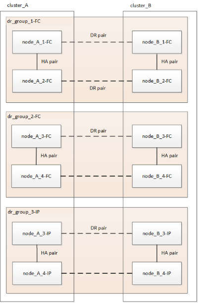

= Workflow per la transizione MetroCluster senza interruzioni
:allow-uri-read: 
:icons: font
:imagesdir: ../media/

[role="lead"]
È necessario seguire il workflow specifico per garantire una transizione senza interruzioni. Scegli il flusso di lavoro per la tua configurazione:

* <<Workflow di transizione della configurazione FC a quattro nodi>>
* <<Workflow di transizione della configurazione FC a otto nodi>>

== Workflow di transizione della configurazione FC a quattro nodi

Il processo di transizione inizia con una configurazione FC MetroCluster a quattro nodi funzionante.

image::../media/transition_dr_group_1_fc_nodes.png[transizione dei nodi fc del gruppo dr 1]

I nuovi nodi IP MetroCluster vengono aggiunti come secondo gruppo DR.

image::../media/transition_dr_groups_fc_and_ip.png[gruppi di dr di transizione fc e ip]

I dati vengono trasferiti dal vecchio gruppo DR al nuovo gruppo DR, quindi i vecchi nodi e il relativo storage vengono rimossi dalla configurazione e dismessi. Il processo termina con una configurazione IP MetroCluster a quattro nodi.

image::../media/transition_dr_group_2_ip.png[ip gruppo 2 dr di transizione]

== Workflow di transizione della configurazione FC a otto nodi

Il processo di transizione inizia con una configurazione FC MetroCluster a otto nodi funzionante.

image::../media/mcc_dr_group_c1.png[gruppo dr mcc c1]

I nuovi nodi IP MetroCluster vengono aggiunti come terzo gruppo DR.

I dati vengono trasferiti da DR_Group_1-FC a DR_Group_1-IP, quindi i vecchi nodi e il relativo storage vengono rimossi dalla configurazione e dismessi.

NOTE: Se si desidera passare da una configurazione FC a otto nodi a una configurazione IP a quattro nodi, è necessario trasferire tutti i dati in DR_Group_1-FC e DR_Group_2-FC al nuovo gruppo DR IP (DR_Group_1-IP). È quindi possibile decommissionare entrambi i gruppi DR FC. Una volta rimossi i gruppi FC DR, il processo termina con una configurazione IP MetroCluster a quattro nodi.

image::../media/mcc_dr_group_c8.png[mcc dr group c8]

Aggiungere i restanti nodi IP MetroCluster alla configurazione MetroCluster esistente. Ripetere la procedura per trasferire i dati dai nodi DR_Group_2-FC ai nodi DR_Group_2-IP.

image::../media/mcc_dr_group_c7.png[gruppo dr mcc c7]

Dopo aver rimosso DR_Group_2-FC, il processo termina con una configurazione IP MetroCluster a otto nodi.

image::../media/mcc_dr_group_c6.png[gruppo dr mcc c6]

== Workflow del processo di transizione

Per eseguire la transizione della configurazione MetroCluster, utilizzare il seguente flusso di lavoro.

image::../media/workflow_4n_transition_nondisruptive.png[workflow 4n transizione senza interruzioni]
