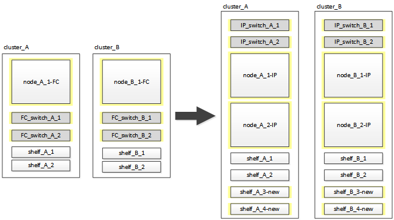

= Transizione dirompente da un MetroCluster FC a due nodi a una configurazione MetroCluster IP a quattro nodi (ONTAP 9.8 e versioni successive)
:allow-uri-read: 
:icons: font
:imagesdir: ../media/

[role="lead"]
A partire da ONTAP 9.8, è possibile trasferire carichi di lavoro e dati da una configurazione MetroCluster FC a due nodi esistente a una nuova configurazione MetroCluster IP a quattro nodi. Gli shelf di dischi dai nodi FC MetroCluster vengono spostati nei nodi IP.

L'illustrazione seguente fornisce una vista semplificata della configurazione prima e dopo questa procedura di transizione.

* Questa procedura è supportata nei sistemi che eseguono ONTAP 9.8 e versioni successive.
* Questa procedura ha un'interruzione.
* Questa procedura si applica solo a una configurazione MetroCluster FC a due nodi.
+
Se si dispone di una configurazione MetroCluster FC a quattro nodi, vedere link:concept_choosing_your_transition_procedure_mcc_transition.html["Scelta della procedura di transizione"].

* ADP non è supportato nella configurazione IP MetroCluster a quattro nodi creata da questa procedura.
* È necessario soddisfare tutti i requisiti e seguire tutte le fasi della procedura.
* Gli shelf di storage esistenti vengono spostati nei nuovi nodi IP MetroCluster.
* Se necessario, è possibile aggiungere ulteriori shelf di storage alla configurazione.
+
Vedere link:concept_requirements_for_fc_to_ip_transition_2n_mcc_transition.html["Riutilizzo degli shelf dei dischi e requisiti dei dischi per una transizione FC-IP senza interruzioni"].

