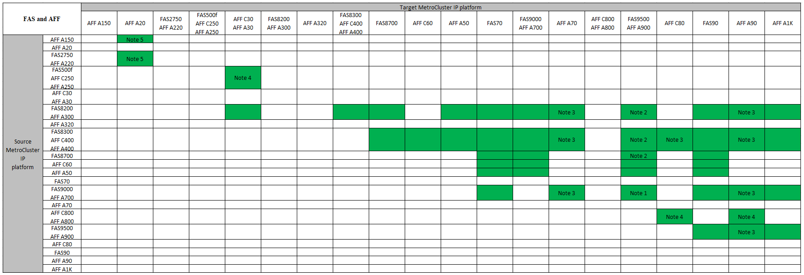

= Scegliere una procedura di aggiornamento del controller
:allow-uri-read: 
:icons: font
:imagesdir: ../media/

[role="lead"]
La procedura di aggiornamento del controller utilizzata dipende dal modello di piattaforma e dal tipo di configurazione MetroCluster.

In una procedura di aggiornamento, i controller vengono sostituiti con un nuovo modello di controller. I modelli di shelf storage non vengono aggiornati.

* Nelle procedure di switchover e switchback, l'operazione di switchover MetroCluster viene utilizzata per fornire un servizio senza interruzioni ai client mentre i moduli controller sul cluster partner vengono aggiornati.
* In una procedura di upgrade del controller basata su ARL, le operazioni di trasferimento aggregato vengono utilizzate per spostare i dati senza interruzioni dalla vecchia configurazione alla nuova configurazione aggiornata.

== Aggiornamenti dei controller supportati

Scopri le combinazioni di aggiornamento dei controller FC e IP MetroCluster supportate.

=== Aggiornamenti del controller IP MetroCluster supportati utilizzando i comandi "sostituzione del controller di sistema"

Fare riferimento alla tabella in link:task_upgrade_controllers_system_control_commands_in_a_four_node_mcc_ip.html["Aggiornare i controller in una configurazione MetroCluster IP a quattro nodi utilizzando lo switchover e lo switchback con i comandi "system controller replace" (ONTAP 9.13.1 e versioni successive)"] per le piattaforme supportate.

=== Tutti gli altri aggiornamenti dei controller IP MetroCluster supportati

Individuare la piattaforma *Source* dalle tabelle di aggiornamento del controller MetroCluster in questa sezione. Se l'intersezione della riga della piattaforma *Source* e della colonna della piattaforma *Target* è vuota, l'aggiornamento non è supportato.

* Se la piattaforma non è elencata, non è disponibile alcuna combinazione di upgrade del controller supportata.
* Quando si esegue un aggiornamento del controller, il vecchio e il nuovo tipo di piattaforma *devono* corrispondere:
+
** Puoi aggiornare un sistema FAS ad un sistema FAS o AFF A-Series ad un AFF a-Series.
** Non è possibile aggiornare un sistema FAS ad un AFF A-Series o AFF A-Series a un AFF C-Series.
+
Ad esempio, se la piattaforma che si desidera aggiornare è FAS8200, è possibile eseguire l'aggiornamento a FAS9000. Non è possibile aggiornare un sistema FAS8200 a un sistema AFF A700.

* Tutti i nodi (vecchi e nuovi) della configurazione MetroCluster devono eseguire la stessa versione di ONTAP. Fare riferimento alla link:https://hwu.netapp.com["Hardware Universe"^] per la versione minima supportata di ONTAP per la combinazione in uso.

.Aggiornamenti del controller IP AFF e FAS MetroCluster supportati
La seguente tabella mostra le combinazioni di piattaforme supportate per l'aggiornamento manuale di un sistema AFF o FAS in una configurazione IP di MetroCluster:

* Nota 1: Per questo aggiornamento, utilizzare la procedura link:task_upgrade_A700_to_A900_in_a_four_node_mcc_ip_us_switchover_and_switchback.html["Upgrade dei controller da AFF A700/FAS9000 a AFF A900/FAS9500 in una configurazione MetroCluster IP utilizzando switchover e switchback (ONTAP 9.10.1 o versione successiva)"]
* Nota 2: Gli aggiornamenti dei controller sono supportati nei sistemi che eseguono ONTAP 9.13.1 o versioni successive.
* Nota 3: La piattaforma di destinazione non può avere dischi interni fino al completamento dell'aggiornamento del controller. È possibile aggiungere le unità interne dopo l'aggiornamento.
* Nota 4: Richiede la sostituzione dei moduli controller.
* Nota 5: Richiede moduli IOM per convertire i vecchi controller in uno shelf SAS esterno. Fare riferimento alla link:https://hwu.netapp.com/["Hardware Universe"^] per i moduli IOM supportati.

.Aggiornamenti del controller IP ASA MetroCluster supportati
La seguente tabella mostra le combinazioni di piattaforme supportate per l'aggiornamento manuale di un sistema ASA in una configurazione IP di MetroCluster:

image:../media/mcc-ip-upgrade-asa-comb-9161.png["Mostra le combinazioni di piattaforme di aggiornamento dei controller IP MetroCluster supportate da ASA"]

* Nota 1: Gli upgrade dei controller sono supportati sui sistemi con ONTAP 9.13.1 o versione successiva.

=== Aggiornamenti del controller FC MetroCluster supportati

Individuare la piattaforma *Source* dalle tabelle di aggiornamento del controller MetroCluster in questa sezione. Se l'intersezione della riga della piattaforma *Source* e della colonna della piattaforma *Target* è vuota, l'aggiornamento non è supportato.

* Se la piattaforma non è elencata, non è disponibile alcuna combinazione di upgrade del controller supportata.
* Quando si esegue un aggiornamento del controller, il vecchio e il nuovo tipo di piattaforma *devono* corrispondere:
+
** Puoi aggiornare un sistema FAS ad un sistema FAS o AFF A-Series ad un AFF a-Series.
** Non è possibile aggiornare un sistema FAS ad un AFF A-Series o AFF A-Series a un AFF C-Series.
+
Ad esempio, se la piattaforma che si desidera aggiornare è FAS8200, è possibile eseguire l'aggiornamento a FAS9000. Non è possibile aggiornare un sistema FAS8200 a un sistema AFF A700.

* Tutti i nodi (vecchi e nuovi) della configurazione MetroCluster devono eseguire la stessa versione di ONTAP. Fare riferimento alla link:https://hwu.netapp.com["Hardware Universe"^] per la versione minima supportata di ONTAP per la combinazione in uso.

.Aggiornamenti dei controller FC AFF e FAS MetroCluster supportati
La tabella seguente mostra le combinazioni di piattaforme supportate per l'upgrade di un sistema AFF o FAS in una configurazione MetroCluster FC:

image::../media/metrocluster_fc_upgrade_table_aff_fas.png[MetroCluster fc upgrade table AFF FAS]

* Nota 1: Per l'aggiornamento dei controller quando le connessioni FCVI su nodi FAS8020 o AFF8020 esistenti utilizzano le porte 1c e 1d, vedere quanto seguehttps://kb.netapp.com/Advice_and_Troubleshooting/Data_Protection_and_Security/MetroCluster/Upgrading_controllers_when_FCVI_connections_on_existing_FAS8020_or_AFF8020_nodes_use_ports_1c_and_1d["Articolo della Knowledge base"^].
* Nota 2: Gli upgrade dei controller da piattaforme AFF A300 o FAS8200 utilizzando le porte integrate 0e e 0f come connessioni FC-VI sono supportati solo sui seguenti sistemi:
+
** ONTAP 9.9.1 e versioni precedenti
** ONTAP 9.10.1P9
** ONTAP 9.11.1P5
** ONTAP 9.12.1GA
** ONTAP 9.13.1 e versioni successive
+
Per ulteriori informazioni, consultare link:https://mysupport.netapp.com/site/bugs-online/product/ONTAP/BURT/1507088["Report pubblico"^].

* Nota 3: Per questo aggiornamento, fare riferimento a. link:task_upgrade_A700_to_A900_in_a_four_node_mcc_fc_us_switchover_and_switchback.html["Upgrade dei controller da AFF A700/FAS9000 a AFF A900/FAS9500 in una configurazione MetroCluster FC utilizzando switchover e switchback (ONTAP 9.10.1 o versione successiva)"]
* Nota 4: Gli upgrade dei controller sono supportati sui sistemi con ONTAP 9.13.1 o versione successiva.

.Aggiornamenti del controller FC ASA MetroCluster supportati
La tabella seguente mostra le combinazioni di piattaforme supportate per l'upgrade di un sistema ASA in una configurazione MetroCluster FC:

[cols="3*"]
|===
| Piattaforma FC MetroCluster di origine | Piattaforma FC MetroCluster di destinazione | Supportato? 

.2+| ASA A400 | ASA A400 | Sì 

| ASA A900 | No 

.2+| ASA A900 | ASA A400 | No 

| ASA A900 | Sì (vedere nota 1) 
|===
* Nota 1: Gli upgrade dei controller sono supportati sui sistemi con ONTAP 9.14.1 o versione successiva.

== Scegliere una procedura che utilizzi il processo di switchover e switchback

Dopo aver esaminato le combinazioni di aggiornamenti supportate, scegliere la procedura di aggiornamento del controller corretta per la configurazione.

[cols="2,1,1,2"]
|===

| Tipo di MetroCluster | Metodo di aggiornamento | Versione di ONTAP | Procedura 

 a| 
IP
 a| 
Eseguire l'aggiornamento con i comandi "System controller replace"
 a| 
9.13.1 e versioni successive
 a| 
link:task_upgrade_controllers_system_control_commands_in_a_four_node_mcc_ip.html["Collegamento alla procedura"]

 a| 
FC
 a| 
Eseguire l'aggiornamento con i comandi "System controller replace"
 a| 
9.10.1 e versioni successive
 a| 
link:task_upgrade_controllers_system_control_commands_in_a_four_node_mcc_fc.html["Collegamento alla procedura"]

 a| 
FC
 a| 
Aggiornamento manuale con comandi CLI (solo da AFF A700/FAS9000 a AFF A900/FAS9500)
 a| 
9.10.1 e versioni successive
 a| 
link:task_upgrade_A700_to_A900_in_a_four_node_mcc_fc_us_switchover_and_switchback.html["Collegamento alla procedura"]

 a| 
IP
 a| 
Aggiornamento manuale con comandi CLI (solo da AFF A700/FAS9000 a AFF A900/FAS9500)
 a| 
9.10.1 e versioni successive
 a| 
link:task_upgrade_A700_to_A900_in_a_four_node_mcc_ip_us_switchover_and_switchback.html["Collegamento alla procedura"]

 a| 
FC
 a| 
Aggiornamento manuale con comandi CLI
 a| 
9.8 e versioni successive
 a| 
link:task_upgrade_controllers_in_a_four_node_fc_mcc_us_switchover_and_switchback_mcc_fc_4n_cu.html["Collegamento alla procedura"]

 a| 
IP
 a| 
Aggiornamento manuale con comandi CLI
 a| 
9.8 e versioni successive
 a| 
link:task_upgrade_controllers_in_a_four_node_ip_mcc_us_switchover_and_switchback_mcc_ip.html["Collegamento alla procedura"]

|===

== Scelta di una procedura che utilizzi il trasferimento di aggregati

In una procedura di upgrade del controller basata su ARL, le operazioni di trasferimento aggregato vengono utilizzate per spostare i dati senza interruzioni dalla vecchia configurazione alla nuova configurazione aggiornata.

|===
| Tipo di MetroCluster | Ricollocazione di aggregati | Versione di ONTAP | Procedura 

 a| 
FC
 a| 
Utilizzo dei comandi "System controller replace" per aggiornare i modelli di controller nello stesso chassis
 a| 
9.10.1 e versioni successive
 a| 
https://docs.netapp.com/us-en/ontap-systems-upgrade/upgrade-arl-auto-affa900/index.html["Collegamento alla procedura"^]

 a| 
FC
 a| 
Utilizzo di `system controller replace` comandi
 a| 
9.8 e versioni successive
 a| 
https://docs.netapp.com/us-en/ontap-systems-upgrade/upgrade-arl-auto-app/index.html["Collegamento alla procedura"^]

 a| 
FC
 a| 
Utilizzo di `system controller replace` comandi
 a| 
da 9.5 a 9.7
 a| 
https://docs.netapp.com/us-en/ontap-systems-upgrade/upgrade-arl-auto/index.html["Collegamento alla procedura"^]

 a| 
FC
 a| 
Utilizzo di comandi ARL manuali
 a| 
9.8
 a| 
https://docs.netapp.com/us-en/ontap-systems-upgrade/upgrade-arl-manual-app/index.html["Collegamento alla procedura"^]

 a| 
FC
 a| 
Utilizzo di comandi ARL manuali
 a| 
9.7 e versioni precedenti
 a| 
https://docs.netapp.com/us-en/ontap-systems-upgrade/upgrade-arl-manual/index.html["Collegamento alla procedura"^]

|===