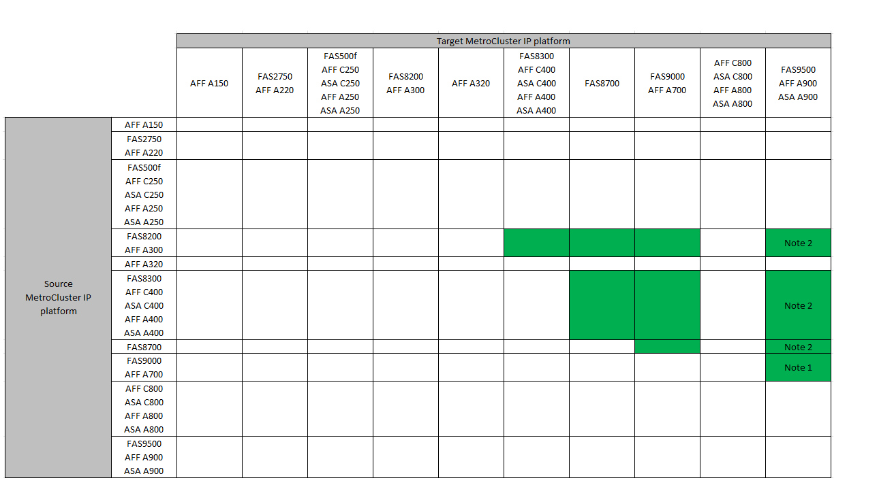

= Scegliere una procedura di aggiornamento del controller
:allow-uri-read: 
:icons: font
:imagesdir: ../media/

[role="lead"]
La procedura di aggiornamento del controller utilizzata dipende dal modello di piattaforma e dal tipo di configurazione MetroCluster.

In una procedura di aggiornamento, i controller vengono sostituiti con un nuovo modello di controller. I modelli di shelf storage non vengono aggiornati.

* Nelle procedure di switchover e switchback, l'operazione di switchover MetroCluster viene utilizzata per fornire un servizio senza interruzioni ai client mentre i moduli controller sul cluster partner vengono aggiornati.
* In una procedura di upgrade del controller basata su ARL, le operazioni di trasferimento aggregato vengono utilizzate per spostare i dati senza interruzioni dalla vecchia configurazione alla nuova configurazione aggiornata.

== Scelta di una procedura che utilizzi il processo di switchover e switchback

Selezionare la piattaforma corrente dalla tabella FC o IP riportata di seguito. Se l'intersezione tra la riga della piattaforma corrente e la colonna della piattaforma di destinazione è vuota, l'aggiornamento non è supportato.

=== Aggiornamenti del controller IP MetroCluster supportati

Se la piattaforma non è elencata, non è disponibile alcuna combinazione di upgrade del controller supportata.

[IMPORTANT]
====
Quando si esegue un aggiornamento del controller, il vecchio e il nuovo tipo di piattaforma *devono* corrispondere.

* Puoi aggiornare un sistema FAS ad un sistema FAS o AFF A-Series ad un AFF a-Series.
* Non è possibile aggiornare un sistema FAS ad un AFF A-Series o AFF A-Series a un AFF C-Series.

Ad esempio, se la piattaforma che si desidera aggiornare è FAS8200, è possibile eseguire l'aggiornamento a FAS9000. Non è possibile aggiornare un sistema FAS8200 a un sistema AFF A700.

====

* Nota 1: Per questo aggiornamento, utilizzare la procedura link:task_upgrade_A700_to_A900_in_a_four_node_mcc_ip_us_switchover_and_switchback.html["Upgrade dei controller da AFF A700/FAS9000 a AFF A900/FAS9500 in una configurazione MetroCluster IP utilizzando switchover e switchback (ONTAP 9.10.1 o versione successiva)"]
* Nota 2: Gli aggiornamenti dei controller sono supportati nei sistemi che eseguono ONTAP 9.13.1 o versioni successive.
* Tutti i nodi della configurazione MetroCluster devono utilizzare la stessa versione di ONTAP. Ad esempio, i nuovi controller devono eseguire la stessa versione di ONTAP dei vecchi controller.

=== Aggiornamenti del controller FC MetroCluster supportati

Se la piattaforma non è elencata, non è disponibile alcuna combinazione di upgrade del controller supportata.

[IMPORTANT]
====
Quando si esegue un aggiornamento del controller, il vecchio e il nuovo tipo di piattaforma *devono* corrispondere.

* Puoi aggiornare un sistema FAS ad un sistema FAS o AFF A-Series ad un AFF a-Series.
* Non è possibile aggiornare un sistema FAS ad un AFF A-Series o AFF A-Series a un AFF C-Series.

Ad esempio, se la piattaforma che si desidera aggiornare è FAS8200, è possibile eseguire l'aggiornamento a FAS9000. Non è possibile aggiornare un sistema FAS8200 a un sistema AFF A700.

====
image::../media/metrocluster_fc_upgrade_table_914.png[MetroCluster fc tabella di aggiornamento 914]

* Nota 1: Per l'aggiornamento dei controller quando le connessioni FCVI su nodi FAS8020 o AFF8020 esistenti utilizzano le porte 1c e 1d, vedere quanto seguehttps://kb.netapp.com/Advice_and_Troubleshooting/Data_Protection_and_Security/MetroCluster/Upgrading_controllers_when_FCVI_connections_on_existing_FAS8020_or_AFF8020_nodes_use_ports_1c_and_1d["Articolo della Knowledge base"^].
* Nota 2: Gli aggiornamenti dei controller dalle piattaforme AFF A300 o FAS8200 che utilizzano le porte onboard 0e e 0f come connessioni FC-VI sono supportati solo sui sistemi che eseguono ONTAP 9.9.1. o prima. Per ulteriori informazioni, consultare link:https://mysupport.netapp.com/site/bugs-online/product/ONTAP/BURT/1507088["Report pubblico"^].
* Nota 3: Per questo aggiornamento, fare riferimento a. link:task_upgrade_A700_to_A900_in_a_four_node_mcc_fc_us_switchover_and_switchback.html["Upgrade dei controller da AFF A700/FAS9000 a AFF A900/FAS9500 in una configurazione MetroCluster FC utilizzando switchover e switchback (ONTAP 9.10.1 o versione successiva)"]
* Nota 4: Gli upgrade dei controller sono supportati sui sistemi con ONTAP 9.13.1 o versione successiva.
* Nota 5: Gli upgrade dei controller sono supportati sui sistemi con ONTAP 9.14.1 o versione successiva.
* Tutti i nodi della configurazione MetroCluster devono utilizzare la stessa versione di ONTAP. Ad esempio, i nuovi controller devono eseguire la stessa versione di ONTAP dei vecchi controller.

[cols="2,1,1,2"]
|===

| Tipo di MetroCluster | Metodo di aggiornamento | Versione di ONTAP | Procedura 

 a| 
IP
 a| 
Eseguire l'aggiornamento con i comandi "System controller replace"
 a| 
9.13.1 e versioni successive
 a| 
link:task_upgrade_controllers_system_control_commands_in_a_four_node_mcc_ip.html["Collegamento alla procedura"]

 a| 
FC
 a| 
Eseguire l'aggiornamento con i comandi "System controller replace"
 a| 
9.10.1 e versioni successive
 a| 
link:task_upgrade_controllers_system_control_commands_in_a_four_node_mcc_fc.html["Collegamento alla procedura"]

 a| 
FC
 a| 
Aggiornamento manuale con comandi CLI (solo da AFF A700/FAS9000 a AFF A900/FAS9500)
 a| 
9.10.1 e versioni successive
 a| 
link:task_upgrade_A700_to_A900_in_a_four_node_mcc_fc_us_switchover_and_switchback.html["Collegamento alla procedura"]

 a| 
IP
 a| 
Aggiornamento manuale con comandi CLI (solo da AFF A700/FAS9000 a AFF A900/FAS9500)
 a| 
9.10.1 e versioni successive
 a| 
link:task_upgrade_A700_to_A900_in_a_four_node_mcc_ip_us_switchover_and_switchback.html["Collegamento alla procedura"]

 a| 
FC
 a| 
Aggiornamento manuale con comandi CLI
 a| 
9.8 e versioni successive
 a| 
link:task_upgrade_controllers_in_a_four_node_fc_mcc_us_switchover_and_switchback_mcc_fc_4n_cu.html["Collegamento alla procedura"]

 a| 
IP
 a| 
Aggiornamento manuale con comandi CLI
 a| 
9.8 e versioni successive
 a| 
link:task_upgrade_controllers_in_a_four_node_ip_mcc_us_switchover_and_switchback_mcc_ip.html["Collegamento alla procedura"]

|===

== Scelta di una procedura che utilizzi il trasferimento di aggregati

In una procedura di upgrade del controller basata su ARL, le operazioni di trasferimento aggregato vengono utilizzate per spostare i dati senza interruzioni dalla vecchia configurazione alla nuova configurazione aggiornata.

|===
| Tipo di MetroCluster | Ricollocazione di aggregati | Versione di ONTAP | Procedura 

 a| 
FC
 a| 
Utilizzo dei comandi "System controller replace" per aggiornare i modelli di controller nello stesso chassis
 a| 
9.10.1 e versioni successive
 a| 
https://docs.netapp.com/us-en/ontap-systems-upgrade/upgrade-arl-auto-affa900/index.html["Collegamento alla procedura"^]

 a| 
FC
 a| 
Utilizzo di `system controller replace` comandi
 a| 
9.8 e versioni successive
 a| 
https://docs.netapp.com/us-en/ontap-systems-upgrade/upgrade-arl-auto-app/index.html["Collegamento alla procedura"^]

 a| 
FC
 a| 
Utilizzo di `system controller replace` comandi
 a| 
da 9.5 a 9.7
 a| 
https://docs.netapp.com/us-en/ontap-systems-upgrade/upgrade-arl-auto/index.html["Collegamento alla procedura"^]

 a| 
FC
 a| 
Utilizzo di comandi ARL manuali
 a| 
9.8
 a| 
https://docs.netapp.com/us-en/ontap-systems-upgrade/upgrade-arl-manual-app/index.html["Collegamento alla procedura"^]

 a| 
FC
 a| 
Utilizzo di comandi ARL manuali
 a| 
9.7 e versioni precedenti
 a| 
https://docs.netapp.com/us-en/ontap-systems-upgrade/upgrade-arl-manual/index.html["Collegamento alla procedura"^]

|===