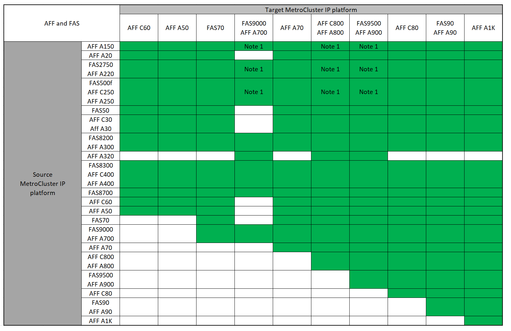

= Scelta di un metodo di refresh del sistema
:allow-uri-read: 
:icons: font
:imagesdir: ../media/

[role="lead"]
La procedura di refresh del sistema utilizzata dipende dal modello di piattaforma e dal tipo di configurazione MetroCluster. Le procedure di refresh si applicano ai controller e agli shelf di storage. Nelle procedure di refresh, nuovi controller e shelf vengono aggiunti alla configurazione di MetroCluster, creando un secondo gruppo di DR e quindi i dati vengono migrati senza interruzioni nei nuovi nodi. I controller originali vengono quindi ritirati.

== Combinazioni di aggiornamento tecnico MetroCluster IP supportate

* È necessario completare la procedura di aggiornamento tecnico prima di aggiungere un nuovo carico.
* Tutti i nodi della configurazione MetroCluster devono utilizzare la stessa versione di ONTAP. Ad esempio, se si dispone di una configurazione a otto nodi, tutti e otto i nodi devono utilizzare la stessa versione di ONTAP. Fare riferimento alla link:https://hwu.netapp.com["Hardware Universe"^] per la versione minima supportata di ONTAP per la combinazione in uso.
* Non superare i limiti di oggetti della "parte inferiore" delle piattaforme nella combinazione. Applicare il limite inferiore di oggetti delle due piattaforme.
* Se i limiti della piattaforma di destinazione sono inferiori ai limiti MetroCluster, è necessario riconfigurare il MetroCluster in modo che sia uguale o inferiore ai limiti della piattaforma di destinazione prima di aggiungere i nuovi nodi.
* Fare riferimento a. link:https://hwu.netapp.com["Hardware Universe"^] per i limiti della piattaforma.

=== Combinazioni di tech refresh AFF e FAS MetroCluster IP supportate

Nella tabella seguente sono illustrate le combinazioni di piattaforme supportate per l'aggiornamento di un sistema AFF o FAS in una configurazione IP di MetroCluster. Le tabelle sono suddivise in due gruppi:

* *Gruppo 1* mostra le combinazioni per i sistemi AFF A150, AFF A20, FAS2750, AFF A220, FAS500f, AFF C250, FAS8200, FAS50, AFF C30, AFF A30, AFF A250, AFF A300, AFF A320, FAS8300, AFF C400, AFF A400 e FAS8700.
* *Gruppo 2* mostra le combinazioni per i sistemi AFF C60, AFF A50, FAS70, FAS9000, AFF A700, AFF A70, AFF C800, AFF A800, FAS9500, AFF A900, AFF C80, FAS90, AFF A90 e AFF A1K.

Le seguenti note si applicano a entrambi i gruppi:

* Nota 1: Questa combinazione richiede ONTAP 9.13.1 o versione successiva.

[role="tabbed-block"]
====
.Combinazioni AFF e FAS gruppo 1
--
Esaminare le combinazioni di refresh del sistema per i sistemi AFF A150, AFF A20, FAS2750, AFF A220, FAS500f, AFF C250, FAS8200, FAS50, AFF C30, AFF A30, AFF A250, AFF A300, AFF A320, FAS8300, AFF C400, AFF A400 e FAS8700.

image:../media/tech-refresh-ip-group-1-updated.png[""]

--
.Combinazioni AFF e FAS gruppo 2
--
Esaminare le combinazioni di refresh del sistema per i sistemi AFF C60, AFF A50, FAS70, FAS9000, AFF A700, AFF A70, AFF C800, AFF A800, FAS9500, AFF A900, AFF C80, FAS90, AFF A90 e AFF A1K.

--
====

=== Combinazioni di aggiornamento tecnologico ASA MetroCluster IP supportate

La seguente tabella mostra le combinazioni di piattaforme supportate per l'aggiornamento di un sistema ASA in una configurazione MetroCluster IP:

image::../media/mcc-ip-techrefresh-asa-9161.png[Combinazioni di aggiornamento tecnologico di MetroCluster IP ASA]

== Combinazioni di aggiornamento tecnico FC MetroCluster supportate

* È necessario completare la procedura di aggiornamento tecnico prima di aggiungere un nuovo carico.
* Tutti i nodi della configurazione MetroCluster devono utilizzare la stessa versione di ONTAP. Ad esempio, se si dispone di una configurazione a otto nodi, tutti e otto i nodi devono utilizzare la stessa versione di ONTAP. Fare riferimento alla link:https://hwu.netapp.com["Hardware Universe"^] per la versione minima supportata di ONTAP per la combinazione in uso.
* Non superare i limiti di oggetti della "parte inferiore" delle piattaforme nella combinazione. Applicare il limite inferiore di oggetti delle due piattaforme.
* Se i limiti della piattaforma di destinazione sono inferiori ai limiti MetroCluster, è necessario riconfigurare il MetroCluster in modo che sia pari o inferiore ai limiti della piattaforma di destinazione prima di aggiungere i nuovi nodi.
* Fare riferimento a. link:https://hwu.netapp.com["Hardware Universe"^] per i limiti della piattaforma.

=== Combinazioni supportate di tech refresh AFF e FAS MetroCluster FC

La tabella seguente mostra le combinazioni di piattaforme supportate per l'aggiornamento di un sistema AFF o FAS in una configurazione MetroCluster FC:

image::../media/metrocluster_fc_tech_refresh.png[aggiornamento tecnico di MetroCluster fc]

=== Combinazioni di tech refresh FC ASA MetroCluster supportate

La tabella seguente mostra le combinazioni di piattaforme supportate per l'aggiornamento di un sistema ASA in una configurazione MetroCluster FC:

[cols="3*"]
|===
| Piattaforma FC MetroCluster di origine | Piattaforma FC MetroCluster di destinazione | Supportato? 

.2+| ASA A400 | ASA A400 | Sì 

| ASA A900 | No 

.2+| ASA A900 | ASA A400 | No 

| ASA A900 | Sì 
|===

== Scegliere una procedura di aggiornamento

Scegliere la procedura di aggiornamento per la configurazione dalla tabella riportata di seguito.

[cols="2,1,1,2"]
|===
| Metodo di refresh | Tipo di configurazione | Versione di ONTAP | Procedura 

 a| 
* Metodo: Espandere la configurazione MetroCluster e rimuovere i nodi precedenti

 a| 
FC a quattro nodi
 a| 
9.6 e versioni successive
 a| 
link:task_refresh_4n_mcc_fc.html["Collegamento alla procedura"]

 a| 
* Metodo: Espandere la configurazione MetroCluster e rimuovere i nodi precedenti

 a| 
IP a quattro nodi
 a| 
9.8 e versioni successive
 a| 
link:task_refresh_4n_mcc_ip.html["Collegamento alla procedura"]

|===