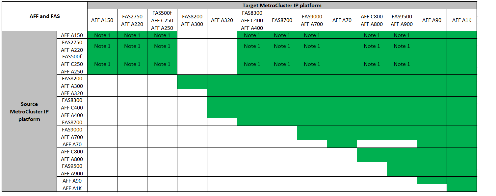
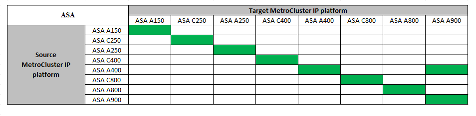

= Scelta di un metodo di refresh del sistema
:allow-uri-read: 
:icons: font
:imagesdir: ../media/

[role="lead"]
La procedura di refresh del sistema utilizzata dipende dal modello di piattaforma e dal tipo di configurazione MetroCluster. Le procedure di refresh si applicano ai controller e agli shelf di storage. Nelle procedure di refresh, nuovi controller e shelf vengono aggiunti alla configurazione di MetroCluster, creando un secondo gruppo di DR e quindi i dati vengono migrati senza interruzioni nei nuovi nodi. I controller originali vengono quindi ritirati.

== Combinazioni di aggiornamento tecnico MetroCluster IP supportate

* È necessario completare la procedura di aggiornamento tecnico prima di aggiungere un nuovo carico.
* Tutti i nodi della configurazione MetroCluster devono utilizzare la stessa versione di ONTAP. Ad esempio, se si dispone di una configurazione a otto nodi, tutti e otto i nodi devono utilizzare la stessa versione di ONTAP.
* Non superare i limiti di oggetti della "parte inferiore" delle piattaforme nella combinazione. Applicare il limite inferiore di oggetti delle due piattaforme.
* Se i limiti della piattaforma di destinazione sono inferiori ai limiti MetroCluster, è necessario riconfigurare il MetroCluster in modo che sia uguale o inferiore ai limiti della piattaforma di destinazione prima di aggiungere i nuovi nodi.
* Fare riferimento a. link:https://hwu.netapp.com["Hardware Universe"^] per i limiti della piattaforma.

.Combinazioni di tech refresh AFF e FAS MetroCluster IP supportate
La tabella seguente mostra le combinazioni di piattaforme supportate per l'aggiornamento di un sistema AFF o FAS in una configurazione IP di MetroCluster:

*Nota 1:* questa combinazione richiede ONTAP 9.13.1 o versione successiva.

.Combinazioni di aggiornamento tecnologico ASA MetroCluster IP supportate
La seguente tabella mostra le combinazioni di piattaforme supportate per l'aggiornamento di un sistema ASA in una configurazione MetroCluster IP:

== Combinazioni di aggiornamento tecnico FC MetroCluster supportate

* È necessario completare la procedura di aggiornamento tecnico prima di aggiungere un nuovo carico.
* Tutti i nodi della configurazione MetroCluster devono utilizzare la stessa versione di ONTAP. Ad esempio, se si dispone di una configurazione a otto nodi, tutti e otto i nodi devono utilizzare la stessa versione di ONTAP.
* Non superare i limiti di oggetti della "parte inferiore" delle piattaforme nella combinazione. Applicare il limite inferiore di oggetti delle due piattaforme.
* Se i limiti della piattaforma di destinazione sono inferiori ai limiti MetroCluster, è necessario riconfigurare il MetroCluster in modo che sia pari o inferiore ai limiti della piattaforma di destinazione prima di aggiungere i nuovi nodi.
* Fare riferimento a. link:https://hwu.netapp.com["Hardware Universe"^] per i limiti della piattaforma.

.Combinazioni supportate di tech refresh AFF e FAS MetroCluster FC
La tabella seguente mostra le combinazioni di piattaforme supportate per l'aggiornamento di un sistema AFF o FAS in una configurazione MetroCluster FC:

image::../media/metrocluster_fc_tech_refresh.png[aggiornamento tecnico di MetroCluster fc]

.Combinazioni di tech refresh FC ASA MetroCluster supportate
La tabella seguente mostra le combinazioni di piattaforme supportate per l'aggiornamento di un sistema ASA in una configurazione MetroCluster FC:

[cols="3*"]
|===
| Piattaforma FC MetroCluster di origine | Piattaforma FC MetroCluster di destinazione | Supportato? 

.2+| ASA A400 | ASA A400 | Sì 

| ASA A900 | No 

.2+| ASA A900 | ASA A400 | No 

| ASA A900 | Sì 
|===

== Scegliere una procedura di aggiornamento

Scegliere la procedura di aggiornamento per la configurazione dalla tabella riportata di seguito.

[cols="2,1,1,2"]
|===
| Metodo di refresh | Tipo di configurazione | Versione di ONTAP | Procedura 

 a| 
* Metodo: Espandere la configurazione MetroCluster e rimuovere i nodi precedenti

 a| 
FC a quattro nodi
 a| 
9.6 e versioni successive
 a| 
link:task_refresh_4n_mcc_fc.html["Collegamento alla procedura"]

 a| 
* Metodo: Espandere la configurazione MetroCluster e rimuovere i nodi precedenti

 a| 
IP a quattro nodi
 a| 
9.8 e versioni successive
 a| 
link:task_refresh_4n_mcc_ip.html["Collegamento alla procedura"]

|===