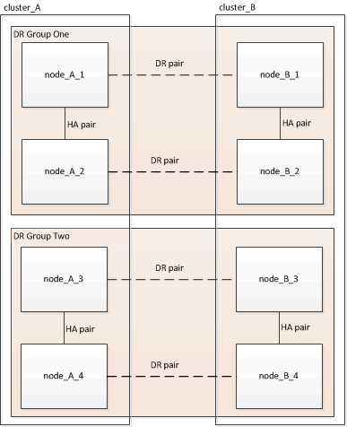

= Rimozione di un gruppo di disaster recovery
:allow-uri-read: 
:icons: font
:imagesdir: ../media/

[role="lead"]
A partire da ONTAP 9.8, è possibile rimuovere un gruppo di DR da una configurazione MetroCluster a otto nodi per creare una configurazione MetroCluster a quattro nodi.

Questa procedura è supportata in ONTAP 9.8 e versioni successive. Per i sistemi che eseguono ONTAP 9.7 o versioni precedenti, consultare l'articolo della Knowledge base

link:https://kb.netapp.com/Advice_and_Troubleshooting/Data_Protection_and_Security/MetroCluster/How_to_remove_a_DR-Group_from_a_MetroCluster["Come rimuovere un gruppo DR da una configurazione MetroCluster"]

https://mysupport.netapp.com/site/global/dashboard["Supporto NetApp"]

Una configurazione a otto nodi include otto nodi organizzati in due gruppi DR a quattro nodi.

Rimuovendo un gruppo di DR, nella configurazione rimangono quattro nodi.

image::../media/mcc_dr_groups_4_node.gif[mcc dr raggruppa 4 nodi]

== Rimozione dei nodi del gruppo di DR da ciascun cluster

.Prima di iniziare
* È necessario eseguire questa operazione su entrambi i cluster.
* Il `metrocluster remove-dr-group` Il comando è supportato solo su ONTAP 9.8 e versioni successive.

.Fasi
. Se non lo hai già fatto, preparati per la rimozione del gruppo di DR.
+
.. Spostare tutti i volumi di dati in un altro gruppo di DR.
.. Se il gruppo DR da rimuovere contiene volumi mirror per la condivisione del carico, non è possibile spostarli.  Ricreare tutti i volumi mirror di condivisione del carico in un altro gruppo DR, quindi eliminare i volumi mirror di condivisione del carico nel gruppo DR da rimuovere.
.. Spostare tutti i volumi di metadati MDV_CRS in un altro gruppo DR seguendo la link:https://docs.netapp.com/us-en/ontap-metrocluster/upgrade/task_move_a_metadata_volume_in_mcc_configurations.html["Spostamento di un volume di metadati nelle configurazioni MetroCluster"] procedura.
.. Eliminare tutti i volumi di metadati MDV_aud che potrebbero esistere nel gruppo di DR da rimuovere.
.. Eliminare tutti gli aggregati di dati nel gruppo DR da rimuovere, come illustrato nell'esempio seguente:
+
[listing]
----
ClusterA::> storage aggregate show -node ClusterA-01, ClusterA-02 -fields aggregate ,node
ClusterA::> aggr delete -aggregate aggregate_name
ClusterB::> storage aggregate show -node ClusterB-01, ClusterB-02 -fields aggregate ,node
ClusterB::> aggr delete -aggregate aggregate_name
----
+

NOTE: Gli aggregati root non vengono cancellati.

.. Spostare i dati LIF offline.
`network interface modify -vserver _svm-name_ -lif _data-lif_ -status-admin down`
.. Eseguire la migrazione di tutte le LIF dei dati nei nodi domestici di un altro gruppo di DR. +
`network interface show -home-node _old_node_`
+
`network interface modify -vserver _svm-name_ -lif _data-lif_ -home-node _new_node_ -home-port _port-id_`

.. Riportare online i dati LIF.
`network interface modify -vserver _svm-name_ -lif _data-lif_ -status-admin up`
.. Eseguire la migrazione della LIF di gestione del cluster a un nodo principale in un altro gruppo di DR.
+
`network interface show -role cluster-mgmt`

+
`network interface modify -vserver _svm-name_ -lif _cluster_mgmt_ -home-node _new_node_ -home-port _port-id_`

+
La gestione dei nodi e le LIF tra cluster non vengono migrate.

.. Trasferire epsilon a un nodo di un altro gruppo DR, se necessario.
+
[listing]
----
ClusterA::> set advanced
ClusterA::*> cluster show
Move epsilon if needed
ClusterA::*> cluster modify -node nodename -epsilon false
ClusterA::*> cluster modify -node nodename -epsilon true

ClusterB::> set advanced
ClusterB::*> cluster show
ClusterB::*> cluster modify -node nodename -epsilon false
ClusterB::*> cluster modify -node nodename -epsilon true
ClusterB::*> set admin
----

. Identificare e rimuovere il gruppo DR.
+
.. Identificare il gruppo DR corretto per la rimozione:
+
`metrocluster node show`

.. Rimuovere i nodi del gruppo di DR: +
`metrocluster remove-dr-group -dr-group-id 1`
+
Nell'esempio seguente viene illustrata la rimozione della configurazione del gruppo di DR sul cluster_A.

+
[listing]
----
cluster_A::*>

Warning: Nodes in the DR group that are removed from the MetroCluster
         configuration will lose their disaster recovery protection.

         Local nodes "node_A_1-FC, node_A_2-FC"will be removed from the
         MetroCluster configuration. You must repeat the operation on the
         partner cluster "cluster_B"to remove the remote nodes in the DR group.
Do you want to continue? {y|n}: y

Info: The following preparation steps must be completed on the local and partner
      clusters before removing a DR group.

      1. Move all data volumes to another DR group.
      2. Move all MDV_CRS metadata volumes to another DR group.
      3. Delete all MDV_aud metadata volumes that may exist in the DR group to
      be removed.
      4. Delete all data aggregates in the DR group to be removed. Root
      aggregates are not deleted.
      5. Migrate all data LIFs to home nodes in another DR group.
      6. Migrate the cluster management LIF to a home node in another DR group.
      Node management and inter-cluster LIFs are not migrated.
      7. Transfer epsilon to a node in another DR group.

      The command is vetoed if the preparation steps are not completed on the
      local and partner clusters.
Do you want to continue? {y|n}: y
[Job 513] Job succeeded: Remove DR Group is successful.

cluster_A::*>
----

. Ripetere il passaggio precedente sul cluster partner.
. In una configurazione MetroCluster IP, rimuovere le connessioni MetroCluster sui nodi del vecchio gruppo di DR.
+
Questi comandi possono essere emessi da entrambi i cluster e applicati all'intero gruppo di DR che copre entrambi i cluster.

+
.. Scollegare i collegamenti:
+
`metrocluster configuration-settings connection disconnect _dr-group-id_`

.. Eliminare le interfacce MetroCluster sui nodi del vecchio gruppo di DR:
+
`metrocluster configuration-settings interface delete`

.. Eliminare la configurazione del vecchio gruppo di DR. +
`metrocluster configuration-settings dr-group delete`

. Disunire i nodi nel vecchio gruppo di DR.
+
È necessario eseguire questa operazione su ciascun cluster.

+
.. Impostare il livello di privilegio avanzato:
+
`set -privilege advanced`

.. Disattivare il failover dello storage:
+
`storage failover modify -node _node-name_ -enable false`

.. Disunire il nodo: +
`cluster unjoin -node _node-name_`
+
Ripetere questo passaggio per l'altro nodo locale del vecchio gruppo DR.

.. Impostare il livello di privilegio admin: +
`set -privilege admin`

. Riattivare il cluster ha nel nuovo gruppo di DR:
+
`cluster ha modify -configured true`

+
È necessario eseguire questa operazione su ciascun cluster.

. Arrestare, spegnere e rimuovere i vecchi moduli controller e gli shelf di storage.

