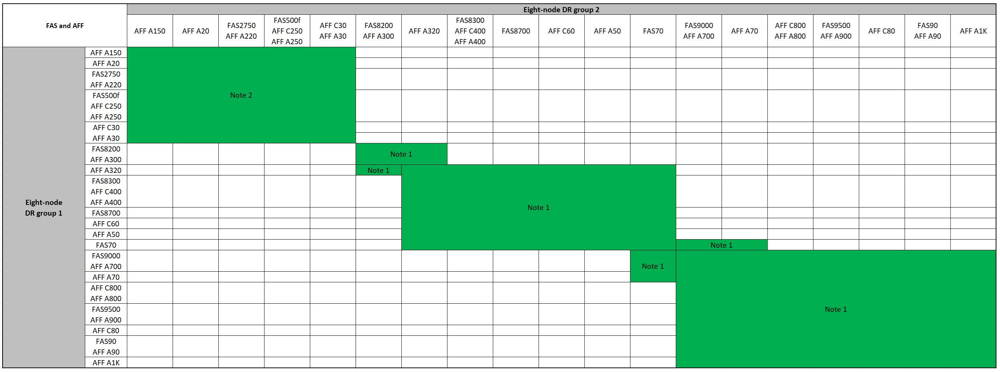

= Espandere una configurazione IP MetroCluster
:allow-uri-read: 
:icons: font
:imagesdir: ../media/

[role="lead"]
A seconda della versione di ONTAP, è possibile espandere la configurazione IP di MetroCluster aggiungendo quattro nuovi nodi come nuovo gruppo di DR.

A partire da ONTAP 9.13.1, puoi espandere temporaneamente una configurazione MetroCluster a otto nodi per fare un refresh dei controller e dello storage. Vedere link:task_refresh_4n_mcc_ip.html["Aggiornamento di una configurazione MetroCluster IP a quattro o otto nodi (ONTAP 9.8 e versioni successive)"] per ulteriori informazioni.

A partire da ONTAP 9.9.1, è possibile aggiungere quattro nuovi nodi alla configurazione IP di MetroCluster come secondo gruppo di DR. In questo modo viene creata una configurazione MetroCluster a otto nodi.

.Prima di iniziare
* I nodi vecchi e nuovi devono eseguire la stessa versione di ONTAP.
* Questa procedura descrive i passaggi necessari per aggiungere un gruppo DR a quattro nodi a una configurazione IP MetroCluster esistente. Se si aggiorna una configurazione a otto nodi, è necessario ripetere l'intera procedura per ciascun gruppo di DR, aggiungendone uno alla volta.
* Verificare che i modelli di piattaforma vecchi e nuovi siano supportati per la combinazione di piattaforme.
+
https://hwu.netapp.com["NetApp Hardware Universe"^]

* Verificare che i modelli di piattaforma vecchi e nuovi siano entrambi supportati dagli switch IP.
+
https://hwu.netapp.com["NetApp Hardware Universe"^]

* Se lo sei link:task_refresh_4n_mcc_ip.html["Aggiornamento di una configurazione IP MetroCluster a quattro o otto nodi"], i nuovi nodi devono disporre di spazio di archiviazione sufficiente per ospitare i dati dei vecchi nodi, insieme a dischi adeguati per gli aggregati root e i dischi di riserva.
* Verificare di disporre di un dominio di broadcast predefinito creato sui vecchi nodi.
+
Quando si aggiungono nuovi nodi a un cluster esistente senza un dominio di broadcast predefinito, le LIF di gestione nodi vengono create per i nuovi nodi utilizzando gli UUID (Universal Unique Identifier) e non i nomi previsti. Per ulteriori informazioni, consultare l'articolo della Knowledge base https://kb.netapp.com/onprem/ontap/os/Node_management_LIFs_on_newly-added_nodes_generated_with_UUID_names["LIF di gestione nodi su nodi appena aggiunti generati con nomi UUID"^].

== Attivare la registrazione della console

NetApp consiglia vivamente di attivare la registrazione della console sui dispositivi in uso e di eseguire le seguenti operazioni quando si esegue questa procedura:

* Lasciare attivato AutoSupport durante la manutenzione.
* Attivare un messaggio AutoSupport di manutenzione prima e dopo la manutenzione per disattivare la creazione del caso per tutta la durata dell'attività di manutenzione.
+
Consultare l'articolo della Knowledge base link:https://kb.netapp.com/Support_Bulletins/Customer_Bulletins/SU92["Come eliminare la creazione automatica del caso durante le finestre di manutenzione pianificata"^].

* Abilita la registrazione della sessione per qualsiasi sessione CLI. Per istruzioni su come attivare la registrazione della sessione, consultare la sezione "registrazione dell'output della sessione" nell'articolo della Knowledge base link:https://kb.netapp.com/on-prem/ontap/Ontap_OS/OS-KBs/How_to_configure_PuTTY_for_optimal_connectivity_to_ONTAP_systems["Come configurare Putty per una connettività ottimale ai sistemi ONTAP"^].

== Esempio di denominazione in questa procedura

Questa procedura utilizza nomi di esempio per identificare i gruppi DR, i nodi e gli switch coinvolti.

|===

| Gruppi DR | Cluster_A presso il sito_A. | Cluster_B nel sito_B. 

 a| 
dr_group_1-old
 a| 
* Node_A_1-old
* Node_A_2-old

 a| 
* Node_B_1-old
* Node_B_2-old

 a| 
dr_group_2-new
 a| 
* Node_A_3-new
* Node_A_4-new

 a| 
* Node_B_3-new
* Node_B_4-new

|===

== Combinazioni di piattaforme supportate quando si aggiunge un secondo gruppo DR

Nelle tabelle seguenti sono illustrate le combinazioni di piattaforme supportate per le configurazioni IP MetroCluster a otto nodi.

[IMPORTANT]
====
* Tutti i nodi della configurazione MetroCluster devono utilizzare la stessa versione di ONTAP. Ad esempio, se si dispone di una configurazione a otto nodi, tutti e otto i nodi devono utilizzare la stessa versione di ONTAP. Fare riferimento alla link:https://hwu.netapp.com["Hardware Universe"^] per la versione minima supportata di ONTAP per la combinazione in uso.
* Le combinazioni di questa tabella si applicano solo alle configurazioni a otto nodi regolari o permanenti.
* Le combinazioni di piattaforme mostrate in questa tabella *non* si applicano se si utilizzano le procedure di transizione o aggiornamento.
* Tutti i nodi di un gruppo di DR devono essere dello stesso tipo e configurazione.

====
.Combinazioni di espansione AFF e FAS MetroCluster IP supportate
La tabella seguente mostra le combinazioni di piattaforme supportate per l'espansione di un sistema AFF o FAS in una configurazione IP di MetroCluster:

* *Nota 1*: Per queste combinazioni è necessario ONTAP 9.9.1 o versione successiva (o la versione minima di ONTAP supportata dalla piattaforma).
* *Nota 2*: Per queste combinazioni è necessario ONTAP 9.13.1 o versione successiva (o la versione minima di ONTAP supportata dalla piattaforma).

.Combinazioni di espansione ASA MetroCluster IP supportate
La tabella seguente mostra le combinazioni di piattaforme supportate per l'espansione di un sistema ASA in una configurazione IP di MetroCluster:

image::../media/8node_comb_ip_asa.png[Combinazioni di piattaforme per configurazioni a 8 nodi]

== Invio di un messaggio AutoSupport personalizzato prima della manutenzione

Prima di eseguire la manutenzione, devi inviare un messaggio AutoSupport per informare il supporto tecnico NetApp che la manutenzione è in corso. Informare il supporto tecnico che la manutenzione è in corso impedisce loro di aprire un caso partendo dal presupposto che si sia verificata un'interruzione.

.A proposito di questa attività
Questa attività deve essere eseguita su ciascun sito MetroCluster.

.Fasi
. Per impedire la generazione automatica del caso di supporto, inviare un messaggio AutoSupport per indicare che l'aggiornamento è in corso.
+
.. Immettere il seguente comando:
+
`system node autosupport invoke -node * -type all -message "MAINT=10h Upgrading <old-model> to <new-model>`

+
Questo esempio specifica una finestra di manutenzione di 10 ore. A seconda del piano, potrebbe essere necessario dedicare più tempo.

+
Se la manutenzione viene completata prima che sia trascorso il tempo, è possibile richiamare un messaggio AutoSupport che indica la fine del periodo di manutenzione:

+
`system node autosupport invoke -node * -type all -message MAINT=end`

.. Ripetere il comando sul cluster partner.

== Considerazioni sulle VLAN per l'aggiunta di un nuovo gruppo DR

* Le seguenti considerazioni relative alla VLAN si applicano quando si espande una configurazione IP di MetroCluster:
+
Alcune piattaforme utilizzano una VLAN per l'interfaccia IP di MetroCluster. Per impostazione predefinita, ciascuna delle due porte utilizza una VLAN diversa: 10 e 20.

+
Se supportato, è anche possibile specificare una VLAN diversa (non predefinita) superiore a 100 (tra 101 e 4095) utilizzando il `-vlan-id` parametro nel `metrocluster configuration-settings interface create` comando.

+
Le seguenti piattaforme *non* supportano il `-vlan-id` parametro:

+
** FAS8200 e AFF A300
** AFF A320
** FAS9000 e AFF A700
** AFF C800, ASA C800, AFF A800 e ASA A800
+
Tutte le altre piattaforme supportano il `-vlan-id` parametro.

+
Le assegnazioni VLAN predefinite e valide dipendono dal supporto del parametro da parte della piattaforma `-vlan-id` :

+
[role="tabbed-block"]
====
.Piattaforme che supportano <code>-vlan-</code>
--
VLAN predefinita:

*** Quando il `-vlan-id` parametro non è specificato, le interfacce vengono create con VLAN 10 per le porte "A" e VLAN 20 per le porte "B".
*** La VLAN specificata deve corrispondere alla VLAN selezionata nell'RCF.

Intervalli VLAN validi:

*** VLAN 10 e 20 predefinite
*** VLAN 101 e superiori (tra 101 e 4095)

--
.Piattaforme che non supportano <code>-vlan-</code>
--
VLAN predefinita:

*** Non applicabile. L'interfaccia non richiede che venga specificata una VLAN sull'interfaccia MetroCluster. La porta dello switch definisce la VLAN utilizzata.

Intervalli VLAN validi:

*** Tutte le VLAN non esplicitamente escluse durante la generazione dell'RCF. L'RCF avvisa l'utente se la VLAN non è valida.

--
====

* Entrambi i gruppi di DR utilizzano le stesse VLAN per l'espansione da una configurazione a quattro nodi a una configurazione MetroCluster a otto nodi.
* Se non è possibile configurare entrambi i gruppi DR utilizzando la stessa VLAN, è necessario aggiornare il gruppo DR che non supporta il `vlan-id` parametro per utilizzare una VLAN supportata dall'altro gruppo DR.

== Verifica dello stato della configurazione MetroCluster

È necessario verificare lo stato e la connettività della configurazione MetroCluster prima di eseguire l'espansione.

.Fasi
. Verificare il funzionamento della configurazione MetroCluster in ONTAP:
+
.. Verificare che il sistema sia multipercorso:
+
`node run -node <node-name> sysconfig -a`

.. Verificare la presenza di eventuali avvisi sullo stato di salute su entrambi i cluster:
+
`system health alert show`

.. Verificare la configurazione MetroCluster e che la modalità operativa sia normale:
+
`metrocluster show`

.. Eseguire un controllo MetroCluster:
+
`metrocluster check run`

.. Visualizzare i risultati del controllo MetroCluster:
+
`metrocluster check show`

.. Eseguire Config Advisor.
+
https://mysupport.netapp.com/site/tools/tool-eula/activeiq-configadvisor["Download NetApp: Config Advisor"]

.. Dopo aver eseguito Config Advisor, esaminare l'output dello strumento e seguire le raccomandazioni nell'output per risolvere eventuali problemi rilevati.

. Verificare che il cluster funzioni correttamente:
+
`cluster show`

+
[listing]
----
cluster_A::> cluster show
Node           Health  Eligibility
-------------- ------  -----------
node_A_1       true    true
node_A_2       true    true

cluster_A::>
----
. Verificare che tutte le porte del cluster siano installate:
+
`network port show -ipspace Cluster`

+
[listing]
----
cluster_A::> network port show -ipspace Cluster

Node: node_A_1-old

                                                  Speed(Mbps) Health
Port      IPspace      Broadcast Domain Link MTU  Admin/Oper  Status
--------- ------------ ---------------- ---- ---- ----------- --------
e0a       Cluster      Cluster          up   9000  auto/10000 healthy
e0b       Cluster      Cluster          up   9000  auto/10000 healthy

Node: node_A_2-old

                                                  Speed(Mbps) Health
Port      IPspace      Broadcast Domain Link MTU  Admin/Oper  Status
--------- ------------ ---------------- ---- ---- ----------- --------
e0a       Cluster      Cluster          up   9000  auto/10000 healthy
e0b       Cluster      Cluster          up   9000  auto/10000 healthy

4 entries were displayed.

cluster_A::>
----
. Verificare che tutte le LIF del cluster siano operative:
+
`network interface show -vserver Cluster`

+
Ogni LIF del cluster dovrebbe visualizzare true per is Home e avere uno stato Admin/Oper di up/up

+
[listing]
----
cluster_A::> network interface show -vserver cluster

            Logical      Status     Network          Current       Current Is
Vserver     Interface  Admin/Oper Address/Mask       Node          Port    Home
----------- ---------- ---------- ------------------ ------------- ------- -----
Cluster
            node_A_1-old_clus1
                       up/up      169.254.209.69/16  node_A_1   e0a     true
            node_A_1-old_clus2
                       up/up      169.254.49.125/16  node_A_1   e0b     true
            node_A_2-old_clus1
                       up/up      169.254.47.194/16  node_A_2   e0a     true
            node_A_2-old_clus2
                       up/up      169.254.19.183/16  node_A_2   e0b     true

4 entries were displayed.

cluster_A::>
----
. Verificare che l'autorevert sia attivato su tutte le LIF del cluster:
+
`network interface show -vserver Cluster -fields auto-revert`

+
[listing]
----
cluster_A::> network interface show -vserver Cluster -fields auto-revert

          Logical
Vserver   Interface     Auto-revert
--------- ------------- ------------
Cluster
           node_A_1-old_clus1
                        true
           node_A_1-old_clus2
                        true
           node_A_2-old_clus1
                        true
           node_A_2-old_clus2
                        true

    4 entries were displayed.

cluster_A::>
----

== Rimozione della configurazione dalle applicazioni di monitoraggio

Se la configurazione esistente viene monitorata con il software MetroCluster Tiebreaker, il mediatore ONTAP o altre applicazioni di terze parti (ad esempio, ClusterLion) che possono avviare uno switchover, è necessario rimuovere la configurazione MetroCluster dal software di monitoraggio prima di eseguire l'aggiornamento.

.Fasi
. Rimuovere la configurazione MetroCluster esistente da Tiebreaker, Mediator o altro software in grado di avviare lo switchover.
+
[cols="2*"]
|===

| Se si utilizza... | Utilizzare questa procedura... 

 a| 
Spareggio
 a| 
link:../tiebreaker/concept_configuring_the_tiebreaker_software.html#commands-for-modifying-metrocluster-tiebreaker-configurations["Rimozione delle configurazioni MetroCluster"].

 a| 
Mediatore
 a| 
Immettere il seguente comando dal prompt di ONTAP:

`metrocluster configuration-settings mediator remove`

 a| 
Applicazioni di terze parti
 a| 
Consultare la documentazione del prodotto.

|===
. Rimuovere la configurazione MetroCluster esistente da qualsiasi applicazione di terze parti in grado di avviare lo switchover.
+
Consultare la documentazione dell'applicazione.

== Preparazione dei nuovi moduli controller

È necessario preparare i quattro nuovi nodi MetroCluster e installare la versione corretta di ONTAP.

.A proposito di questa attività
Questa attività deve essere eseguita su ciascuno dei nuovi nodi:

* Node_A_3-new
* Node_A_4-new
* Node_B_3-new
* Node_B_4-new

In questa procedura, si cancella la configurazione sui nodi e si cancella l'area della mailbox sui nuovi dischi.

.Fasi
. Inserire in rack i nuovi controller.
. Collegare i nuovi nodi IP MetroCluster agli switch IP come illustrato nella link:../install-ip/using_rcf_generator.html["Collegare gli switch IP"].
. Configurare i nodi IP di MetroCluster utilizzando le seguenti procedure:
+
.. link:../install-ip/task_sw_config_gather_info.html["Raccogliere le informazioni richieste"]
.. link:../install-ip/task_sw_config_restore_defaults.html["Ripristinare le impostazioni predefinite del sistema su un modulo controller"]
.. link:../install-ip/task_sw_config_verify_haconfig.html["Verificare lo stato ha-config dei componenti"]
.. link:../install-ip/task_sw_config_assign_pool0.html#manually-assigning-drives-for-pool-0-ontap-9-4-and-later["Assegnazione manuale dei dischi per il pool 0 (ONTAP 9,4 e versioni successive)"]

. Dalla modalità Maintenance, eseguire il comando halt per uscire dalla modalità Maintenance, quindi eseguire il comando boot_ontap per avviare il sistema e accedere alla configurazione del cluster.
+
Non completare la procedura guidata del cluster o del nodo.

== Aggiornare i file RCF

Se si sta installando un nuovo firmware dello switch, è necessario installare il firmware dello switch prima di aggiornare il file RCF.

.A proposito di questa attività
Questa procedura interrompe il traffico sullo switch in cui viene aggiornato il file RCF. Il traffico riprenderà una volta applicato il nuovo file RCF.

.Fasi
. Verificare lo stato della configurazione.
+
.. Verificare che i componenti di MetroCluster siano integri:
+
`metrocluster check run`

+
[listing]
----
cluster_A::*> metrocluster check run

----

+
L'operazione viene eseguita in background.

+
.. Dopo il `metrocluster check run` operazione completata, eseguire `metrocluster check show` per visualizzare i risultati.
+
Dopo circa cinque minuti, vengono visualizzati i seguenti risultati:

+
[listing]
----
-----------
::*> metrocluster check show

Component           Result
------------------- ---------
nodes               ok
lifs                ok
config-replication  ok
aggregates          ok
clusters            ok
connections         not-applicable
volumes             ok
7 entries were displayed.
----
.. Controllare lo stato dell'operazione di controllo MetroCluster in esecuzione:
+
`metrocluster operation history show -job-id 38`

.. Verificare che non siano presenti avvisi sullo stato di salute:
+
`system health alert show`

. Preparare gli switch IP per l'applicazione dei nuovi file RCF.
+
Seguire la procedura per il fornitore dello switch:

+
** link:../install-ip/task_switch_config_broadcom.html["Ripristinare l'interruttore Broadcom IP alle impostazioni predefinite"]
** link:../install-ip/task_switch_config_cisco.html["Ripristinare lo switch IP Cisco alle impostazioni predefinite"]
** link:../install-ip/task_switch_config_nvidia.html["Ripristinare le impostazioni predefinite dello switch NVIDIA IP SN2100"]

. Scaricare e installare il file RCF IP, a seconda del fornitore dello switch.
+

NOTE: Aggiornare gli switch nel seguente ordine: Switch_A_1, Switch_B_1, Switch_A_2, Switch_B_2

+
** link:../install-ip/task_switch_config_broadcom.html["Scaricare e installare i file Broadcom IP RCF"]
** link:../install-ip/task_switch_config_cisco.html["Scaricare e installare i file RCF IP di Cisco"]
** link:../install-ip/task_switch_config_nvidia.html["Scaricare e installare i file RCF NVIDIA IP"]
+

NOTE: Se si dispone di una configurazione di rete L2 condivisa o L3, potrebbe essere necessario regolare le porte ISL sugli switch intermedi/clienti. La modalità della porta dello switch potrebbe passare dalla modalità di accesso alla modalità 'trunk'. Procedere all'aggiornamento della seconda coppia di switch (A_2, B_2) solo se la connettività di rete tra gli switch A_1 e B_1 è completamente operativa e la rete funziona correttamente.

== Unisciti ai nuovi nodi ai cluster

È necessario aggiungere i quattro nuovi nodi IP MetroCluster alla configurazione MetroCluster esistente.

.A proposito di questa attività
È necessario eseguire questa attività su entrambi i cluster.

.Fasi
. Aggiungere i nuovi nodi IP MetroCluster alla configurazione MetroCluster esistente.
+
.. Collegare il primo nuovo nodo IP MetroCluster (Node_A_1-new) alla configurazione IP MetroCluster esistente.
+
[listing]
----

Welcome to the cluster setup wizard.

You can enter the following commands at any time:
  "help" or "?" - if you want to have a question clarified,
  "back" - if you want to change previously answered questions, and
  "exit" or "quit" - if you want to quit the cluster setup wizard.
     Any changes you made before quitting will be saved.

You can return to cluster setup at any time by typing "cluster setup".
To accept a default or omit a question, do not enter a value.

This system will send event messages and periodic reports to NetApp Technical
Support. To disable this feature, enter
autosupport modify -support disable
within 24 hours.

Enabling AutoSupport can significantly speed problem determination and
resolution, should a problem occur on your system.
For further information on AutoSupport, see:
http://support.netapp.com/autosupport/

Type yes to confirm and continue {yes}: yes

Enter the node management interface port [e0M]: 172.17.8.93

172.17.8.93 is not a valid port.

The physical port that is connected to the node management network. Examples of
node management ports are "e4a" or "e0M".

You can type "back", "exit", or "help" at any question.

Enter the node management interface port [e0M]:
Enter the node management interface IP address: 172.17.8.93
Enter the node management interface netmask: 255.255.254.0
Enter the node management interface default gateway: 172.17.8.1
A node management interface on port e0M with IP address 172.17.8.93 has been created.

Use your web browser to complete cluster setup by accessing https://172.17.8.93

Otherwise, press Enter to complete cluster setup using the command line
interface:

Do you want to create a new cluster or join an existing cluster? {create, join}:
join

Existing cluster interface configuration found:

Port    MTU     IP              Netmask
e0c     9000    169.254.148.217 255.255.0.0
e0d     9000    169.254.144.238 255.255.0.0

Do you want to use this configuration? {yes, no} [yes]: yes
.
.
.
----
.. Collegare il secondo nuovo nodo IP MetroCluster (Node_A_2-new) alla configurazione IP MetroCluster esistente.

. Ripetere questi passaggi per unire node_B_1-new e node_B_2-new a cluster_B.

== Configurazione delle LIF tra cluster, creazione delle interfacce MetroCluster e mirroring degli aggregati root

È necessario creare le LIF di peering del cluster e le interfacce MetroCluster sui nuovi nodi IP MetroCluster.

.A proposito di questa attività
* La porta home utilizzata negli esempi è specifica per la piattaforma. Utilizzare la porta home specifica della piattaforma del nodo IP MetroCluster.
* Prima di eseguire questa attività, rivedere le informazioni contenute in <<Considerazioni sulle VLAN per l'aggiunta di un nuovo gruppo DR>> .

.Fasi
. Sui nuovi nodi IP di MetroCluster, configurare le LIF di intercluster seguendo le seguenti procedure:
+
link:../install-ip/task_sw_config_configure_clusters.html#peering-the-clusters["Configurazione di LIF intercluster su porte dedicate"]

+
link:../install-ip/task_sw_config_configure_clusters.html#peering-the-clusters["Configurazione delle LIF tra cluster su porte dati condivise"]

. In ogni sito, verificare che il peering del cluster sia configurato:
+
`cluster peer show`

+
L'esempio seguente mostra la configurazione del peering del cluster su cluster_A:

+
[listing]
----
cluster_A:> cluster peer show
Peer Cluster Name         Cluster Serial Number Availability   Authentication
------------------------- --------------------- -------------- --------------
cluster_B                 1-80-000011           Available      ok
----
+
L'esempio seguente mostra la configurazione del peering del cluster su cluster_B:

+
[listing]
----
cluster_B:> cluster peer show
Peer Cluster Name         Cluster Serial Number Availability   Authentication
------------------------- --------------------- -------------- --------------
cluster_A                 1-80-000011           Available      ok
cluster_B::>
----
. Creare il gruppo DR per i nodi IP MetroCluster:
+
`metrocluster configuration-settings dr-group create -partner-cluster`

+
Per ulteriori informazioni sulle impostazioni di configurazione e sulle connessioni di MetroCluster, consultare quanto segue:

+
link:../install-ip/concept_considerations_mcip.html["Considerazioni per le configurazioni MetroCluster IP"]

+
link:../install-ip/task_sw_config_configure_clusters.html#creating-the-dr-group["Creazione del gruppo DR"]

+
[listing]
----
cluster_A::> metrocluster configuration-settings dr-group create -partner-cluster
cluster_B -local-node node_A_1-new -remote-node node_B_1-new
[Job 259] Job succeeded: DR Group Create is successful.
cluster_A::>
----
. Verificare che il gruppo DR sia stato creato.
+
`metrocluster configuration-settings dr-group show`

+
[listing]
----
cluster_A::> metrocluster configuration-settings dr-group show

DR Group ID Cluster                    Node               DR Partner Node
----------- -------------------------- ------------------ ------------------
1           cluster_A
                                       node_A_1-old        node_B_1-old
                                       node_A_2-old        node_B_2-old
            cluster_B
                                       node_B_1-old        node_A_1-old
                                       node_B_2-old        node_A_2-old
2           cluster_A
                                       node_A_1-new        node_B_1-new
                                       node_A_2-new        node_B_2-new
            cluster_B
                                       node_B_1-new        node_A_1-new
                                       node_B_2-new        node_A_2-new
8 entries were displayed.

cluster_A::>
----
. Configurare le interfacce IP MetroCluster per i nodi IP MetroCluster appena entrati:
+
[NOTE]
====
** Non utilizzare indirizzi IP 169.254.17.x o 169.254.18.x quando si creano interfacce IP MetroCluster per evitare conflitti con indirizzi IP dell'interfaccia generati automaticamente dal sistema nello stesso intervallo.
** Se supportato, è possibile specificare una VLAN diversa (non predefinita) superiore a 100 (tra 101 e 4095) utilizzando il `-vlan-id` parametro nel `metrocluster configuration-settings interface create` comando. Per informazioni sulla piattaforma supportata, consultare la <<Considerazioni sulle VLAN per l'aggiunta di un nuovo gruppo DR>> sezione.
** È possibile configurare le interfacce IP di MetroCluster da entrambi i cluster.

====
+
`metrocluster configuration-settings interface create -cluster-name`

+
[listing]
----
cluster_A::> metrocluster configuration-settings interface create -cluster-name cluster_A -home-node node_A_1-new -home-port e1a -address 172.17.26.10 -netmask 255.255.255.0
[Job 260] Job succeeded: Interface Create is successful.

cluster_A::> metrocluster configuration-settings interface create -cluster-name cluster_A -home-node node_A_1-new -home-port e1b -address 172.17.27.10 -netmask 255.255.255.0
[Job 261] Job succeeded: Interface Create is successful.

cluster_A::> metrocluster configuration-settings interface create -cluster-name cluster_A -home-node node_A_2-new -home-port e1a -address 172.17.26.11 -netmask 255.255.255.0
[Job 262] Job succeeded: Interface Create is successful.

cluster_A::> :metrocluster configuration-settings interface create -cluster-name cluster_A -home-node node_A_2-new -home-port e1b -address 172.17.27.11 -netmask 255.255.255.0
[Job 263] Job succeeded: Interface Create is successful.

cluster_A::> metrocluster configuration-settings interface create -cluster-name cluster_B -home-node node_B_1-new -home-port e1a -address 172.17.26.12 -netmask 255.255.255.0
[Job 264] Job succeeded: Interface Create is successful.

cluster_A::> metrocluster configuration-settings interface create -cluster-name cluster_B -home-node node_B_1-new -home-port e1b -address 172.17.27.12 -netmask 255.255.255.0
[Job 265] Job succeeded: Interface Create is successful.

cluster_A::> metrocluster configuration-settings interface create -cluster-name cluster_B -home-node node_B_2-new -home-port e1a -address 172.17.26.13 -netmask 255.255.255.0
[Job 266] Job succeeded: Interface Create is successful.

cluster_A::> metrocluster configuration-settings interface create -cluster-name cluster_B -home-node node_B_2-new -home-port e1b -address 172.17.27.13 -netmask 255.255.255.0
[Job 267] Job succeeded: Interface Create is successful.
----

. Verificare che le interfacce IP MetroCluster siano state create:
+
`metrocluster configuration-settings interface show`

+
[listing]
----
cluster_A::>metrocluster configuration-settings interface show

DR                                                                    Config
Group Cluster Node    Network Address Netmask         Gateway         State
----- ------- ------- --------------- --------------- --------------- ---------
1     cluster_A
             node_A_1-old
                 Home Port: e1a
                      172.17.26.10    255.255.255.0   -               completed
                 Home Port: e1b
                      172.17.27.10    255.255.255.0   -               completed
              node_A_2-old
                 Home Port: e1a
                      172.17.26.11    255.255.255.0   -               completed
                 Home Port: e1b
                      172.17.27.11    255.255.255.0   -               completed
      cluster_B
             node_B_1-old
                 Home Port: e1a
                      172.17.26.13    255.255.255.0   -               completed
                 Home Port: e1b
                      172.17.27.13    255.255.255.0   -               completed
              node_B_1-old
                 Home Port: e1a
                      172.17.26.12    255.255.255.0   -               completed
                 Home Port: e1b
                      172.17.27.12    255.255.255.0   -               completed
2     cluster_A
             node_A_3-new
                 Home Port: e1a
                      172.17.28.10    255.255.255.0   -               completed
                 Home Port: e1b
                      172.17.29.10    255.255.255.0   -               completed
              node_A_3-new
                 Home Port: e1a
                      172.17.28.11    255.255.255.0   -               completed
                 Home Port: e1b
                      172.17.29.11    255.255.255.0   -               completed
      cluster_B
             node_B_3-new
                 Home Port: e1a
                      172.17.28.13    255.255.255.0   -               completed
                 Home Port: e1b
                      172.17.29.13    255.255.255.0   -               completed
              node_B_3-new
                 Home Port: e1a
                      172.17.28.12    255.255.255.0   -               completed
                 Home Port: e1b
                      172.17.29.12    255.255.255.0   -               completed
8 entries were displayed.

cluster_A>
----
. Collegare le interfacce IP di MetroCluster:
+
`metrocluster configuration-settings connection connect`

+

NOTE: Il completamento di questo comando potrebbe richiedere alcuni minuti.

+
[listing]
----
cluster_A::> metrocluster configuration-settings connection connect

cluster_A::>
----
. Verificare che le connessioni siano state stabilite correttamente: `metrocluster configuration-settings connection show`
+
[listing]
----
cluster_A::> metrocluster configuration-settings connection show

DR                    Source          Destination
Group Cluster Node    Network Address Network Address Partner Type Config State
----- ------- ------- --------------- --------------- ------------ ------------
1     cluster_A
              node_A_1-old
                 Home Port: e1a
                      172.17.28.10    172.17.28.11    HA Partner   completed
                 Home Port: e1a
                      172.17.28.10    172.17.28.12    DR Partner   completed
                 Home Port: e1a
                      172.17.28.10    172.17.28.13    DR Auxiliary completed
                 Home Port: e1b
                      172.17.29.10    172.17.29.11    HA Partner   completed
                 Home Port: e1b
                      172.17.29.10    172.17.29.12    DR Partner   completed
                 Home Port: e1b
                      172.17.29.10    172.17.29.13    DR Auxiliary completed
              node_A_2-old
                 Home Port: e1a
                      172.17.28.11    172.17.28.10    HA Partner   completed
                 Home Port: e1a
                      172.17.28.11    172.17.28.13    DR Partner   completed
                 Home Port: e1a
                      172.17.28.11    172.17.28.12    DR Auxiliary completed
                 Home Port: e1b
                      172.17.29.11    172.17.29.10    HA Partner   completed
                 Home Port: e1b
                      172.17.29.11    172.17.29.13    DR Partner   completed
                 Home Port: e1b
                      172.17.29.11    172.17.29.12    DR Auxiliary completed

DR                    Source          Destination
Group Cluster Node    Network Address Network Address Partner Type Config State
----- ------- ------- --------------- --------------- ------------ ------------
1     cluster_B
              node_B_2-old
                 Home Port: e1a
                      172.17.28.13    172.17.28.12    HA Partner   completed
                 Home Port: e1a
                      172.17.28.13    172.17.28.11    DR Partner   completed
                 Home Port: e1a
                      172.17.28.13    172.17.28.10    DR Auxiliary completed
                 Home Port: e1b
                      172.17.29.13    172.17.29.12    HA Partner   completed
                 Home Port: e1b
                      172.17.29.13    172.17.29.11    DR Partner   completed
                 Home Port: e1b
                      172.17.29.13    172.17.29.10    DR Auxiliary completed
              node_B_1-old
                 Home Port: e1a
                      172.17.28.12    172.17.28.13    HA Partner   completed
                 Home Port: e1a
                      172.17.28.12    172.17.28.10    DR Partner   completed
                 Home Port: e1a
                      172.17.28.12    172.17.28.11    DR Auxiliary completed
                 Home Port: e1b
                      172.17.29.12    172.17.29.13    HA Partner   completed
                 Home Port: e1b
                      172.17.29.12    172.17.29.10    DR Partner   completed
                 Home Port: e1b
                      172.17.29.12    172.17.29.11    DR Auxiliary completed

DR                    Source          Destination
Group Cluster Node    Network Address Network Address Partner Type Config State
----- ------- ------- --------------- --------------- ------------ ------------
2     cluster_A
              node_A_1-new**
                 Home Port: e1a
                      172.17.26.10    172.17.26.11    HA Partner   completed
                 Home Port: e1a
                      172.17.26.10    172.17.26.12    DR Partner   completed
                 Home Port: e1a
                      172.17.26.10    172.17.26.13    DR Auxiliary completed
                 Home Port: e1b
                      172.17.27.10    172.17.27.11    HA Partner   completed
                 Home Port: e1b
                      172.17.27.10    172.17.27.12    DR Partner   completed
                 Home Port: e1b
                      172.17.27.10    172.17.27.13    DR Auxiliary completed
              node_A_2-new
                 Home Port: e1a
                      172.17.26.11    172.17.26.10    HA Partner   completed
                 Home Port: e1a
                      172.17.26.11    172.17.26.13    DR Partner   completed
                 Home Port: e1a
                      172.17.26.11    172.17.26.12    DR Auxiliary completed
                 Home Port: e1b
                      172.17.27.11    172.17.27.10    HA Partner   completed
                 Home Port: e1b
                      172.17.27.11    172.17.27.13    DR Partner   completed
                 Home Port: e1b
                      172.17.27.11    172.17.27.12    DR Auxiliary completed

DR                    Source          Destination
Group Cluster Node    Network Address Network Address Partner Type Config State
----- ------- ------- --------------- --------------- ------------ ------------
2     cluster_B
              node_B_2-new
                 Home Port: e1a
                      172.17.26.13    172.17.26.12    HA Partner   completed
                 Home Port: e1a
                      172.17.26.13    172.17.26.11    DR Partner   completed
                 Home Port: e1a
                      172.17.26.13    172.17.26.10    DR Auxiliary completed
                 Home Port: e1b
                      172.17.27.13    172.17.27.12    HA Partner   completed
                 Home Port: e1b
                      172.17.27.13    172.17.27.11    DR Partner   completed
                 Home Port: e1b
                      172.17.27.13    172.17.27.10    DR Auxiliary completed
              node_B_1-new
                 Home Port: e1a
                      172.17.26.12    172.17.26.13    HA Partner   completed
                 Home Port: e1a
                      172.17.26.12    172.17.26.10    DR Partner   completed
                 Home Port: e1a
                      172.17.26.12    172.17.26.11    DR Auxiliary completed
                 Home Port: e1b
                      172.17.27.12    172.17.27.13    HA Partner   completed
                 Home Port: e1b
                      172.17.27.12    172.17.27.10    DR Partner   completed
                 Home Port: e1b
                      172.17.27.12    172.17.27.11    DR Auxiliary completed
48 entries were displayed.

cluster_A::>
----
. Verificare l'assegnazione automatica e il partizionamento del disco:
+
`disk show -pool Pool1`

+
[listing]
----
cluster_A::> disk show -pool Pool1
                     Usable           Disk    Container   Container
Disk                   Size Shelf Bay Type    Type        Name      Owner
---------------- ---------- ----- --- ------- ----------- --------- --------
1.10.4                    -    10   4 SAS     remote      -         node_B_2
1.10.13                   -    10  13 SAS     remote      -         node_B_2
1.10.14                   -    10  14 SAS     remote      -         node_B_1
1.10.15                   -    10  15 SAS     remote      -         node_B_1
1.10.16                   -    10  16 SAS     remote      -         node_B_1
1.10.18                   -    10  18 SAS     remote      -         node_B_2
...
2.20.0              546.9GB    20   0 SAS     aggregate   aggr0_rha1_a1 node_a_1
2.20.3              546.9GB    20   3 SAS     aggregate   aggr0_rha1_a2 node_a_2
2.20.5              546.9GB    20   5 SAS     aggregate   rha1_a1_aggr1 node_a_1
2.20.6              546.9GB    20   6 SAS     aggregate   rha1_a1_aggr1 node_a_1
2.20.7              546.9GB    20   7 SAS     aggregate   rha1_a2_aggr1 node_a_2
2.20.10             546.9GB    20  10 SAS     aggregate   rha1_a1_aggr1 node_a_1
...
43 entries were displayed.

cluster_A::>
----
. Mirroring degli aggregati root:
+
`storage aggregate mirror -aggregate aggr0_node_A_1-new`

+

NOTE: È necessario completare questo passaggio su ciascun nodo IP MetroCluster.

+
[listing]
----
cluster_A::> aggr mirror -aggregate aggr0_node_A_1-new

Info: Disks would be added to aggregate "aggr0_node_A_1-new"on node "node_A_1-new"
      in the following manner:

      Second Plex

        RAID Group rg0, 3 disks (block checksum, raid_dp)
                                                            Usable Physical
          Position   Disk                      Type           Size     Size
          ---------- ------------------------- ---------- -------- --------
          dparity    4.20.0                    SAS               -        -
          parity     4.20.3                    SAS               -        -
          data       4.20.1                    SAS         546.9GB  558.9GB

      Aggregate capacity available forvolume use would be 467.6GB.

Do you want to continue? {y|n}: y

cluster_A::>
----
. Verificare che gli aggregati root siano mirrorati:
+
`storage aggregate show`

+
[listing]
----
cluster_A::> aggr show

Aggregate     Size Available Used% State   #Vols  Nodes            RAID Status
--------- -------- --------- ----- ------- ------ ---------------- ------------
aggr0_node_A_1-old
           349.0GB   16.84GB   95% online       1 node_A_1-old      raid_dp,
                                                                   mirrored,
                                                                   normal
aggr0_node_A_2-old
           349.0GB   16.84GB   95% online       1 node_A_2-old      raid_dp,
                                                                   mirrored,
                                                                   normal
aggr0_node_A_1-new
           467.6GB   22.63GB   95% online       1 node_A_1-new      raid_dp,
                                                                   mirrored,
                                                                   normal
aggr0_node_A_2-new
           467.6GB   22.62GB   95% online       1 node_A_2-new      raid_dp,
                                                                   mirrored,
                                                                   normal
aggr_data_a1
            1.02TB    1.01TB    1% online       1 node_A_1-old      raid_dp,
                                                                   mirrored,
                                                                   normal
aggr_data_a2
            1.02TB    1.01TB    1% online       1 node_A_2-old      raid_dp,
                                                                   mirrored,
----

== Finalizzare l'aggiunta dei nuovi nodi

È necessario incorporare il nuovo gruppo DR nella configurazione MetroCluster e creare aggregati di dati mirrorati sui nuovi nodi.

.Fasi
. Aggiornare la configurazione MetroCluster:
+
.. Accedere alla modalità avanzata dei privilegi:
+
`set -privilege advanced`

.. Aggiornare la configurazione MetroCluster su uno dei nodi:
+
[cols="30,70"]
|===

| Se la configurazione di MetroCluster dispone di... | Quindi... 

 a| 
Aggregati di dati multipli
 a| 
Dal prompt di qualsiasi nodo, eseguire:

`metrocluster configure <node-name>`

 a| 
Un singolo aggregato di dati con mirroring in uno o entrambi i siti
 a| 
Da qualsiasi prompt del nodo, configurare MetroCluster con il `-allow-with-one-aggregate true` parametro:

`metrocluster configure -allow-with-one-aggregate true <node-name>`

|===
.. Riavviare ciascuno dei nuovi nodi:
+
`node reboot -node <node_name> -inhibit-takeover true`

+

NOTE: Non è necessario riavviare i nodi in un ordine specifico, ma è necessario attendere che un nodo sia completamente avviato e che tutte le connessioni siano stabilite prima di riavviare il nodo successivo.

.. Tornare alla modalità privilegi di amministratore:
+
`set -privilege admin`

. Creare aggregati di dati mirrorati su ciascuno dei nuovi nodi MetroCluster:
+
`storage aggregate create -aggregate <aggregate-name> -node <node-name> -diskcount <no-of-disks> -mirror true`

+

NOTE: È necessario creare almeno un aggregato di dati mirrorati per sito. Si consiglia di disporre di due aggregati di dati mirrorati per sito su nodi IP MetroCluster per ospitare i volumi MDV, tuttavia è supportato un singolo aggregato per sito (ma non consigliato). È accettabile che un sito della MetroCluster disponga di un singolo aggregato di dati mirrorati e l'altro sito disponga di più di un aggregato di dati mirrorati.

+
Nell'esempio seguente viene illustrata la creazione di un aggregato su Node_A_1-New.

+
[listing]
----
cluster_A::> storage aggregate create -aggregate data_a3 -node node_A_1-new -diskcount 10 -mirror t

Info: The layout for aggregate "data_a3" on node "node_A_1-new" would be:

      First Plex

        RAID Group rg0, 5 disks (block checksum, raid_dp)
                                                            Usable Physical
          Position   Disk                      Type           Size     Size
          ---------- ------------------------- ---------- -------- --------
          dparity    5.10.15                   SAS               -        -
          parity     5.10.16                   SAS               -        -
          data       5.10.17                   SAS         546.9GB  547.1GB
          data       5.10.18                   SAS         546.9GB  558.9GB
          data       5.10.19                   SAS         546.9GB  558.9GB

      Second Plex

        RAID Group rg0, 5 disks (block checksum, raid_dp)
                                                            Usable Physical
          Position   Disk                      Type           Size     Size
          ---------- ------------------------- ---------- -------- --------
          dparity    4.20.17                   SAS               -        -
          parity     4.20.14                   SAS               -        -
          data       4.20.18                   SAS         546.9GB  547.1GB
          data       4.20.19                   SAS         546.9GB  547.1GB
          data       4.20.16                   SAS         546.9GB  547.1GB

      Aggregate capacity available for volume use would be 1.37TB.

Do you want to continue? {y|n}: y
[Job 440] Job succeeded: DONE

cluster_A::>
----
. Verificare che i nodi siano aggiunti al gruppo di DR.
+
[listing]
----
cluster_A::*> metrocluster node show

DR                               Configuration  DR
Group Cluster Node               State          Mirroring Mode
----- ------- ------------------ -------------- --------- --------------------
1     cluster_A
              node_A_1-old        configured     enabled   normal
              node_A_2-old        configured     enabled   normal
      cluster_B
              node_B_1-old        configured     enabled   normal
              node_B_2-old        configured     enabled   normal
2     cluster_A
              node_A_3-new        configured     enabled   normal
              node_A_4-new        configured     enabled   normal
      cluster_B
              node_B_3-new        configured     enabled   normal
              node_B_4-new        configured     enabled   normal
8 entries were displayed.

cluster_A::*>
----
. Spostare i volumi MDV_CRS in modalità privilegio avanzato.
+
.. Visualizzare i volumi per identificare i volumi MDV:
+
Se si dispone di un singolo aggregato di dati mirrorati per sito, spostare entrambi i volumi MDV in questo singolo aggregato. Se si dispone di due o più aggregati di dati mirrorati, spostare ciascun volume MDV in un aggregato diverso.

+
Se si sta espandendo una configurazione MetroCluster a quattro nodi in una configurazione permanente a otto nodi, è necessario spostare uno dei volumi MDV nel nuovo gruppo DR.

+
L'esempio seguente mostra i volumi MDV in `volume show` uscita:

+
[listing]
----
cluster_A::> volume show
Vserver   Volume       Aggregate    State      Type       Size  Available Used%
--------- ------------ ------------ ---------- ---- ---------- ---------- -----
...

cluster_A   MDV_CRS_2c78e009ff5611e9b0f300a0985ef8c4_A
                       aggr_b1      -          RW            -          -     -
cluster_A   MDV_CRS_2c78e009ff5611e9b0f300a0985ef8c4_B
                       aggr_b2      -          RW            -          -     -
cluster_A   MDV_CRS_d6b0b313ff5611e9837100a098544e51_A
                       aggr_a1      online     RW         10GB     9.50GB    0%
cluster_A   MDV_CRS_d6b0b313ff5611e9837100a098544e51_B
                       aggr_a2      online     RW         10GB     9.50GB    0%
...
11 entries were displayed.mple
----
.. Impostare il livello di privilegio avanzato:
+
`set -privilege advanced`

.. Spostare i volumi MDV uno alla volta:
+
`volume move start -volume <mdv-volume> -destination-aggregate <aggr-on-new-node> -vserver <svm-name>`

+
L'esempio seguente mostra il comando e l'output per spostare "MDV_CRS_d6b0b313ff5611e9837100a098544e51_A" per aggregare "data_a3" su "Node_A_3".

+
[listing]
----
cluster_A::*> vol move start -volume MDV_CRS_d6b0b313ff5611e9837100a098544e51_A -destination-aggregate data_a3 -vserver cluster_A

Warning: You are about to modify the system volume
         "MDV_CRS_d6b0b313ff5611e9837100a098544e51_A". This might cause severe
         performance or stability problems. Do not proceed unless directed to
         do so by support. Do you want to proceed? {y|n}: y
[Job 494] Job is queued: Move "MDV_CRS_d6b0b313ff5611e9837100a098544e51_A" in Vserver "cluster_A" to aggregate "data_a3". Use the "volume move show -vserver cluster_A -volume MDV_CRS_d6b0b313ff5611e9837100a098544e51_A" command to view the status of this operation.
----
.. Utilizzare il comando di visualizzazione del volume per verificare che il volume MDV sia stato spostato correttamente:
+
`volume show <mdv-name>`

+
Il seguente output indica che il volume MDV è stato spostato correttamente.

+
[listing]
----
cluster_A::*> vol show MDV_CRS_d6b0b313ff5611e9837100a098544e51_B
Vserver     Volume       Aggregate    State      Type       Size  Available Used%
---------   ------------ ------------ ---------- ---- ---------- ---------- -----
cluster_A   MDV_CRS_d6b0b313ff5611e9837100a098544e51_B
                       aggr_a2      online     RW         10GB     9.50GB    0%
----

. Spostare epsilon da un nodo vecchio a un nuovo nodo:
+
.. Identificare il nodo attualmente dotato di epsilon:
+
`cluster show -fields epsilon`

+
[listing]
----
cluster_B::*> cluster show -fields epsilon
node             epsilon
---------------- -------
node_A_1-old      true
node_A_2-old      false
node_A_3-new      false
node_A_4-new      false
4 entries were displayed.
----
.. Impostare epsilon su false sul vecchio nodo (node_A_1-old):
+
`cluster modify -node <old-node> -epsilon false*`

.. Impostare epsilon su true sul nuovo nodo (node_A_3-new):
+
`cluster modify -node <new-node> -epsilon true`

.. Verificare che epsilon sia stato spostato nel nodo corretto:
+
`cluster show -fields epsilon`

+
[listing]
----
cluster_A::*> cluster show -fields epsilon
node             epsilon
---------------- -------
node_A_1-old      false
node_A_2-old      false
node_A_3-new      true
node_A_4-new      false
4 entries were displayed.
----

. Se il sistema supporta la crittografia end-to-end, è possibile farlo link:../maintain/task-configure-encryption.html#enable-end-to-end-encryption["Attiva la crittografia end-to-end"] Nel nuovo gruppo DR.

