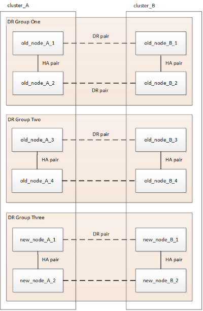

= Aggiornare una configurazione MetroCluster IP a quattro o otto nodi (ONTAP 9.8 e versioni successive)
:allow-uri-read: 
:icons: font
:imagesdir: ../media/

[role="lead"]
È possibile utilizzare questa procedura per aggiornare controller e storage in configurazioni a quattro o otto nodi.

A partire da ONTAP 9.13.1, è possibile aggiornare i controller e lo storage in una configurazione MetroCluster IP a otto nodi espandendo la configurazione fino a diventare una configurazione temporanea a dodici nodi e rimuovendo i vecchi gruppi di disaster recovery (DR).

A partire da ONTAP 9.8, è possibile aggiornare i controller e lo storage in una configurazione MetroCluster IP a quattro nodi espandendo la configurazione fino a diventare una configurazione temporanea a otto nodi e rimuovendo quindi il vecchio gruppo di DR.

.Informazioni importanti se si aggiunge un modello di piattaforma precedente
Le seguenti indicazioni riguardano uno scenario insolito in cui è necessario aggiungere un modello di piattaforma precedente (piattaforme rilasciate prima di ONTAP 9.15.1) a una configurazione MetroCluster esistente che contiene un modello di piattaforma più recente (piattaforme rilasciate in ONTAP 9.15.1 o versioni successive).

Se la configurazione MetroCluster esistente contiene una piattaforma che utilizza *porte cluster/HA condivise* (piattaforme rilasciate in ONTAP 9.15.1 o versioni successive), non è possibile aggiungere una piattaforma che utilizza *porte MetroCluster/HA condivise* (piattaforme rilasciate prima di ONTAP 9.15.1) senza aggiornare tutti i nodi nella configurazione a ONTAP 9.15.1P11 o ONTAP 9.16.1P4 o versioni successive.

[CAUTION]
====
L'aggiunta di un modello di piattaforma più vecchio che utilizza *porte condivise/ MetroCluster HA* a un MetroCluster contenente un modello di piattaforma più recente che utilizza *porte condivise cluster/HA* è uno scenario insolito e la maggior parte delle combinazioni non ne è interessata.

====
Utilizzare la seguente tabella per verificare se la combinazione è interessata.  Se la piattaforma esistente è elencata nella prima colonna e la piattaforma che si desidera aggiungere alla configurazione è elencata nella seconda colonna, tutti i nodi nella configurazione devono eseguire ONTAP 9.15.1P11 o ONTAP 9.16.1P4 o versioni successive per aggiungere il nuovo gruppo DR.

[cols="20,20,20,20,20"]
|===
2+| Se il tuo MetroCluster esistente contiene... 2+| E la piattaforma che stai aggiungendo è... | Quindi... 

 a| 
Un sistema AFF che utilizza *porte cluster/HA condivise*:

* AFF A20
* AFF A30
* AFF C30
* AFF A50
* AFF C60
* AFF C80
* AFF A70
* AFF A90
* AFF A1K

 a| 
Un sistema FAS che utilizza *porte cluster/HA condivise*:

* FAS50
* FAS70
* FAS90

 a| 
Un sistema AFF che utilizza *porte MetroCluster/HA condivise*:

* AFF A150, ASA A150
* AFF A220
* AFF C250, ASA C250
* AFF A250, ASA A250
* AFF A300
* AFF A320
* AFF C400, ASA C400
* AFF A400, ASA A400
* AFF A700
* AFF C800, ASA C800
* AFF A800, ASA A800
* AFF A900, ASA A900

 a| 
Un sistema FAS che utilizza *porte MetroCluster/HA condivise*:

* FAS2750
* FAS500f
* FAS8200
* FAS8300
* FAS8700
* FAS9000
* FAS9500

| Prima di aggiungere la nuova piattaforma alla configurazione MetroCluster esistente, aggiornare tutti i nodi nella configurazione esistente e in quella nuova a ONTAP 9.15.1P11 o ONTAP 9.16.1P4 o versione successiva. 
|===
.A proposito di questa attività
* Se si dispone di una configurazione a otto nodi, il sistema deve eseguire ONTAP 9.13.1 o versione successiva.
* Se si dispone di una configurazione a quattro nodi, il sistema deve eseguire ONTAP 9.8 o versione successiva.
* Se si stanno aggiornando anche gli switch IP, è necessario aggiornarli prima di eseguire questa procedura di aggiornamento.
* Questa procedura descrive i passaggi necessari per aggiornare un gruppo DR a quattro nodi. Se si dispone di una configurazione a otto nodi (due gruppi DR), è possibile aggiornare uno o entrambi i gruppi DR.
+
....
 Refresh DR groups one at a time.
* References to "old nodes" mean the nodes that you intend to replace.
* For eight-node configurations, the source and target eight-node MetroCluster platform combination must be supported.
....
+

NOTE: Se si aggiornano entrambi i gruppi di DR, la combinazione di piattaforme potrebbe non essere supportata dopo l'aggiornamento del primo gruppo di DR. È necessario aggiornare entrambi i gruppi di DR per ottenere una configurazione a otto nodi supportata.

* È possibile aggiornare solo modelli di piattaforma specifici utilizzando questa procedura in una configurazione MetroCluster IP.
+
** Per informazioni sulle combinazioni di upgrade della piattaforma supportate, consultare la tabella di aggiornamento dell'IP MetroCluster in link:../upgrade/concept_choosing_tech_refresh_mcc.html#supported-metrocluster-ip-tech-refresh-combinations["Scelta di un metodo di refresh del sistema"].

* Si applicano i limiti inferiori delle piattaforme di origine e di destinazione. Se si passa a una piattaforma superiore, i limiti della nuova piattaforma si applicano solo dopo il completamento dell'aggiornamento tecnico di tutti i gruppi di DR.
* Se si esegue un aggiornamento tecnico su una piattaforma con limiti inferiori rispetto alla piattaforma di origine, è necessario regolare e ridurre i limiti in modo che siano pari o inferiori ai limiti della piattaforma di destinazione prima di eseguire questa procedura.

== Attivare la registrazione della console

NetApp consiglia vivamente di attivare la registrazione della console sui dispositivi in uso e di eseguire le seguenti operazioni quando si esegue questa procedura:

* Lasciare attivato AutoSupport durante la manutenzione.
* Attivare un messaggio AutoSupport di manutenzione prima e dopo la manutenzione per disattivare la creazione del caso per tutta la durata dell'attività di manutenzione.
+
Consultare l'articolo della Knowledge base link:https://kb.netapp.com/Support_Bulletins/Customer_Bulletins/SU92["Come eliminare la creazione automatica del caso durante le finestre di manutenzione pianificata"^].

* Abilita la registrazione della sessione per qualsiasi sessione CLI. Per istruzioni su come attivare la registrazione della sessione, consultare la sezione "registrazione dell'output della sessione" nell'articolo della Knowledge base link:https://kb.netapp.com/on-prem/ontap/Ontap_OS/OS-KBs/How_to_configure_PuTTY_for_optimal_connectivity_to_ONTAP_systems["Come configurare Putty per una connettività ottimale ai sistemi ONTAP"^].

== Eseguire la procedura di aggiornamento

Per aggiornare la configurazione dell'IP di MetroCluster, procedere come segue.

.Fasi
. Verificare di disporre di un dominio di broadcast predefinito creato sui vecchi nodi.
+
Quando si aggiungono nuovi nodi a un cluster esistente senza un dominio di broadcast predefinito, le LIF di gestione nodi vengono create per i nuovi nodi utilizzando gli UUID (Universal Unique Identifier) e non i nomi previsti. Per ulteriori informazioni, consultare l'articolo della Knowledge base https://kb.netapp.com/onprem/ontap/os/Node_management_LIFs_on_newly-added_nodes_generated_with_UUID_names["LIF di gestione nodi su nodi appena aggiunti generati con nomi UUID"^].

. Raccogliere informazioni dai vecchi nodi.
+
A questo punto, la configurazione a quattro nodi viene visualizzata come mostrato nell'immagine seguente:

+
image::../media/mcc_dr_group_a.png[Configurazione a quattro nodi IP MetroCluster prima dell'espansione]

+
La configurazione a otto nodi viene visualizzata come mostrato nell'immagine seguente:

+
image::../media/mcc_dr_groups_8_node.gif[Configurazione IP MetroCluster con otto nodi dopo l'espansione]

. Per impedire la generazione automatica del caso di supporto, inviare un messaggio AutoSupport per indicare che l'aggiornamento è in corso.
+
.. Eseguire il seguente comando: +
`system node autosupport invoke -node * -type all -message "MAINT=10h Upgrading _old-model_ to _new-model"_`
+
L'esempio seguente specifica una finestra di manutenzione di 10 ore.  Calcolare del tempo aggiuntivo a seconda del piano.

+
Se la manutenzione viene completata prima che sia trascorso il tempo, è possibile richiamare un messaggio AutoSupport che indica la fine del periodo di manutenzione:

+
`system node autosupport invoke -node * -type all -message MAINT=end`

.. Ripetere il comando sul cluster partner.

. Se la crittografia end-to-end è attivata, seguire i passaggi da a. link:../maintain/task-configure-encryption.html#disable-end-to-end-encryption["Disattiva la crittografia end-to-end"].
. Rimuovere la configurazione MetroCluster esistente da Tiebreaker, Mediator o altro software in grado di avviare lo switchover.
+
[cols="2*"]
|===

| Se si utilizza... | Utilizzare questa procedura... 

 a| 
Spareggio
 a| 
.. Utilizzare l'interfaccia CLI di tiebreaker `monitor remove` Comando per rimuovere la configurazione MetroCluster.
+
Nell'esempio seguente, "`cluster_A`" viene rimosso dal software:

+
[listing]
----

NetApp MetroCluster Tiebreaker :> monitor remove -monitor-name cluster_A
Successfully removed monitor from NetApp MetroCluster Tiebreaker
software.
----
.. Verificare che la configurazione MetroCluster sia stata rimossa correttamente utilizzando l'interfaccia CLI di tiebreaker `monitor show -status` comando.
+
[listing]
----

NetApp MetroCluster Tiebreaker :> monitor show -status
----

 a| 
Mediatore
 a| 
Immettere il seguente comando dal prompt di ONTAP:

`metrocluster configuration-settings mediator remove`

 a| 
Applicazioni di terze parti
 a| 
Consultare la documentazione del prodotto.

|===
. Eseguire tutte le operazioni descritte in link:../upgrade/task_expand_a_four_node_mcc_ip_configuration.html["Espansione di una configurazione IP MetroCluster"^] per aggiungere i nuovi nodi e lo storage alla configurazione.
+
Al termine della procedura di espansione, la configurazione temporanea viene visualizzata come mostrato nelle seguenti immagini:

+
.Configurazione temporanea a otto nodi
image::../media/mcc_dr_group_b.png[Configurazione MetroCluster dopo l'espansione e la migrazione del volume CRS]

+
.Configurazione temporanea a dodici nodi

. Verificare che sia possibile il Takeover e che i nodi siano connessi eseguendo il seguente comando su entrambi i cluster:
+
`storage failover show`

+
[listing]
----
cluster_A::> storage failover show
                                    Takeover
Node           Partner              Possible    State Description
-------------- -------------------- ---------   ------------------
Node_FC_1      Node_FC_2              true      Connected to Node_FC_2
Node_FC_2      Node_FC_1              true      Connected to Node_FC_1
Node_IP_1      Node_IP_2              true      Connected to Node_IP_2
Node_IP_2      Node_IP_1              true      Connected to Node_IP_1
----
. Spostare i volumi CRS.
+
Eseguire le operazioni descritte in link:../maintain/task_move_a_metadata_volume_in_mcc_configurations.html["Spostamento di un volume di metadati nelle configurazioni MetroCluster"^].

. Spostare i dati dai vecchi nodi ai nuovi nodi seguendo le seguenti procedure:
+
.. Eseguire tutte le operazioni descritte in https://docs.netapp.com/us-en/ontap-systems-upgrade/upgrade/upgrade-create-aggregate-move-volumes.html["Creare un aggregato e spostare i volumi nei nuovi nodi"^].
+

NOTE: È possibile scegliere di eseguire il mirroring dell'aggregato quando o dopo la sua creazione.

.. Eseguire tutte le operazioni descritte in https://docs.netapp.com/us-en/ontap-systems-upgrade/upgrade/upgrade-move-lifs-to-new-nodes.html["Spostamento delle LIF dati non SAN e delle LIF di gestione cluster nei nuovi nodi"^].

. Modificare l'indirizzo IP per il peer del cluster dei nodi in transizione per ciascun cluster:
+
.. Identificare il peer cluster_A utilizzando `cluster peer show` comando:
+
[listing]
----
cluster_A::> cluster peer show
Peer Cluster Name         Cluster Serial Number Availability   Authentication
------------------------- --------------------- -------------- --------------
cluster_B         1-80-000011           Unavailable    absent
----
+
... Modificare l'indirizzo IP del peer cluster_A:
+
`cluster peer modify -cluster cluster_A -peer-addrs node_A_3_IP -address-family ipv4`

.. Identificare il peer cluster_B utilizzando `cluster peer show` comando:
+
[listing]
----
cluster_B::> cluster peer show
Peer Cluster Name         Cluster Serial Number Availability   Authentication
------------------------- --------------------- -------------- --------------
cluster_A         1-80-000011           Unavailable    absent
----
+
... Modificare l'indirizzo IP del peer cluster_B:
+
`cluster peer modify -cluster cluster_B -peer-addrs node_B_3_IP -address-family ipv4`

.. Verificare che l'indirizzo IP del peer del cluster sia aggiornato per ciascun cluster:
+
... Verificare che l'indirizzo IP sia aggiornato per ciascun cluster utilizzando `cluster peer show -instance` comando.
+
Il `Remote Intercluster Addresses` Nei seguenti esempi viene visualizzato l'indirizzo IP aggiornato.

+
Esempio per cluster_A:

+
[listing]
----
cluster_A::> cluster peer show -instance

Peer Cluster Name: cluster_B
           Remote Intercluster Addresses: 172.21.178.204, 172.21.178.212
      Availability of the Remote Cluster: Available
                     Remote Cluster Name: cluster_B
                     Active IP Addresses: 172.21.178.212, 172.21.178.204
                   Cluster Serial Number: 1-80-000011
                    Remote Cluster Nodes: node_B_3-IP,
                                          node_B_4-IP
                   Remote Cluster Health: true
                 Unreachable Local Nodes: -
          Address Family of Relationship: ipv4
    Authentication Status Administrative: use-authentication
       Authentication Status Operational: ok
                        Last Update Time: 4/20/2023 18:23:53
            IPspace for the Relationship: Default
Proposed Setting for Encryption of Inter-Cluster Communication: -
Encryption Protocol For Inter-Cluster Communication: tls-psk
  Algorithm By Which the PSK Was Derived: jpake

cluster_A::>

----
+
Esempio per cluster_B.

+
[listing]
----
cluster_B::> cluster peer show -instance

                       Peer Cluster Name: cluster_A
           Remote Intercluster Addresses: 172.21.178.188, 172.21.178.196 <<<<<<<< Should reflect the modified address
      Availability of the Remote Cluster: Available
                     Remote Cluster Name: cluster_A
                     Active IP Addresses: 172.21.178.196, 172.21.178.188
                   Cluster Serial Number: 1-80-000011
                    Remote Cluster Nodes: node_A_3-IP,
                                          node_A_4-IP
                   Remote Cluster Health: true
                 Unreachable Local Nodes: -
          Address Family of Relationship: ipv4
    Authentication Status Administrative: use-authentication
       Authentication Status Operational: ok
                        Last Update Time: 4/20/2023 18:23:53
            IPspace for the Relationship: Default
Proposed Setting for Encryption of Inter-Cluster Communication: -
Encryption Protocol For Inter-Cluster Communication: tls-psk
  Algorithm By Which the PSK Was Derived: jpake

cluster_B::>
----

. Seguire la procedura descritta in link:concept_removing_a_disaster_recovery_group.html["Rimozione di un gruppo di disaster recovery"] Per rimuovere il vecchio gruppo DR.
. Se è necessario aggiornare entrambi i gruppi DR in una configurazione a otto nodi, ripetere l'intera procedura per ciascun gruppo DR.
+
Dopo aver rimosso il vecchio gruppo DR, la configurazione viene visualizzata come mostrato nelle seguenti immagini:

+
.Configurazione a quattro nodi
image::../media/mcc_dr_group_d.png[Configurazione MetroCluster dopo la rimozione del vecchio gruppo DR]

+
.Configurazione a otto nodi
image::../media/mcc_dr_group_c5.png[Configurazione finale MetroCluster a otto nodi]

. Confermare la modalità operativa della configurazione MetroCluster ed eseguire un controllo MetroCluster.
+
.. Verificare la configurazione MetroCluster e che la modalità operativa sia normale:
+
`metrocluster show`

.. Verificare che siano visualizzati tutti i nodi previsti:
+
`metrocluster node show`

.. Immettere il seguente comando:
+
`metrocluster check run`

.. Visualizzare i risultati del controllo MetroCluster:
+
`metrocluster check show`

. Se la crittografia end-to-end è stata disattivata prima di aggiungere i nuovi nodi, è possibile riattivarla seguendo la procedura descritta in link:../maintain/task-configure-encryption.html#enable-end-to-end-encryption["Attiva la crittografia end-to-end"].
. Ripristinare il monitoraggio, se necessario, utilizzando la procedura per la configurazione.
+
[cols="2*"]
|===

| Se si utilizza... | Utilizzare questa procedura 

 a| 
Spareggio
 a| 
link:../tiebreaker/concept_configuring_the_tiebreaker_software.html#adding-metrocluster-configurations["Aggiunta di configurazioni MetroCluster"] Nella sezione _Installazione e configurazione di MetroCluster Tiebreaker_.

 a| 
Mediatore
 a| 
link:https://docs.netapp.com/us-en/ontap-metrocluster/install-ip/concept_mediator_requirements.html["Configurare ONTAP Mediator da una configurazione IP MetroCluster"] nell'_Installazione e configurazione IP di MetroCluster_.

 a| 
Applicazioni di terze parti
 a| 
Consultare la documentazione del prodotto.

|===
. Per riprendere la generazione automatica del caso di supporto, inviare un messaggio AutoSupport per indicare che la manutenzione è stata completata.
+
.. Immettere il seguente comando:
+
`system node autosupport invoke -node * -type all -message MAINT=end`

.. Ripetere il comando sul cluster partner.

