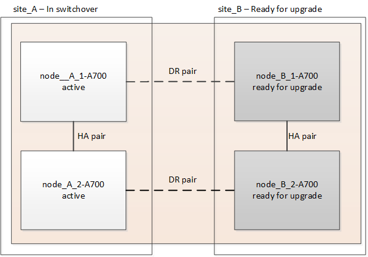

= Upgrade dei controller da AFF A700/FAS9000 a AFF A900/FAS9500 in una configurazione MetroCluster IP utilizzando switchover e switchback (ONTAP 9.10.1 o versione successiva)
:allow-uri-read: 

[role="lead"]
È possibile utilizzare l'operazione di switchover MetroCluster per fornire un servizio senza interruzioni ai client mentre i moduli controller sul cluster partner vengono aggiornati. Altri componenti (ad esempio shelf di storage o switch) non possono essere aggiornati come parte di questa procedura.

.A proposito di questa attività
* Per aggiornare i moduli controller AFF A700 a AFF A900, i controller devono eseguire ONTAP 9.10.1 o versione successiva.
* Per aggiornare i moduli controller FAS9000 a FAS9500, i controller devono eseguire ONTAP 9.10.1P3 o versione successiva.
* Tutti i controller della configurazione devono essere aggiornati durante lo stesso periodo di manutenzione.
+
L'utilizzo della configurazione MetroCluster con un AFF A700 e un AFF A900 o con un FAS9000 e un controller FAS9500 non è supportato al di fuori di questa attività di manutenzione.

* Gli switch IP devono disporre di una versione firmware supportata.
* Gli indirizzi IP, le netmask e i gateway delle piattaforme originali verranno riutilizzati sulle nuove piattaforme.
* In questa procedura vengono utilizzati i seguenti nomi di esempio, sia negli esempi che nella grafica:
+
** Sito_A.
+
*** Prima dell'aggiornamento:
+
**** Node_A_1-A700
**** Node_A_2-A700

*** Dopo l'aggiornamento:
+
**** Node_A_1-A900
**** Node_A_2-A900

** Sito_B
+
*** Prima dell'aggiornamento:
+
**** Node_B_1-A700
**** Node_B_2-A700

*** Dopo l'aggiornamento:
+
**** Node_B_1-A900
**** Node_B_2-A900

== Attivare la registrazione della console

NetApp consiglia vivamente di attivare la registrazione della console sui dispositivi in uso e di eseguire le seguenti operazioni quando si esegue questa procedura:

* Lasciare attivato AutoSupport durante la manutenzione.
* Attivare un messaggio AutoSupport di manutenzione prima e dopo la manutenzione per disattivare la creazione del caso per tutta la durata dell'attività di manutenzione.
+
Consultare l'articolo della Knowledge base link:https://kb.netapp.com/Support_Bulletins/Customer_Bulletins/SU92["Come eliminare la creazione automatica del caso durante le finestre di manutenzione pianificata"^].

* Abilita la registrazione della sessione per qualsiasi sessione CLI. Per istruzioni su come attivare la registrazione della sessione, consultare la sezione "registrazione dell'output della sessione" nell'articolo della Knowledge base link:https://kb.netapp.com/on-prem/ontap/Ontap_OS/OS-KBs/How_to_configure_PuTTY_for_optimal_connectivity_to_ONTAP_systems["Come configurare Putty per una connettività ottimale ai sistemi ONTAP"^].

== Workflow per l'aggiornamento dei controller in una configurazione MetroCluster IP

È possibile utilizzare il diagramma del flusso di lavoro per pianificare le attività di aggiornamento.

image::../media/workflow_ip_upgrade.png[aggiornamento ip del workflow]

== Preparatevi per l'aggiornamento

Prima di apportare modifiche alla configurazione MetroCluster esistente, è necessario controllare lo stato della configurazione, preparare le nuove piattaforme ed eseguire altre attività varie.

=== Liberare lo slot 7 del controller AFF A700 o FAS9000

La configurazione MetroCluster su un sistema AFF A900 o FAS9500 utilizza una delle porte delle schede DR situate negli slot 5 e 7. Prima di iniziare l'aggiornamento, se sono presenti schede nello slot 7 del sistema AFF A700 o FAS9000, è necessario spostarle in altri slot per tutti i nodi del cluster.

=== Aggiornare i file RCF dello switch MetroCluster prima di aggiornare i controller

Quando si esegue questo aggiornamento, è necessario aggiornare i file RCF sugli switch MetroCluster. La seguente tabella fornisce gli intervalli di VLAN supportati per le configurazioni IP MetroCluster AFF A900/FAS9500.

|===

| Modello di piattaforma | ID VLAN supportati 

 a| 
* AFF A900 o FAS9500

 a| 
* 10
* 20
* Qualsiasi valore compreso tra 101 e 4096 inclusi.

|===
* Se lo switch non è configurato con la versione minima supportata del file RCF, è necessario aggiornare il file RCF. Per la versione del file RCF corretta per il modello di switch in uso, fare riferimento a. link:https://mysupport.netapp.com/site/tools/tool-eula/rcffilegenerator["Tool RcfFileGenerator"^]. La procedura seguente riguarda l'applicazione file RCF.

.Fasi
. Preparare gli switch IP per l'applicazione dei nuovi file RCF.
+
Seguire la procedura descritta nella sezione relativa al fornitore dello switch:

+
** link:../install-ip/task_switch_config_broadcom.html#resetting-the-broadcom-ip-switch-to-factory-defaults["Ripristinare l'interruttore Broadcom IP alle impostazioni predefinite"]
** link:../install-ip/task_switch_config_cisco.html#resetting-the-cisco-ip-switch-to-factory-defaults["Ripristinare lo switch IP Cisco alle impostazioni predefinite"]
** link:../install-ip/task_switch_config_nvidia.html#reset-the-nvidia-ip-sn2100-switch-to-factory-defaults["Ripristinare lo switch NVIDIA IP alle impostazioni predefinite"]

. Scaricare e installare i file RCF.
+
Seguire la procedura descritta nella sezione relativa al fornitore dello switch:

+
** link:../install-ip/task_switch_config_broadcom.html#downloading-and-installing-the-broadcom-rcf-files["Scaricare e installare i file Broadcom RCF"]
** link:../install-ip/task_switch_config_cisco.html#downloading-and-installing-the-cisco-ip-rcf-files["Scaricare e installare i file RCF IP di Cisco"]
** link:../install-ip/task_switch_config_nvidia.html#download-and-install-the-nvidia-rcf-files["Scaricare e installare i file RCF NVIDIA IP"]

=== Mappare le porte dai vecchi nodi ai nuovi nodi

Quando si esegue l'aggiornamento da AFF A700 a AFF A900 o da FAS9000 a FAS9500, non è necessario modificare le porte della rete dati, dell'adattatore SAN FCP e delle porte di storage SAS e NVMe. Le LIF dei dati rimangono dove si trovano durante e dopo l'aggiornamento. Pertanto, non è necessario mappare le porte di rete dai vecchi nodi ai nuovi nodi.

=== Verificare lo stato di salute di MetroCluster prima dell'aggiornamento del sito

Prima di eseguire l'aggiornamento, è necessario verificare lo stato e la connettività della configurazione di MetroCluster.

.Fasi
. Verificare il funzionamento della configurazione MetroCluster in ONTAP:
+
.. Verificare che i nodi siano multipathing: +
`node run -node _node-name_ sysconfig -a`
+
Eseguire questo comando per ogni nodo della configurazione MetroCluster.

.. Verificare che non vi siano dischi rotti nella configurazione: +
`storage disk show -broken`
+
Eseguire questo comando su ciascun nodo della configurazione MetroCluster.

.. Verificare la presenza di eventuali avvisi sullo stato di salute:
+
`system health alert show`

+
Eseguire questo comando su ciascun cluster.

.. Verificare le licenze sui cluster:
+
`system license show`

+
Eseguire questo comando su ciascun cluster.

.. Verificare i dispositivi collegati ai nodi:
+
`network device-discovery show`

+
Eseguire questo comando su ciascun cluster.

.. Verificare che il fuso orario e l'ora siano impostati correttamente su entrambi i siti:
+
`cluster date show`

+
Eseguire questo comando su ciascun cluster. È possibile utilizzare `cluster date` per configurare l'ora e il fuso orario.

. Confermare la modalità operativa della configurazione MetroCluster ed eseguire un controllo MetroCluster.
+
.. Confermare la configurazione MetroCluster e che la modalità operativa è `normal`: +
`metrocluster show`
.. Verificare che siano visualizzati tutti i nodi previsti: +
`metrocluster node show`
.. Immettere il seguente comando:
+
`metrocluster check run`

.. Visualizzare i risultati del controllo MetroCluster:
+
`metrocluster check show`

. Controllare il cablaggio MetroCluster con lo strumento Config Advisor.
+
.. Scaricare ed eseguire Config Advisor.
+
https://mysupport.netapp.com/site/tools/tool-eula/activeiq-configadvisor["Download NetApp: Config Advisor"^]

.. Dopo aver eseguito Config Advisor, esaminare l'output dello strumento e seguire le raccomandazioni nell'output per risolvere eventuali problemi rilevati.

=== Raccogliere informazioni prima dell'aggiornamento

Prima di eseguire l'aggiornamento, è necessario raccogliere informazioni per ciascuno dei nodi e, se necessario, regolare i domini di broadcast di rete, rimuovere eventuali VLAN e gruppi di interfacce e raccogliere informazioni sulla crittografia.

.Fasi
. Registrare il cablaggio fisico di ciascun nodo, etichettando i cavi secondo necessità per consentire il cablaggio corretto dei nuovi nodi.
. Raccogliere l'output dei seguenti comandi per ciascun nodo:
+
** `metrocluster interconnect show`
** `metrocluster configuration-settings connection show`
** `network interface show -role cluster,node-mgmt`
** `network port show -node node_name -type physical`
** `network port vlan show -node _node-name_`
** `network port ifgrp show -node _node_name_ -instance`
** `network port broadcast-domain show`
** `network port reachability show -detail`
** `network ipspace show`
** `volume show`
** `storage aggregate show`
** `system node run -node _node-name_ sysconfig -a`
** `vserver fcp initiator show`
** `storage disk show`
** `metrocluster configuration-settings interface show`

. Raccogliere gli UUID per il sito_B (il sito le cui piattaforme sono attualmente in fase di aggiornamento): `metrocluster node show -fields node-cluster-uuid, node-uuid`
+
Questi valori devono essere configurati con precisione sui nuovi moduli controller Site_B per garantire un aggiornamento corretto. Copiare i valori in un file in modo da poterli copiare nei comandi appropriati in un secondo momento del processo di aggiornamento. + l'esempio seguente mostra l'output del comando con gli UUID:

+
[listing]
----
cluster_B::> metrocluster node show -fields node-cluster-uuid, node-uuid
   (metrocluster node show)
dr-group-id cluster     node   node-uuid                            node-cluster-uuid
----------- --------- -------- ------------------------------------ ------------------------------
1           cluster_A node_A_1-A700 f03cb63c-9a7e-11e7-b68b-00a098908039 ee7db9d5-9a82-11e7-b68b-00a098908039
1           cluster_A node_A_2-A700 aa9a7a7a-9a81-11e7-a4e9-00a098908c35 ee7db9d5-9a82-11e7-b68b-00a098908039
1           cluster_B node_B_1-A700 f37b240b-9ac1-11e7-9b42-00a098c9e55d 07958819-9ac6-11e7-9b42-00a098c9e55d
1           cluster_B node_B_2-A700 bf8e3f8f-9ac4-11e7-bd4e-00a098ca379f 07958819-9ac6-11e7-9b42-00a098c9e55d
4 entries were displayed.
cluster_B::*

----
+
Si consiglia di registrare gli UUID in una tabella simile alla seguente.

+
|===

| Cluster o nodo | UUID 

 a| 
Cluster_B
 a| 
07958819-9ac6-11e7-9b42-00a098c9e55d

 a| 
Node_B_1-A700
 a| 
f37b240b-9ac1-11e7-9b42-00a098c9e55d

 a| 
Node_B_2-A700
 a| 
bf8e3f8f-9ac4-11e7-bd4e-00a098ca379f

 a| 
Cluster_A.
 a| 
ee7db9d5-9a82-11e7-b68b-00a098908039

 a| 
Node_A_1-A700
 a| 
f03cb63c-9a7e-11e7-b68b-00a098908039

 a| 
Node_A_2-A700
 a| 
aa9a7a7a-9a81-11e7-a4e9-00a098908c35

|===
. Se i nodi MetroCluster si trovano in una configurazione SAN, raccogliere le informazioni pertinenti.
+
Si dovrebbe ottenere l'output dei seguenti comandi:

+
** `fcp adapter show -instance`
** `fcp interface show -instance`
** `iscsi interface show`
** `ucadmin show`

. Se il volume root è crittografato, raccogliere e salvare la passphrase utilizzata per il gestore delle chiavi:
`security key-manager backup show`
. Se i nodi MetroCluster utilizzano la crittografia per volumi o aggregati, copiare le informazioni relative alle chiavi e alle passphrase. Per ulteriori informazioni, vedere https://docs.netapp.com/us-en/ontap/encryption-at-rest/backup-key-management-information-manual-task.html["Backup manuale delle informazioni di gestione delle chiavi integrate"^].
+
.. Se Onboard Key Manager è configurato: `security key-manager onboard show-backup`+ la passphrase sarà necessaria più avanti nella procedura di aggiornamento.
.. Se la gestione delle chiavi aziendali (KMIP) è configurata, eseguire i seguenti comandi:
+
....
security key-manager external show -instance
security key-manager key query
....

. Raccogliere gli ID di sistema dei nodi esistenti:
`metrocluster node show -fields node-systemid,ha-partner-systemid,dr-partner-systemid,dr-auxiliary-systemid`
+
Il seguente output mostra i dischi riassegnati.

+
[listing]
----
::> metrocluster node show -fields node-systemid,ha-partner-systemid,dr-partner-systemid,dr-auxiliary-systemid

dr-group-id cluster     node     node-systemid ha-partner-systemid dr-partner-systemid dr-auxiliary-systemid
----------- ----------- -------- ------------- ------------------- ------------------- ---------------------
1           cluster_A node_A_1-A700   537403324     537403323           537403321           537403322
1           cluster_A node_A_2-A700   537403323     537403324           537403322          537403321
1           cluster_B node_B_1-A700   537403322     537403321           537403323          537403324
1           cluster_B node_B_2-A700   537403321     537403322           537403324          537403323
4 entries were displayed.
----

=== Rimuovere il monitoraggio di Mediator o Tiebreaker

Prima di aggiornare le piattaforme, è necessario rimuovere il monitoraggio se la configurazione MetroCluster viene monitorata con l'utility Tiebreaker o Mediator.

.Fasi
. Raccogliere l'output per il seguente comando:
+
`storage iscsi-initiator show`

. Rimuovere la configurazione MetroCluster esistente da Tiebreaker, Mediator o altro software in grado di avviare lo switchover.
+
|===

| Se si utilizza... | Utilizzare questa procedura... 

 a| 
Spareggio
 a| 
link:../tiebreaker/concept_configuring_the_tiebreaker_software.html#removing-metrocluster-configurations["Rimozione delle configurazioni MetroCluster"] Nel _contenuto di installazione e configurazione di MetroCluster Tiebreaker_

 a| 
Mediatore
 a| 
Immettere il seguente comando dal prompt di ONTAP:

`metrocluster configuration-settings mediator remove`

 a| 
Applicazioni di terze parti
 a| 
Consultare la documentazione del prodotto.

|===

=== Inviare un messaggio AutoSupport personalizzato prima della manutenzione

Prima di eseguire la manutenzione, è necessario inviare un messaggio AutoSupport per informare il supporto tecnico che la manutenzione è in corso. Informare il supporto tecnico che la manutenzione è in corso impedisce loro di aprire un caso partendo dal presupposto che si sia verificata un'interruzione.

.A proposito di questa attività
Questa attività deve essere eseguita su ciascun sito MetroCluster.

.Fasi
. Accedere al cluster.
. Richiamare un messaggio AutoSupport che indica l'inizio della manutenzione:
+
`system node autosupport invoke -node * -type all -message MAINT=__maintenance-window-in-hours__`

+
Il `maintenance-window-in-hours` parametro specifica la lunghezza della finestra di manutenzione, con un massimo di 72 ore. Se la manutenzione viene completata prima che sia trascorso il tempo, è possibile richiamare un messaggio AutoSupport che indica la fine del periodo di manutenzione:

+
`system node autosupport invoke -node * -type all -message MAINT=end`

. Ripetere questi passaggi sul sito del partner.

== Passare alla configurazione MetroCluster

È necessario passare alla configurazione Site_A in modo che le piattaforme sul sito_B possano essere aggiornate.

.A proposito di questa attività
Questa attività deve essere eseguita sul sito_A.

Dopo aver completato questa attività, Site_A è attivo e fornisce dati per entrambi i siti. Site_B è inattivo e pronto per iniziare il processo di aggiornamento.

.Fasi
. Passare alla configurazione MetroCluster del sito_A in modo che i nodi del sito_B possano essere aggiornati:
+
.. Eseguire il seguente comando sul sito_A:
+
`metrocluster switchover -controller-replacement true`

+
Il completamento dell'operazione può richiedere alcuni minuti.

.. Monitorare il funzionamento dello switchover:
+
`metrocluster operation show`

.. Al termine dell'operazione, verificare che i nodi siano in stato di switchover:
+
`metrocluster show`

.. Controllare lo stato dei nodi MetroCluster:
+
`metrocluster node show`

+
La riparazione automatica degli aggregati dopo lo switchover negoziato viene disattivata durante l'aggiornamento del controller. I nodi nel sito_B vengono arrestati e arrestati nel `LOADER` prompt.

== Rimuovere il modulo controller della piattaforma AFF A700 o FAS9000 e il modulo NVS

.A proposito di questa attività
Se non si è già collegati a terra, mettere a terra l'utente.

.Fasi
. Raccogliere i valori di bootarg da entrambi i nodi nel sito_B: `printenv`
. Spegnere lo chassis sul sito_B.

=== Rimuovere il modulo del controller AFF A700 o FAS9000

Utilizzare la seguente procedura per rimuovere il modulo controller AFF A700 o FAS9000

.Fasi
. Scollegare il cavo della console, se presente, e il cavo di gestione dal modulo controller prima di rimuovere il modulo controller.
. Sbloccare e rimuovere il modulo controller dal telaio.
+
.. Far scorrere il pulsante arancione sulla maniglia della camma verso il basso fino a sbloccarla.
+
image::../media/drw_9500_remove_PCM.png[modulo controller]

+
|===

| image:../media/number1.png["number1"] | Pulsante di rilascio della maniglia della camma 

| image:../media/number2.png["number2"] | Maniglia CAM 
|===
.. Ruotare la maniglia della camma in modo da disimpegnare completamente il modulo controller dal telaio, quindi estrarre il modulo controller dal telaio. Assicurarsi di sostenere la parte inferiore del modulo controller mentre lo si sposta fuori dallo chassis.

=== Rimuovere il modulo NVS AFF A700 o FAS9000

Per rimuovere il modulo NVS AFF A700 o FAS9000, attenersi alla seguente procedura.

Nota: Il modulo NVS si trova nello slot 6 e presenta un'altezza doppia rispetto agli altri moduli del sistema.

.Fasi
. Sbloccare e rimuovere l'NVS dallo slot 6.
+
.. Premere il tasto 'Cam' con lettere e numeri. Il pulsante CAM si allontana dal telaio.
.. Ruotare il fermo della camma verso il basso fino a portarlo in posizione orizzontale. Il sistema NVS si disinnesta dal telaio e si sposta di pochi centimetri.
.. Rimuovere l'NVS dal telaio tirando le linguette di estrazione ai lati della superficie del modulo.
+
image::../media/drw_a900_move-remove_NVRAM_module.png[rimuovere il modulo]

+
|===

| image:../media/number1.png["numero 1"] | Latch i/o Cam intestato e numerato 

| image:../media/number2.png["numero 2"] | Fermo i/o completamente sbloccato 
|===

. Se si utilizzano moduli aggiuntivi utilizzati come dispositivi di coredump su AFF A700 o FAS9000 NVS, non trasferirli su AFF A900 o FAS9500 NVS. Non trasferire alcuna parte dal modulo controller AFF A700 o FAS9000 e NVS al modulo AFF A900 o FAS9500.

== Installare i moduli NVS e controller AFF A900 o FAS9500

È necessario installare il modulo NVS e controller AFF A900 o FAS9500 ricevuto nel kit di aggiornamento su entrambi i nodi presso il sito_B. Non spostare il dispositivo di coredump dal modulo NVS AFF A700 o FAS9000 al modulo NVS AFF A900 o FAS9500.

.A proposito di questa attività
Se non si è già collegati a terra, mettere a terra l'utente.

=== Installare AFF A900 o FAS9500 NVS

Utilizzare la seguente procedura per installare AFF A900 o FAS9500 NVS nello slot 6 di entrambi i nodi nel sito_B.

.Fasi
. Allineare l'NVS con i bordi dell'apertura dello chassis nello slot 6.
. Far scorrere delicatamente l'NVS nello slot fino a quando il dispositivo di chiusura della camma i/o con lettere e numeri non inizia a impegnarsi con il perno della camma i/o, quindi spingere il dispositivo di chiusura della camma i/o fino in fondo per bloccare l'NVS in posizione.
+
image::../media/drw_a900_move-remove_NVRAM_module.png[rimuovere il modulo]

+
|===

| image:../media/number1.png["numero 1"] | Latch i/o Cam intestato e numerato 

| image:../media/number2.png["numero 2"] | Fermo i/o completamente sbloccato 
|===

=== Installare il modulo controller AFF A900 o FAS9500.

Utilizzare la seguente procedura per installare il modulo controller AFF A900 o FAS9500.

.Fasi
. Allineare l'estremità del modulo controller con l'apertura dello chassis, quindi spingere delicatamente il modulo controller a metà nel sistema.
. Spingere con decisione il modulo controller nello chassis fino a quando non raggiunge la scheda intermedia e non è completamente inserito. Il dispositivo di chiusura si solleva quando il modulo controller è completamente inserito. Attenzione: Per evitare di danneggiare i connettori, non esercitare una forza eccessiva quando si fa scorrere il modulo controller nel telaio.
. Collegare le porte di gestione e console al modulo controller.
+
image::../media/drw_9500_remove_PCM.png[modulo controller]

+
|===

| image:../media/number1.png["numero 1"] | Pulsante di rilascio della maniglia della camma 

| image:../media/number2.png["number2"] | Maniglia CAM 
|===
. Installare la seconda scheda X91146A nello slot 7 di ciascun nodo.
+
.. Spostare la connessione e5b su e7b.
.. Spostare la connessione e5a su e5b.
+

NOTE: Lo slot 7 su tutti i nodi del cluster deve essere vuoto come indicato nella <<upgrade_a700_a900_ip_map,Mappare le porte dai vecchi nodi ai nuovi nodi>> sezione.

. Accendere lo chassis e collegarlo alla console seriale.
. Dopo l'inizializzazione del BIOS, se il nodo avvia l'autoboot, interrompere L'AUTOBOOT premendo Control-C.
. Dopo l'interruzione dell'autoboot, i nodi si fermano al prompt DEL CARICATORE. Se non si interrompe l'autoboot in tempo e node1 inizia l'avvio, attendere che il prompt premi Ctrl-C per accedere al menu di boot. Dopo che il nodo si è arrestato nel menu di boot, usare l'opzione 8 per riavviare il nodo e interrompere l'autoboot durante il riavvio.
. Al prompt DEL CARICATORE, impostare le variabili di ambiente predefinite: Set-defaults
. Salvare le impostazioni predefinite delle variabili di ambiente:
`saveenv`

=== Nodi NetBoot nel sito_B.

Dopo aver scambiato il modulo controller AFF A900 o FAS9500 e NVS, è necessario eseguire il netboot dei nodi AFF A900 o FAS9500 e installare la stessa versione e lo stesso livello di patch ONTAP in esecuzione sul cluster. Il termine netboot indica che si sta eseguendo l'avvio da un'immagine ONTAP memorizzata su un server remoto. Durante la preparazione per il netboot, è necessario aggiungere una copia dell'immagine di boot di ONTAP 9 su un server Web a cui il sistema può accedere. Non è possibile controllare la versione di ONTAP installata sul supporto di avvio di un modulo controller AFF A900 o FAS9500, a meno che non sia installato in uno chassis e acceso. La versione di ONTAP sul supporto di avvio di AFF A900 o FAS9500 deve essere la stessa della versione di ONTAP in esecuzione sul sistema AFF A700 o FAS9000 in fase di aggiornamento e le immagini di avvio primaria e di backup devono corrispondere. È possibile configurare le immagini eseguendo un netboot seguito da `wipeconfig` dal menu di boot. Se il modulo controller è stato utilizzato in precedenza in un altro cluster, il `wipeconfig` il comando cancella qualsiasi configurazione residua sul supporto di avvio.

.Prima di iniziare
* Verificare che sia possibile accedere a un server HTTP con il sistema.
* È necessario scaricare i file di sistema necessari per il sistema e la versione corretta di ONTAP dal sito del supporto NetApp.

.A proposito di questa attività
Se la versione di ONTAP installata non corrisponde a quella installata sui controller originali, è necessario eseguire il netboot dei nuovi controller. Dopo aver installato ciascun nuovo controller, avviare il sistema dall'immagine di ONTAP 9 memorizzata sul server Web. È quindi possibile scaricare i file corretti sul dispositivo di avvio per i successivi avvii del sistema.

.Fasi
. Accedere a. https://mysupport.netapp.com/site/["Sito di supporto NetApp"^] per scaricare i file utilizzati per eseguire il netboot del sistema.
. [[step2-download-software]]Scarica il software ONTAP appropriato dalla sezione di download del software del sito di supporto NetApp e memorizza il `ontap-version_image.tgz` file in una directory accessibile dal web.
. Passare alla directory accessibile dal Web e verificare che i file necessari siano disponibili.
. L'elenco delle directory deve contenere ontap_version_image.tgz.
. Configurare la connessione di netboot scegliendo una delle seguenti operazioni.
+

NOTE: Utilizzare la porta di gestione e l'IP come connessione di netboot. Non utilizzare un IP LIF dei dati, altrimenti potrebbe verificarsi un'interruzione dei dati durante l'aggiornamento.

+
|===

| Se il protocollo DCHP (Dynamic host Configuration Protocol) è... | Quindi... 

 a| 
In esecuzione
 a| 
Configurare la connessione automaticamente utilizzando il seguente comando al prompt dell'ambiente di boot:
`ifconfig e0M -auto`

 a| 
Non in esecuzione
 a| 
Configurare manualmente la connessione utilizzando il seguente comando al prompt dell'ambiente di boot:
`ifconfig e0M -addr=<filer_addr> -mask=<netmask> -gw=<gateway> - dns=<dns_addr> domain=<dns_domain>`

`<filer_addr>` È l'indirizzo IP del sistema di storage. `<netmask>` è la maschera di rete del sistema di storage.
`<gateway>` è il gateway per il sistema storage.
`<dns_addr>` È l'indirizzo IP di un name server sulla rete. Questo parametro è facoltativo.
`<dns_domain>` È il nome di dominio DNS (Domain Name Service). Questo parametro è facoltativo. NOTA: Per l'interfaccia potrebbero essere necessari altri parametri. Invio `help ifconfig` al prompt del firmware per ulteriori informazioni.

|===
. Eseguire il netboot su Node_B_1:
`netboot` `\http://<web_server_ip/path_to_web_accessible_directory>/netboot/kernel`
+
Il `<path_to_the_web-accessible_directory>` dovrebbe portare alla posizione in cui è stato scaricato `<ontap_version>\_image.tgz` poll <<step2-download-software,Fase 2>>.

+

NOTE: Non interrompere l'avvio.

. Attendere l'avvio del Node_B_1 sul modulo controller AFF A900 o FAS9500 e visualizzare le opzioni del menu di avvio come mostrato di seguito:
+
[listing]
----
Please choose one of the following:

(1)  Normal Boot.
(2)  Boot without /etc/rc.
(3)  Change password.
(4)  Clean configuration and initialize all disks.
(5)  Maintenance mode boot.
(6)  Update flash from backup config.
(7)  Install new software first.
(8)  Reboot node.
(9)  Configure Advanced Drive Partitioning.
(10) Set Onboard Key Manager recovery secrets.
(11) Configure node for external key management.
Selection (1-11)?
----
. Dal menu di avvio, selezionare opzione ``(7) Install new software first.``Questa opzione di menu consente di scaricare e installare la nuova immagine ONTAP sul dispositivo di avvio. NOTA: Ignorare il seguente messaggio: `This procedure is not supported for Non-Disruptive Upgrade on an HA pair.` Questa nota si applica agli aggiornamenti software ONTAP senza interruzioni e non agli aggiornamenti del controller.
+
Utilizzare sempre netboot per aggiornare il nuovo nodo all'immagine desiderata. Se si utilizza un altro metodo per installare l'immagine sul nuovo controller, l'immagine potrebbe non essere corretta. Questo problema riguarda tutte le versioni di ONTAP.

. Se viene richiesto di continuare la procedura, immettere `y`E quando viene richiesto il pacchetto, immettere l'URL:
`\http://<web_server_ip/path_to_web-accessible_directory>/<ontap_version>\_image.tgz`
. Completare i seguenti passaggi secondari per riavviare il modulo controller:
+
.. Invio `n` per ignorare il ripristino del backup quando viene visualizzato il seguente prompt:
`Do you want to restore the backup configuration now? {y|n}`
.. Invio ``y to reboot when you see the following prompt:
`The node must be rebooted to start using the newly installed software. Do you want to reboot now? {y|n}``Il modulo controller si riavvia ma si arresta al menu di avvio perché il dispositivo di avvio è stato riformattato e i dati di configurazione devono essere ripristinati.

. Quando richiesto, eseguire `wipeconfig` comando per cancellare qualsiasi configurazione precedente sul supporto di avvio:
+
.. Quando viene visualizzato il seguente messaggio, rispondere `yes`:
`This will delete critical system configuration, including cluster membership.
Warning: do not run this option on a HA node that has been taken over.
Are you sure you want to continue?:`
.. Il nodo viene riavviato per terminare `wipeconfig` e poi si ferma al menu di boot.

. Selezionare l'opzione `5` per passare alla modalità di manutenzione dal menu di avvio. Risposta `yes` ai prompt fino all'arresto del nodo in modalità di manutenzione e al prompt dei comandi.
. Ripetere questa procedura per netboot Node_B_2.

=== Ripristinare la configurazione dell'HBA

A seconda della presenza e della configurazione delle schede HBA nel modulo controller, è necessario configurarle correttamente per l'utilizzo da parte del sito.

.Fasi
. In modalità Maintenance (manutenzione), configurare le impostazioni per gli HBA presenti nel sistema:
+
.. Verificare le impostazioni correnti delle porte:
+
`ucadmin show`

.. Aggiornare le impostazioni della porta secondo necessità.

+
|===

| Se si dispone di questo tipo di HBA e della modalità desiderata... | Utilizzare questo comando... 

 a| 
FC CNA
 a| 
`ucadmin modify -m fc -t initiator _adapter-name_`

 a| 
Ethernet CNA
 a| 
`ucadmin modify -mode cna _adapter-name_`

 a| 
Destinazione FC
 a| 
`fcadmin config -t target _adapter-name_`

 a| 
Iniziatore FC
 a| 
`fcadmin config -t initiator _adapter-name_`

|===
. Uscire dalla modalità di manutenzione:
+
`halt`

+
Dopo aver eseguito il comando, attendere che il nodo si arresti al prompt DEL CARICATORE.

. Riavviare il nodo in modalità Maintenance per rendere effettive le modifiche di configurazione:
+
`boot_ontap maint`

. Verificare le modifiche apportate:
+
|===

| Se si dispone di questo tipo di HBA... | Utilizzare questo comando... 

 a| 
CNA
 a| 
`ucadmin show`

 a| 
FC
 a| 
`fcadmin show`

|===

=== Impostare lo stato ha sui nuovi controller e chassis

È necessario verificare lo stato ha dei controller e dello chassis e, se necessario, aggiornarlo in modo che corrisponda alla configurazione del sistema.

.Fasi
. In modalità Maintenance (manutenzione), visualizzare lo stato ha del modulo controller e dello chassis:
+
`ha-config show`

+
Lo stato ha per tutti i componenti deve essere `mccip`.

. Se lo stato di sistema visualizzato del controller o dello chassis non è corretto, impostare lo stato ha:
+
`ha-config modify controller mccip`

+
`ha-config modify chassis mccip`

. Arrestare il nodo: `halt`
+
Il nodo deve arrestarsi su `LOADER>` prompt.

. Su ciascun nodo, controllare la data, l'ora e il fuso orario del sistema: `show date`
. Se necessario, impostare la data in UTC o GMT: `set date <mm/dd/yyyy>`
. Controllare l'ora utilizzando il seguente comando al prompt dell'ambiente di boot: `show time`
. Se necessario, impostare l'ora in UTC o GMT: `set time <hh:mm:ss>`
. Salvare le impostazioni: `saveenv`
. Raccogliere le variabili di ambiente: `printenv`

== Aggiornare i file RCF dello switch per ospitare le nuove piattaforme

È necessario aggiornare gli switch a una configurazione che supporti i nuovi modelli di piattaforma.

.A proposito di questa attività
Questa attività viene eseguita nel sito contenente i controller attualmente in fase di aggiornamento. Negli esempi illustrati in questa procedura, si esegue prima l'aggiornamento di Site_B.

Gli switch del sito_A verranno aggiornati quando i controller del sito_A verranno aggiornati.

.Fasi
. Preparare gli switch IP per l'applicazione dei nuovi file RCF.
+
Seguire la procedura descritta nella sezione relativa al fornitore dello switch:

+
** link:../install-ip/task_switch_config_broadcom.html#resetting-the-broadcom-ip-switch-to-factory-defaults["Ripristinare l'interruttore Broadcom IP alle impostazioni predefinite"]
** link:../install-ip/task_switch_config_cisco.html#resetting-the-cisco-ip-switch-to-factory-defaults["Ripristinare lo switch IP Cisco alle impostazioni predefinite"]
** link:../install-ip/task_switch_config_nvidia.html#reset-the-nvidia-ip-sn2100-switch-to-factory-defaults["Ripristinare le impostazioni predefinite dello switch NVIDIA IP SN2100"]

. Scaricare e installare i file RCF.
+
Seguire la procedura descritta nella sezione relativa al fornitore dello switch:

+
** link:../install-ip/task_switch_config_broadcom.html#downloading-and-installing-the-broadcom-rcf-files["Scaricare e installare i file Broadcom RCF"]
** link:../install-ip/task_switch_config_cisco.html#downloading-and-installing-the-cisco-ip-rcf-files["Scaricare e installare i file RCF IP di Cisco"]
** link:../install-ip/task_switch_config_nvidia.html#download-and-install-the-nvidia-rcf-files["Scaricare e installare i file RCF NVIDIA IP"]

== Configurare i nuovi controller

A questo punto, i nuovi controller devono essere pronti e cablati.

=== Impostare le variabili di boot IP di MetroCluster

Alcuni valori di boot MetroCluster IP devono essere configurati sui nuovi moduli controller. I valori devono corrispondere a quelli configurati sui vecchi moduli controller.

.A proposito di questa attività
In questa attività, verranno utilizzati gli UUID e gli ID di sistema identificati in precedenza nella procedura di aggiornamento in <<Raccogliere informazioni prima dell'aggiornamento>>.

.Fasi
. Su `LOADER>` Prompt, impostare i seguenti bootargs sui nuovi nodi in Site_B:
+
`setenv bootarg.mcc.port_a_ip_config _local-IP-address/local-IP-mask,0,HA-partner-IP-address,DR-partner-IP-address,DR-aux-partnerIP-address,vlan-id_`

+
`setenv bootarg.mcc.port_b_ip_config _local-IP-address/local-IP-mask,0,HA-partner-IP-address,DR-partner-IP-address,DR-aux-partnerIP-address,vlan-id_`

+
Nell'esempio seguente vengono impostati i valori per Node_B_1-A900 utilizzando VLAN 120 per la prima rete e VLAN 130 per la seconda rete:

+
[listing]
----
setenv bootarg.mcc.port_a_ip_config 172.17.26.10/23,0,172.17.26.11,172.17.26.13,172.17.26.12,120
setenv bootarg.mcc.port_b_ip_config 172.17.27.10/23,0,172.17.27.11,172.17.27.13,172.17.27.12,130
----
+
Nell'esempio seguente vengono impostati i valori per Node_B_2-A900 utilizzando VLAN 120 per la prima rete e VLAN 130 per la seconda rete:

+
[listing]
----
setenv bootarg.mcc.port_a_ip_config 172.17.26.11/23,0,172.17.26.10,172.17.26.12,172.17.26.13,120
setenv bootarg.mcc.port_b_ip_config 172.17.27.11/23,0,172.17.27.10,172.17.27.12,172.17.27.13,130
----
. Ai nuovi nodi" `LOADER` Impostare gli UUID:
+
`setenv bootarg.mgwd.partner_cluster_uuid _partner-cluster-UUID_`

+
`setenv bootarg.mgwd.cluster_uuid _local-cluster-UUID_`

+
`setenv bootarg.mcc.pri_partner_uuid _DR-partner-node-UUID_`

+
`setenv bootarg.mcc.aux_partner_uuid _DR-aux-partner-node-UUID_`

+
`setenv bootarg.mcc_iscsi.node_uuid _local-node-UUID_`

+
.. Impostare gli UUID su Node_B_1-A900.
+
L'esempio seguente mostra i comandi per impostare gli UUID su Node_B_1-A900:

+
[listing]
----
setenv bootarg.mgwd.cluster_uuid ee7db9d5-9a82-11e7-b68b-00a098908039
setenv bootarg.mgwd.partner_cluster_uuid 07958819-9ac6-11e7-9b42-00a098c9e55d
setenv bootarg.mcc.pri_partner_uuid f37b240b-9ac1-11e7-9b42-00a098c9e55d
setenv bootarg.mcc.aux_partner_uuid bf8e3f8f-9ac4-11e7-bd4e-00a098ca379f
setenv bootarg.mcc_iscsi.node_uuid f03cb63c-9a7e-11e7-b68b-00a098908039
----
.. Impostare gli UUID su Node_B_2-A900:
+
L'esempio seguente mostra i comandi per impostare gli UUID su Node_B_2-A900:

+
[listing]
----
setenv bootarg.mgwd.cluster_uuid ee7db9d5-9a82-11e7-b68b-00a098908039
setenv bootarg.mgwd.partner_cluster_uuid 07958819-9ac6-11e7-9b42-00a098c9e55d
setenv bootarg.mcc.pri_partner_uuid bf8e3f8f-9ac4-11e7-bd4e-00a098ca379f
setenv bootarg.mcc.aux_partner_uuid f37b240b-9ac1-11e7-9b42-00a098c9e55d
setenv bootarg.mcc_iscsi.node_uuid aa9a7a7a-9a81-11e7-a4e9-00a098908c35
----

. Se i sistemi originali sono stati configurati per ADP, al prompt DEL CARICATORE di ciascun nodo sostitutivo, abilitare ADP:
+
`setenv bootarg.mcc.adp_enabled true`

. Impostare le seguenti variabili:
+
`setenv bootarg.mcc.local_config_id _original-sys-id_`

+
`setenv bootarg.mcc.dr_partner _dr-partner-sys-id_`

+

NOTE: Il `setenv bootarg.mcc.local_config_id` Variable deve essere impostato sul sys-id del modulo controller *original*, Node_B_1-A700.

+
.. Impostare le variabili su Node_B_1-A900.
+
L'esempio seguente mostra i comandi per impostare i valori su Node_B_1-A900:

+
[listing]
----
setenv bootarg.mcc.local_config_id 537403322
setenv bootarg.mcc.dr_partner 537403324
----
.. Impostare le variabili su Node_B_2-A900.
+
L'esempio seguente mostra i comandi per impostare i valori su Node_B_2-A900:

+
[listing]
----
setenv bootarg.mcc.local_config_id 537403321
setenv bootarg.mcc.dr_partner 537403323
----

. Se si utilizza la crittografia con il gestore delle chiavi esterno, impostare i bootargs richiesti:
+
`setenv bootarg.kmip.init.ipaddr`

+
`setenv bootarg.kmip.kmip.init.netmask`

+
`setenv bootarg.kmip.kmip.init.gateway`

+
`setenv bootarg.kmip.kmip.init.interface`

=== Riassegnare i dischi aggregati root

Riassegnare i dischi aggregati root al nuovo modulo controller, utilizzando i sistemi raccolti in precedenza.

.A proposito di questa attività
Questi passaggi vengono eseguiti in modalità manutenzione.

.Fasi
. Avviare il sistema in modalità di manutenzione:
+
`boot_ontap maint`

. Visualizzare i dischi su Node_B_1-A900 dal prompt della modalità di manutenzione:
+
`disk show -a`

+
L'output del comando mostra l'ID di sistema del nuovo modulo controller (1574774970). Tuttavia, i dischi aggregati root sono ancora di proprietà del vecchio ID di sistema (537403322). Questo esempio non mostra i dischi di proprietà di altri nodi nella configurazione MetroCluster.

+
[listing]
----
*> disk show -a
Local System ID: 1574774970
DISK                  OWNER                 POOL   SERIAL NUMBER   HOME                  DR HOME
------------          ---------             -----  -------------   -------------         -------------
prod3-rk18:9.126L44   node_B_1-A700(537403322)  Pool1  PZHYN0MD     node_B_1-A700(537403322)  node_B_1-A700(537403322)
prod4-rk18:9.126L49  node_B_1-A700(537403322)  Pool1  PPG3J5HA     node_B_1-A700(537403322)  node_B_1-700(537403322)
prod4-rk18:8.126L21   node_B_1-A700(537403322)  Pool1  PZHTDSZD     node_B_1-A700(537403322)  node_B_1-A700(537403322)
prod2-rk18:8.126L2    node_B_1-A700(537403322)  Pool0  S0M1J2CF     node_B_1-(537403322)  node_B_1-A700(537403322)
prod2-rk18:8.126L3    node_B_1-A700(537403322)  Pool0  S0M0CQM5     node_B_1-A700(537403322)  node_B_1-A700(537403322)
prod1-rk18:9.126L27   node_B_1-A700(537403322)  Pool0  S0M1PSDW     node_B_1-A700(537403322)  node_B_1-A700(537403322)
.
.
.
----
. Riassegnare i dischi aggregati root sugli shelf di dischi ai nuovi controller.
+
|===

| Se si utilizza ADP... | Quindi utilizzare questo comando... 

 a| 
Sì
 a| 
`disk reassign -s _old-sysid_ -d _new-sysid_ -r _dr-partner-sysid_`

 a| 
No
 a| 
`disk reassign -s _old-sysid_ -d _new-sysid_`

|===
. Riassegnare i dischi aggregati root sugli shelf di dischi ai nuovi controller:
+
`disk reassign -s old-sysid -d new-sysid`

+
L'esempio seguente mostra la riassegnazione dei dischi in una configurazione non ADP:

+
[listing]
----
*> disk reassign -s 537403322 -d 1574774970
Partner node must not be in Takeover mode during disk reassignment from maintenance mode.
Serious problems could result!!
Do not proceed with reassignment if the partner is in takeover mode. Abort reassignment (y/n)? n

After the node becomes operational, you must perform a takeover and giveback of the HA partner node to ensure disk reassignment is successful.
Do you want to continue (y/n)? y
Disk ownership will be updated on all disks previously belonging to Filer with sysid 537403322.
Do you want to continue (y/n)? y
----
. Verificare che i dischi dell'aggregato root siano riassegnati correttamente, rimuovere i dischi:
+
`disk show`

+
`storage aggr status`

+
[listing]
----

*> disk show
Local System ID: 537097247

  DISK                    OWNER                    POOL   SERIAL NUMBER   HOME                     DR HOME
------------              -------------            -----  -------------   -------------            -------------
prod03-rk18:8.126L18 node_B_1-A900(537097247)  Pool1  PZHYN0MD        node_B_1-A900(537097247)   node_B_1-A900(537097247)
prod04-rk18:9.126L49 node_B_1-A900(537097247)  Pool1  PPG3J5HA        node_B_1-A900(537097247)   node_B_1-A900(537097247)
prod04-rk18:8.126L21 node_B_1-A900(537097247)  Pool1  PZHTDSZD        node_B_1-A900(537097247)   node_B_1-A900(537097247)
prod02-rk18:8.126L2  node_B_1-A900(537097247)  Pool0  S0M1J2CF        node_B_1-A900(537097247)   node_B_1-A900(537097247)
prod02-rk18:9.126L29 node_B_1-A900(537097247)  Pool0  S0M0CQM5        node_B_1-A900(537097247)   node_B_1-A900(537097247)
prod01-rk18:8.126L1  node_B_1-A900(537097247)  Pool0  S0M1PSDW        node_B_1-A900(537097247)   node_B_1-A900(537097247)
::>
::> aggr status
           Aggr          State           Status                Options
aggr0_node_B_1           online          raid_dp, aggr         root, nosnap=on,
                                         mirrored              mirror_resync_priority=high(fixed)
                                         fast zeroed
                                         64-bit
----

=== Avviare i nuovi controller

È necessario avviare i nuovi controller, assicurandosi che le variabili di boot siano corrette e, se necessario, eseguire le operazioni di ripristino della crittografia.

.Fasi
. Arrestare i nuovi nodi:
+
`halt`

. Se è configurato un gestore di chiavi esterno, impostare i relativi bootargs:
+
`setenv bootarg.kmip.init.ipaddr _ip-address_`

+
`setenv bootarg.kmip.init.netmask _netmask_`

+
`setenv bootarg.kmip.init.gateway _gateway-address_`

+
`setenv bootarg.kmip.init.interface _interface-id_`

. Verificare se il sistema partner è quello corrente:
+
`printenv partner-sysid`

+
Se il partner-sysid non è corretto, impostarlo:

+
`setenv partner-sysid _partner-sysID_`

. Visualizzare il menu di avvio di ONTAP:
+
`boot_ontap menu`

. Se viene utilizzata la crittografia root, selezionare l'opzione del menu di avvio per la configurazione della gestione delle chiavi.
+
|===

| Se si utilizza... | Selezionare questa opzione del menu di avvio... 

 a| 
Gestione delle chiavi integrata
 a| 
Opzione 10 e seguire le istruzioni per fornire gli input necessari per ripristinare o ripristinare la configurazione del gestore delle chiavi

 a| 
Gestione esterna delle chiavi
 a| 
Opzione 11 e seguire le istruzioni per fornire gli input necessari per ripristinare o ripristinare la configurazione del gestore delle chiavi

|===
. Dal menu di avvio, selezionare `(6) Update flash from backup config`.
+

NOTE: L'opzione 6 riavvia il nodo due volte prima del completamento.

+
Rispondere `y` alle richieste di modifica dell'id di sistema. Attendere i secondi messaggi di riavvio:

+
[listing]
----
Successfully restored env file from boot media...

Rebooting to load the restored env file...
----
. Interrompere L'AUTOBOOT per arrestare i controller al CARICATORE.
+

NOTE: Su ogni nodo, controllare i bootargs impostati in link:task_upgrade_controllers_in_a_four_node_ip_mcc_us_switchover_and_switchback_mcc_ip.html["Impostazione delle variabili di boot MetroCluster IP"] e correggere eventuali valori errati. Passare alla fase successiva solo dopo aver controllato i valori di boot.

. Verificare che il sistema partner sia corretto:
+
`printenv partner-sysid`

+
Se il partner-sysid non è corretto, impostarlo:

+
`setenv partner-sysid _partner-sysID_`

. Se viene utilizzata la crittografia root, selezionare l'opzione del menu di avvio per la configurazione della gestione delle chiavi.
+
|===

| Se si utilizza... | Selezionare questa opzione del menu di avvio... 

 a| 
Gestione delle chiavi integrata
 a| 
Opzione 10 e seguire le istruzioni per fornire gli input necessari per ripristinare o ripristinare la configurazione del gestore delle chiavi

 a| 
Gestione esterna delle chiavi
 a| 
Opzione 11 e seguire le istruzioni per fornire gli input necessari per ripristinare o ripristinare la configurazione del gestore delle chiavi

|===
+
È necessario eseguire la procedura di ripristino selezionando l'opzione 10 o l'opzione 11 a seconda dell'impostazione del gestore delle chiavi e l'opzione 6 al prompt del menu di avvio. Per avviare completamente i nodi, potrebbe essere necessario eseguire la procedura di ripristino, continua con l'opzione 1 (avvio normale).

. Attendere l'avvio dei nuovi nodi Node_B_1-A900 e Node_B_2-A900.
+
Se uno dei nodi è in modalità Takeover, eseguire un giveback utilizzando `storage failover giveback` comando.

. Se viene utilizzata la crittografia, ripristinare le chiavi utilizzando il comando corretto per la configurazione di gestione delle chiavi.
+
|===

| Se si utilizza... | Utilizzare questo comando... 

 a| 
Gestione delle chiavi integrata
 a| 
`security key-manager onboard sync`

Per ulteriori informazioni, vedere https://docs.netapp.com/us-en/ontap/encryption-at-rest/restore-onboard-key-management-encryption-keys-task.html["Ripristino delle chiavi di crittografia integrate per la gestione delle chiavi"^].

 a| 
Gestione esterna delle chiavi
 a| 
`security key-manager external restore -vserver _SVM_ -node _node_ -key-server _host_name|IP_address:port_ -key-id key_id -key-tag key_tag _node-name_`

Per ulteriori informazioni, vedere https://docs.netapp.com/us-en/ontap/encryption-at-rest/restore-external-encryption-keys-93-later-task.html["Ripristino delle chiavi di crittografia esterne per la gestione delle chiavi"^].

|===
. Verificare che tutte le porte si trovino in un dominio di trasmissione:
+
.. Visualizzare i domini di trasmissione:
+
`network port broadcast-domain show`

.. Aggiungere eventuali porte a un dominio di broadcast in base alle esigenze.
+
https://docs.netapp.com/us-en/ontap/networking/add_or_remove_ports_from_a_broadcast_domain97.html["Aggiunta o rimozione di porte da un dominio di broadcast"^]

.. Ricreare VLAN e gruppi di interfacce in base alle esigenze.
+
L'appartenenza alla VLAN e al gruppo di interfacce potrebbe essere diversa da quella del nodo precedente.

+
https://docs.netapp.com/us-en/ontap/networking/configure_vlans_over_physical_ports.html#create-a-vlan["Creazione di una VLAN"^]

+
https://docs.netapp.com/us-en/ontap/networking/combine_physical_ports_to_create_interface_groups.html["Combinazione di porte fisiche per creare gruppi di interfacce"^]

=== Verificare e ripristinare la configurazione LIF

Verificare che i file LIF siano ospitati su nodi e porte appropriati, come mappati all'inizio della procedura di aggiornamento.

.A proposito di questa attività
* Questa attività viene eseguita sul sito_B.
* Vedere il piano di mappatura delle porte creato in <<upgrade_a700_a900_ip_map,Mappare le porte dai vecchi nodi ai nuovi nodi>>

.Fasi
. Verificare che i file LIF siano ospitati sul nodo e sulle porte appropriati prima di passare al switchback.
+
.. Passare al livello di privilegio avanzato:
+
`set -privilege advanced`

.. Eseguire l'override della configurazione della porta per garantire il corretto posizionamento di LIF:
+
`vserver config override -command "network interface modify -vserver _vserver_name_ -home-port _active_port_after_upgrade_ -lif _lif_name_ -home-node _new_node_name_"`

+
Quando si immette il comando di modifica dell'interfaccia di rete in `vserver config override` non è possibile utilizzare la funzione di completamento automatico della scheda. È possibile creare la rete `interface modify` utilizzando il completamento automatico e quindi racchiuderlo in `vserver config override` comando.

.. Tornare al livello di privilegio admin:
+
`set -privilege admin`

. Ripristinare le interfacce nel nodo principale:
+
`network interface revert * -vserver _vserver-name_`

+
Eseguire questo passaggio su tutte le SVM secondo necessità.

== Ripristinare la configurazione MetroCluster

In questa attività, viene eseguita l'operazione di switchback e la configurazione MetroCluster torna al funzionamento normale. I nodi sul sito_A sono ancora in attesa di aggiornamento.

image::../media/mcc_upgrade_cluster_a_switchback_A900.png[Cluster di upgrade mcc a switchback A900]

.Fasi
. Eseguire il `metrocluster node show` Dal sito_B e controllare l'output.
+
.. Verificare che i nuovi nodi siano rappresentati correttamente.
.. Verificare che i nuovi nodi siano nello stato "in attesa di switchback".

. Eseguire la riparazione e lo switchback eseguendo i comandi richiesti da qualsiasi nodo del cluster attivo (il cluster che non è in fase di aggiornamento).
+
.. Riparare gli aggregati di dati: +
`metrocluster heal aggregates`
.. Riparare gli aggregati root:
+
`metrocluster heal root`

.. Switchback del cluster:
+
`metrocluster switchback`

. Controllare l'avanzamento dell'operazione di switchback:
+
`metrocluster show`

+
L'operazione di switchback è ancora in corso quando viene visualizzato l'output `waiting-for-switchback`:

+
[listing]
----
cluster_B::> metrocluster show
Cluster                   Entry Name          State
------------------------- ------------------- -----------
 Local: cluster_B         Configuration state configured
                          Mode                switchover
                          AUSO Failure Domain -
Remote: cluster_A         Configuration state configured
                          Mode                waiting-for-switchback
                          AUSO Failure Domain -
----
+
L'operazione di switchback è completa quando l'output visualizza normale:

+
[listing]
----
cluster_B::> metrocluster show
Cluster                   Entry Name          State
------------------------- ------------------- -----------
 Local: cluster_B         Configuration state configured
                          Mode                normal
                          AUSO Failure Domain -
Remote: cluster_A         Configuration state configured
                          Mode                normal
                          AUSO Failure Domain -
----
+
Se il completamento di uno switchback richiede molto tempo, è possibile verificare lo stato delle linee di base in corso utilizzando `metrocluster config-replication resync-status show` comando. Questo comando si trova al livello di privilegio avanzato.

== Controllare lo stato della configurazione MetroCluster

Dopo aver aggiornato i moduli controller, è necessario verificare lo stato della configurazione MetroCluster.

.A proposito di questa attività
Questa attività può essere eseguita su qualsiasi nodo della configurazione MetroCluster.

.Fasi
. Verificare il funzionamento della configurazione MetroCluster:
+
.. Confermare la configurazione MetroCluster e verificare che la modalità operativa sia normale: +
`metrocluster show`
.. Eseguire un controllo MetroCluster: +
`metrocluster check run`
.. Visualizzare i risultati del controllo MetroCluster:
+
`metrocluster check show`

. Verificare lo stato e la connettività MetroCluster.
+
.. Verificare le connessioni IP MetroCluster:
+
`storage iscsi-initiator show`

.. Verificare che i nodi funzionino:
+
`metrocluster node show`

.. Verificare che le interfacce IP di MetroCluster siano disponibili:
+
`metrocluster configuration-settings interface show`

.. Verificare che il failover locale sia attivato:
+
`storage failover show`

== Aggiornare i nodi sul sito_A.

È necessario ripetere le attività di aggiornamento sul sito_A.

.Fasi
. Ripetere la procedura per aggiornare i nodi sul sito_A, iniziando con <<upgrade_a700_a900_ip_prepare,Preparatevi per l'aggiornamento>>.
+
Durante l'esecuzione delle attività, tutti i riferimenti di esempio ai siti e ai nodi vengono invertiti. Ad esempio, quando l'esempio viene fornito per lo switchover da Site_A, si passa da Site_B.

== Ripristinare il monitoraggio di Tiebreaker o Mediator

Dopo aver completato l'aggiornamento della configurazione MetroCluster, è possibile riprendere il monitoraggio con l'utility Tiebreaker o Mediator.

.Fasi
. Ripristinare il monitoraggio, se necessario, utilizzando la procedura per la configurazione.
+
|===
| Se si utilizza... | Utilizzare questa procedura 

 a| 
Spareggio
 a| 
link:../tiebreaker/concept_configuring_the_tiebreaker_software.html#adding-metrocluster-configurations["Aggiunta di configurazioni MetroCluster"] Nella sezione _Installazione e configurazione di MetroCluster Tiebreaker_.

 a| 
Mediatore
 a| 
link:../install-ip/concept_mediator_requirements.html["Configurazione del servizio ONTAP Mediator da una configurazione IP MetroCluster"] Nella sezione _Installazione e configurazione IP MetroCluster_.

 a| 
Applicazioni di terze parti
 a| 
Consultare la documentazione del prodotto.

|===

== Inviare un messaggio AutoSupport personalizzato dopo la manutenzione

Una volta completato l'aggiornamento, inviare un messaggio AutoSupport che indica la fine della manutenzione, in modo da poter riprendere la creazione automatica del caso.

.Fasi
. Per riprendere la generazione automatica del caso di supporto, inviare un messaggio AutoSupport per indicare che la manutenzione è stata completata.
+
.. Eseguire il seguente comando: +
`system node autosupport invoke -node * -type all -message MAINT=end`
.. Ripetere il comando sul cluster partner.

