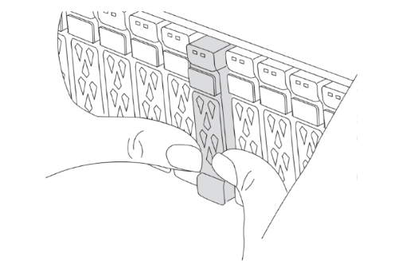

= Configurare e avviare da rete i nuovi controller IP MetroCluster
:allow-uri-read: 
:icons: font
:imagesdir: ../media/

[role="lead"]
Configurare i nuovi controller prima di eseguire il netboot dei controller per confermare che i nuovi nodi eseguano la stessa versione di ONTAP dei nodi originali.

== Configurare le nuove centraline

I nuovi controller devono essere montati in rack e cablati.

.Fasi
. Pianificare il posizionamento dei nuovi moduli controller e degli shelf di storage in base alle necessità.
+
Lo spazio rack dipende dal modello di piattaforma dei moduli controller, dai tipi di switch e dal numero di shelf di storage nella configurazione.

. Mettere a terra l'utente.
. Se l'aggiornamento richiede la sostituzione dei moduli controller, ad esempio l'aggiornamento da un sistema AFF A800 a un sistema AFF A90 o da un sistema AFF C800 a un sistema AFF C80, è necessario rimuovere il modulo controller dallo chassis quando si sostituisce il modulo controller. Per tutti gli altri aggiornamenti, passare a <<ip_upgrades_replace_4,Fase 4>>.
+
Nella parte anteriore dello chassis, premere con decisione ciascun disco fino a quando non si avverte un arresto positivo. Ciò conferma che le unità sono saldamente alloggiate contro il piano intermedio del telaio.

+

. [[ip_updates_replace_4]] installare i moduli del controller.
+
La procedura di installazione che segui dipende se l'aggiornamento richiede la sostituzione dei moduli controller o se sono necessari moduli IOM per convertire i vecchi controller in uno shelf esterno.

+
[cols="2*"]
|===
| Se si sta effettuando l'aggiornamento... | Seguire i passaggi per ... 

 a| 
** Da un AFF A150 a un sistema AFF A20
** Da un AFF A220 a un sistema AFF A20

| Conversione da controller a shelf esterno 

 a| 
** Da AFF A800 a un sistema AFF A90
** Da un AFF C800 a un sistema AFF C80

| Sostituzione del modulo controller 

| Qualsiasi altra combinazione di upgrade dei controller | Tutti gli altri aggiornamenti 
|===
+
[role="tabbed-block"]
====
.Conversione da controller a shelf esterno
--
Se i tuoi controller MetroCluster IP originali sono modelli AFF A150 o AFF A220, puoi convertire la coppia ha AFF A150 o AFF A220 in uno shelf di dischi DS224C, quindi allegarla ai nuovi nodi.

Ad esempio, quando si effettua l'upgrade da un sistema AFF A150 o AFF A220 a un sistema AFF A20, è possibile convertire la coppia ha AFF A150 o AFF A220 in uno shelf DS224C sostituendo i moduli controller AFF A150 o AFF A220 con IOM12 moduli.

.Fasi
.. Sostituire i moduli controller nel nodo che si sta convertendo con moduli shelf IOM12.
+
https://hwu.netapp.com["Hardware Universe"^]

.. Impostare l'ID dello shelf del disco.
+
Ogni shelf di dischi, incluso lo chassis, richiede un ID univoco.

.. Reimpostare gli altri ID dello shelf di dischi secondo necessità.
.. Spegnere gli scaffali.
.. Collegare lo shelf di dischi convertiti a una porta SAS del nuovo sistema e, se si utilizza un cablaggio ACP out-of-band, alla porta ACP del nuovo nodo.
.. Accendere lo shelf di dischi convertito e gli altri shelf di dischi collegati ai nuovi nodi.
.. Accendere i nuovi nodi, quindi interrompere il processo di boot su ciascun nodo premendo Ctrl-C per accedere al prompt dell'ambiente di boot.

--
.Sostituzione del modulo controller
--
L'installazione separata dei nuovi controller non è applicabile agli upgrade dei sistemi integrati con dischi e controller nello stesso chassis, ad esempio da un sistema AFF A800 a un sistema AFF A90. È necessario sostituire i nuovi moduli controller e le schede i/o dopo aver spento i vecchi controller, come illustrato nell'immagine seguente.

L'immagine di esempio seguente è solo a scopo di rappresentazione, i moduli controller e le schede i/o possono variare da un sistema all'altro.

image::../media/a90-a70-pcm-swap.png[Mostra lo scambio del modulo controller]

--
.Tutti gli altri aggiornamenti
--
Installare i moduli controller nel rack o nell'armadietto.

--
====
. Collegare l'alimentazione dei controller, la console seriale e le connessioni di gestione come descritto in link:../install-ip/using_rcf_generator.html["Collegare via cavo gli switch IP MetroCluster"]
+
Non collegare altri cavi scollegati dai vecchi controller in questo momento.

+
https://docs.netapp.com/us-en/ontap-systems/index.html["Documentazione dei sistemi hardware ONTAP"^]

. Accendere i nuovi nodi e premere Ctrl-C quando viene richiesto di visualizzare il `LOADER` prompt.

== NetBoot i nuovi controller

Dopo aver installato i nuovi nodi, è necessario eseguire il netboot per assicurarsi che i nuovi nodi eseguano la stessa versione di ONTAP dei nodi originali. Il termine netboot indica che si sta eseguendo l'avvio da un'immagine ONTAP memorizzata su un server remoto. Durante la preparazione per il netboot, è necessario inserire una copia dell'immagine di boot di ONTAP 9 su un server Web a cui il sistema può accedere.

Questa attività viene eseguita su ciascuno dei nuovi moduli controller.

.Fasi
. Accedere a. link:https://mysupport.netapp.com/site/["Sito di supporto NetApp"^] per scaricare i file utilizzati per eseguire il netboot del sistema.
. Scaricare il software ONTAP appropriato dalla sezione di download del software del sito di supporto NetApp e memorizzare il `ontap-version_image.tgz` file in una directory accessibile dal web.
. Accedere alla directory accessibile dal Web e verificare che i file necessari siano disponibili.
+
L'elenco delle directory dovrebbe contenere una cartella netboot con un file del kernel: `ontap-version_image.tgz`

+
Non è necessario estrarre il `ontap-version_image.tgz` file.

. Quando `LOADER` richiesto, configurare la connessione netboot per una LIF di gestione:
+
** Se l'indirizzo IP è DHCP, configurare la connessione automatica:
+
`ifconfig e0M -auto`

** Se l'indirizzo IP è statico, configurare la connessione manuale:
+
`ifconfig e0M -addr=ip_addr -mask=netmask` `-gw=gateway`

. Eseguire il netboot.
+
`netboot \http://web_server_ip/path_to_web-accessible_directory/ontap-version_image.tgz`

. Dal menu di avvio, selezionare l'opzione *(7) installare prima il nuovo software* per scaricare e installare la nuova immagine software sul dispositivo di avvio.
+
 Disregard the following message: "This procedure is not supported for Non-Disruptive Upgrade on an HA pair". It applies to nondisruptive upgrades of software, not to upgrades of controllers.
. Se viene richiesto di continuare la procedura, immettere `y`E quando viene richiesto il pacchetto, inserire l'URL del file immagine: `\http://web_server_ip/path_to_web-accessible_directory/ontap-version_image.tgz`
+
....
Enter username/password if applicable, or press Enter to continue.
....
. Assicurarsi di entrare `n` per ignorare il ripristino del backup quando viene visualizzato un prompt simile a quanto segue:
+
....
Do you want to restore the backup configuration now? {y|n}
....
. Riavviare immettendo `y` quando viene visualizzato un prompt simile a quanto segue:
+
....
The node must be rebooted to start using the newly installed software. Do you want to reboot now? {y|n}
....

== Cancellare la configurazione su un modulo controller

Prima di utilizzare un nuovo modulo controller nella configurazione MetroCluster, è necessario cancellare la configurazione esistente.

.Fasi
. Se necessario, arrestare il nodo per visualizzare il `LOADER` prompt:
+
`halt`

. Quando `LOADER` richiesto, impostare le variabili ambientali sui valori predefiniti:
+
`set-defaults`

. Salvare l'ambiente:
+
`saveenv`

. Quando `LOADER` richiesto, avviare il menu di avvio:
+
`boot_ontap menu`

. Al prompt del menu di avvio, cancellare la configurazione:
+
`wipeconfig`

+
Rispondere `yes` al prompt di conferma.

+
Il nodo si riavvia e viene visualizzato di nuovo il menu di avvio.

. Nel menu di avvio, selezionare l'opzione *5* per avviare il sistema in modalità di manutenzione.
+
Rispondere `yes` al prompt di conferma.

.Quali sono le prossime novità?
link:upgrade-mcc-ip-system-controller-replace-restore-hba-set-ha.html["Ripristinare la configurazione dell'HBA e impostare lo stato ha"].
