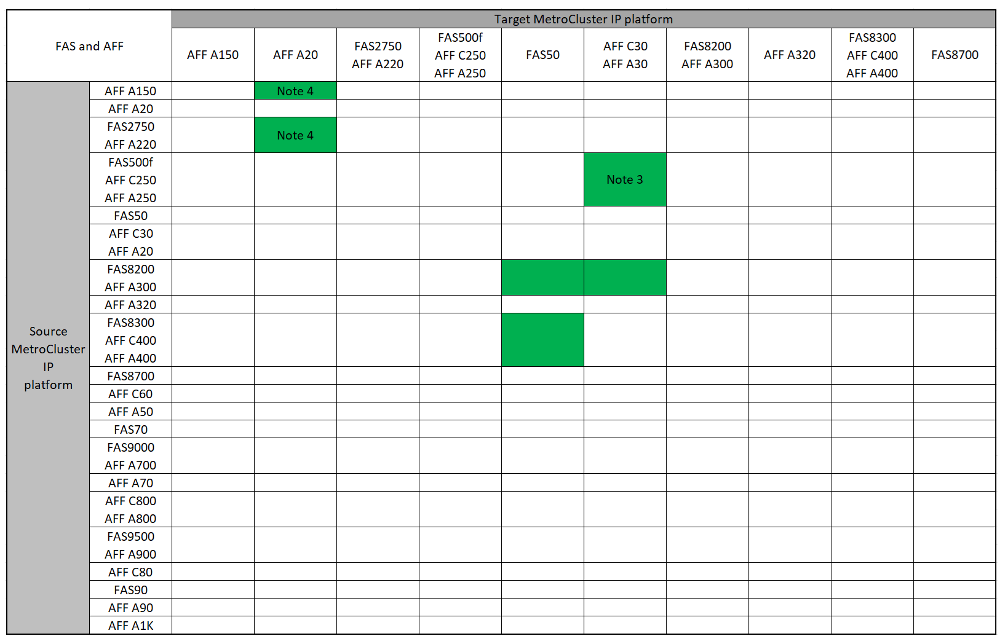

= Aggiornamenti del controller IP MetroCluster supportati utilizzando i comandi "sostituzione del controller di sistema"
:allow-uri-read: 
:icons: font
:imagesdir: ../media/

[role="lead"]
Prima di iniziare l'aggiornamento del controller IP MetroCluster, verificare che la combinazione di aggiornamento sia supportata.

Individuare la piattaforma *Source* dalle tabelle di aggiornamento del controller MetroCluster in questa sezione. Se l'intersezione della riga della piattaforma *Source* e della colonna della piattaforma *Target* è vuota, l'aggiornamento non è supportato.

Prima di avviare l'aggiornamento, esaminare le seguenti considerazioni per verificare che la configurazione sia supportata.

* Se la piattaforma non è elencata, non è disponibile alcuna combinazione di upgrade del controller supportata.
* Quando si esegue un aggiornamento del controller, il vecchio e il nuovo tipo di piattaforma *devono* corrispondere:
+
** Puoi aggiornare un sistema FAS ad un sistema FAS o AFF A-Series ad un AFF a-Series.
** Non è possibile aggiornare un sistema FAS ad un AFF A-Series o AFF A-Series a un AFF C-Series.
+
Ad esempio, se la piattaforma che si desidera aggiornare è FAS8200, è possibile eseguire l'aggiornamento a FAS9000. Non è possibile aggiornare un sistema FAS8200 a un sistema AFF A700.

* Tutti i nodi (vecchi e nuovi) della configurazione MetroCluster devono eseguire la stessa versione di ONTAP. Fare riferimento alla link:https://hwu.netapp.com["Hardware Universe"^] per la versione minima supportata di ONTAP per la combinazione in uso.

== Aggiornamenti del controller IP AFF e FAS MetroCluster supportati

La tabella seguente mostra le combinazioni di piattaforme supportate per l'aggiornamento di un sistema AFF o FAS in una configurazione IP MetroCluster utilizzando i comandi "sostituzione controller di sistema", suddivisi in due gruppi.

* *Gruppo 1* mostra le combinazioni per gli aggiornamenti ai sistemi AFF A150, AFF A20, FAS2750, AFF A220, FAS500f, AFF C250, FAS8200, FAS50, AFF C30, AFF A30, AFF A250, AFF A300, AFF A320, FAS8300, AFF C400, AFF A400 e FAS8700.
* *Gruppo 2* mostra le combinazioni per gli aggiornamenti ai sistemi AFF C60, AFF A50, FAS70, FAS9000, AFF A700, AFF A70, AFF C800, AFF A800, FAS9500, AFF A900, AFF C80, FAS90, AFF A90 e AFF A1K.

Le seguenti note si applicano a entrambi i gruppi:

* Nota 1: Gli upgrade dei controller sono supportati sui sistemi con ONTAP 9.13.1 o versione successiva.
* Nota 2: La piattaforma di destinazione non può avere dischi interni fino al completamento dell'aggiornamento del controller. È possibile aggiungere le unità interne dopo l'aggiornamento.
* Nota 3: Richiede la sostituzione dei moduli controller.
* Nota 4: Richiede moduli IOM per convertire i vecchi controller in uno shelf SAS esterno. Fare riferimento alla link:https://hwu.netapp.com/["Hardware Universe"^] per i moduli IOM supportati.

[role="tabbed-block"]
====
.Combinazioni AFF e FAS gruppo 1
--
Esaminare le combinazioni supportate per gli aggiornamenti ai sistemi AFF A150, AFF A20, FAS2750, FAS8300, FAS500f, AFF C250, AFF A250, FAS50, AFF C30, AFF A30, FAS8200, AFF A300, AFF A320, AFF A220, AFF C400, AFF A400 e FAS8700.

--
.Combinazioni AFF e FAS gruppo 2
--
Esaminare le combinazioni supportate per gli aggiornamenti ai sistemi AFF C60, AFF A50, FAS70, FAS9000, AFF A700, AFF A70, AFF C800, AFF A800, FAS9500, AFF A900, AFF C80, FAS90, AFF A90 e AFF A1K.

image:../media/assisted-group-2-updated.png["Mostra le combinazioni di aggiornamento AFF e FAS gruppo 2"]

--
====

== Aggiornamenti del controller IP ASA MetroCluster supportati

L'aggiornamento dei controller tramite `system controller replace` comandi sui sistemi ASA non è supportato.

Per ulteriori procedure, fare riferimento alla link:https://docs.netapp.com/us-en/ontap-metrocluster/upgrade/concept_choosing_an_upgrade_method_mcc.html["Scegliere un metodo di aggiornamento o aggiornamento"].

.Quali sono le prossime novità?
Esaminare la link:upgrade-mcc-ip-system-controller-replace-requirements.html["requisiti per l'utilizzo di questa procedura di aggiornamento"].
